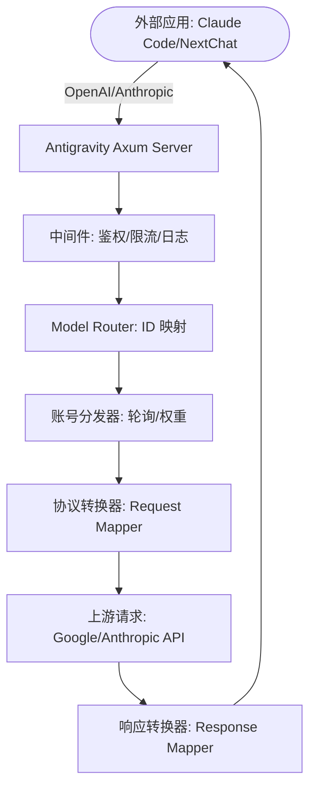

# Antigravity Tools 🚀
> 专业的 AI 账号管理与协议反代系统 (v4.1.4)
<div align="center">
  

  <h3>您的个人高性能 AI 调度网关</h3>
  <p>不仅仅是账号管理，更是打破 API 调用壁垒的终极解决方案。</p>
  
  <p>
    <a href="https://github.com/lbjlaq/Antigravity-Manager">
      
    </a>
    
    
    
    
  </p>

  <p>
    <a href="#-核心功能">核心功能</a> • 
    <a href="#-界面导览">界面导览</a> • 
    <a href="#-技术架构">技术架构</a> • 
    <a href="#-安装指南">安装指南</a> • 
    <a href="#-快速接入">快速接入</a>
  </p>

  <p>
    <strong>简体中文</strong> | 
    <a href="./README_EN.md">English</a>
  </p>
</div>

---

**Antigravity Tools** 是一个专为开发者和 AI 爱好者设计的全功能桌面应用。它将多账号管理、协议转换和智能请求调度完美结合，为您提供一个稳定、极速且成本低廉的 **本地 AI 中转站**。

通过本应用，您可以将常见的 Web 端 Session (Google/Anthropic) 转化为标准化的 API 接口，消除不同厂商间的协议鸿沟。

## 💖 赞助商 (Sponsors)

| 赞助商 (Sponsor) | 简介 (Description) |
| :---: | :--- |
|  | 感谢 **PackyCode** 对本项目的赞助！PackyCode 是一家可靠高效的 API 中转服务商，提供 Claude Code、Codex、Gemini 等多种服务的中转。PackyCode 为本项目的用户提供了特别优惠：使用[此链接](https://www.packyapi.com/register?aff=Ctrler)注册，并在充值时输入 **“Ctrler”** 优惠码即可享受 **九折优惠**。 |
|  | 感谢 AICodeMirror 赞助了本项目！AICodeMirror 提供 Claude Code / Codex / Gemini CLI 官方高稳定中转服务，支持企业级高并发、极速开票、7×24 专属技术支持。 Claude Code / Codex / Gemini 官方渠道低至 3.8 / 0.2 / 0.9 折，充值更有折上折！AICodeMirror 为 Antigravity-Manager 的用户提供了特别福利，通过[此链接](https://www.aicodemirror.com/register?invitecode=MV5XUM)注册的用户，可享受首充8折，企业客户最高可享 7.5 折！ |

### ☕ 支持项目 (Support)

如果您觉得本项目对您有所帮助，欢迎打赏作者！

<a href="https://www.buymeacoffee.com/Ctrler" target="_blank"></a>

| 支付宝 (Alipay) | 微信支付 (WeChat) | Buy Me a Coffee |
| :---: | :---: | :---: |
|  |  |  |

## 🌟 深度功能解析 (Detailed Features)

### 1. 🎛️ 智能账号仪表盘 (Smart Dashboard)
*   **全局实时监控**: 一眼洞察所有账号的健康状况，包括 Gemini Pro、Gemini Flash、Claude 以及 Gemini 绘图的 **平均剩余配额**。
*   **最佳账号推荐 (Smart Recommendation)**: 系统会根据当前所有账号的配额冗余度，实时算法筛选并推荐“最佳账号”，支持 **一键切换**。
*   **活跃账号快照**: 直观显示当前活跃账号的具体配额百分比及最后同步时间。

### 2. 🔐 强大的账号管家 (Account Management)
*   **OAuth 2.0 授权（自动/手动）**: 添加账号时会提前生成可复制的授权链接，支持在任意浏览器完成授权；回调成功后应用会自动完成并保存（必要时可点击“我已授权，继续”手动收尾）。
*   **多维度导入**: 支持单条 Token 录入、JSON 批量导入（如来自其他工具的备份），以及从 V1 旧版本数据库自动热迁移。
*   **网关级视图**: 支持“列表”与“网格”双视图切换。提供 403 封禁检测，自动标注并跳过权限异常的账号。

### 3. 🔌 协议转换与中继 (API Proxy)
*   **全协议适配 (Multi-Sink)**:
    *   **OpenAI 格式**: 提供 `/v1/chat/completions` 端点，兼容 99% 的现有 AI 应用。
    *   **Anthropic 格式**: 提供原生 `/v1/messages` 接口，支持 **Claude Code CLI** 的全功能（如思思维链、系统提示词）。
    *   **Gemini 格式**: 支持 Google 官方 SDK 直接调用。
*   **智能状态自愈**: 当请求遇到 `429 (Too Many Requests)` 或 `401 (Expire)` 时，后端会毫秒级触发 **自动重试与静默轮换**，确保业务不中断。

### 4. 🔀 模型路由中心 (Model Router)
*   **系列化映射**: 您可以将复杂的原始模型 ID 归类到“规格家族”（如将所有 GPT-4 请求统一路由到 `gemini-3-pro-high`）。
*   **专家级重定向**: 支持自定义正则表达式级模型映射，精准控制每一个请求的落地模型。
*   **智能分级路由 (Tiered Routing)**: [新] 系统根据账号类型（Ultra/Pro/Free）和配额重置频率自动优先级排序，优先消耗高速重置账号，确保高频调用下的服务稳定性。
*   **后台任务静默降级**: [新] 自动识别 Claude CLI 等工具生成的后台请求（如标题生成），智能重定向至 Flash 模型，保护高级模型配额不被浪费。

### 5. 🎨 多模态与 Imagen 3 支持
*   **高级画质控制**: 支持通过 OpenAI `size` (如 `1024x1024`, `16:9`) 参数自动映射到 Imagen 3 的相应规格。
*   **超强 Body 支持**: 后端支持高达 **100MB** (可配置) 的 Payload，处理 4K 高清图识别绰绰有余。

## 📸 界面导览 (GUI Overview)

| | |
| :---: | :---: |
|  <br> 仪表盘 |  <br> 账号列表 |
|  <br> 关于页面 |  <br> API 反代 |
|  <br> 系统设置 | |

### 💡 使用案例 (Usage Examples)

| | |
| :---: | :---: |
|  <br> Claude Code 联网搜索 |  <br> Cherry Studio 深度集成 |
|  <br> Imagen 3 高级绘图 |  <br> Kilo Code 接入 |

## 🏗️ 技术架构 (Architecture)



##  安装指南 (Installation)

### 选项 A: 终端安装 (macOS & Linux 推荐)

#### macOS 
如果您已安装 [Homebrew](https://brew.sh/)，可以通过以下命令快速安装：

```bash
# 1. 订阅本仓库的 Tap
brew tap lbjlaq/antigravity-manager https://github.com/lbjlaq/Antigravity-Manager

# 2. 安装应用
brew install --cask antigravity-tools
```
> **提示**: 如果遇到权限问题，建议添加 `--no-quarantine` 参数。

#### Arch Linux
您可以选择通过一键安装脚本或 Homebrew 进行安装：

**方式 1：一键安装脚本 (推荐)**
```bash
curl -sSL https://raw.githubusercontent.com/lbjlaq/Antigravity-Manager/main/deploy/arch/install.sh | bash
```

**方式 2：通过 Homebrew** (如果您已安装 [Linuxbrew](https://sh.brew.sh/))
```bash
brew tap lbjlaq/antigravity-manager https://github.com/lbjlaq/Antigravity-Manager
brew install --cask antigravity-tools
```

#### 其他 Linux 发行版
安装后会自动将 AppImage 添加到二进制路径并配置可执行权限。

### 选项 B: 手动下载
前往 [GitHub Releases](https://github.com/lbjlaq/Antigravity-Manager/releases) 下载对应系统的包：
*   **macOS**: `.dmg` (支持 Apple Silicon & Intel)
*   **Windows**: `.msi` 或 便携版 `.zip`
*   **Linux**: `.deb` 或 `AppImage`

### 选项 C: Docker 部署 (推荐用于 NAS/服务器)
如果您希望在容器化环境中运行，我们提供了原生的 Docker 镜像。该镜像内置了对 v4.0.2 原生 Headless 架构的支持，可自动托管前端静态资源，并通过浏览器直接进行管理。

```bash
# 方式 1: 直接运行 (推荐)
# - API_KEY: 必填。用于所有协议的 AI 请求鉴定。
# - WEB_PASSWORD: 可选。用于管理后台登录。若不设置则默认使用 API_KEY。
docker run -d --name antigravity-manager \
  -p 8045:8045 \
  -e API_KEY=sk-your-api-key \
  -e WEB_PASSWORD=your-login-password \
  -e ABV_MAX_BODY_SIZE=104857600 \
  -v ~/.antigravity_tools:/root/.antigravity_tools \
  lbjlaq/antigravity-manager:latest

# 忘记密钥？执行 docker logs antigravity-manager 或 grep -E '"api_key"|"admin_password"' ~/.antigravity_tools/gui_config.json

#### 🔐 鉴权逻辑说明
*   **场景 A：仅设置了 `API_KEY`**
    - **Web 登录**：使用 `API_KEY` 进入后台。
    - **API 调用**：使用 `API_KEY` 进行 AI 请求鉴权。
*   **场景 B：同时设置了 `API_KEY` 和 `WEB_PASSWORD` (推荐)**
    - **Web 登录**：**必须**使用 `WEB_PASSWORD`，使用 API Key 将被拒绝（更安全）。
    - **API 调用**：统一使用 `API_KEY`。这样您可以将 API Key 分发给成员，而保留密码仅供管理员使用。

#### 🆙 旧版本升级指引
如果您是从 v4.0.1 及更早版本升级，系统默认未设置 `WEB_PASSWORD`。您可以通过以下任一方式设置：
1.  **Web UI 界面 (推荐)**：使用原有 `API_KEY` 登录后，在 **API 反代设置** 页面手动设置并保存。新密码将持久化存储在 `gui_config.json` 中。
2.  **环境变量 (Docker)**：在启动容器时增加 `-e WEB_PASSWORD=您的新密码`。**注意：环境变量具有最高优先级，将覆盖 UI 中的任何修改。**
3.  **配置文件 (持久化)**：直接修改 `~/.antigravity_tools/gui_config.json`，在 `proxy` 对象中修改或添加 `"admin_password": "您的新密码"` 字段。
    - *注：`WEB_PASSWORD` 是环境变量名，`admin_password` 是配置文件中的 JSON 键名。*

> [!TIP]
> **密码优先级逻辑 (Priority)**:
> - **第一优先级 (环境变量)**: `ABV_WEB_PASSWORD` 或 `WEB_PASSWORD`。只要设置了环境变量，系统将始终使用它。
> - **第二优先级 (配置文件)**: `gui_config.json` 中的 `admin_password` 字段。UI 的“保存”操作会更新此值。
> - **保底回退 (向后兼容)**: 若上述均未设置，则回退使用 `API_KEY` 作为登录密码。

# 方式 2: 使用 Docker Compose
# 1. 进入项目的 docker 目录
cd docker
# 2. 启动服务
docker compose up -d
```
> **访问地址**: `http://localhost:8045` (管理后台) | `http://localhost:8045/v1` (API Base)
> **系统要求**:
> - **内存**: 建议 **1GB** (最小 256MB)。
> - **持久化**: 需挂载 `/root/.antigravity_tools` 以保存数据。
> - **架构**: 支持 x86_64 和 ARM64。
> **详情见**: [Docker 部署指南 (docker)](./docker/README.md)

---

Copyright © 2024-2026 [lbjlaq](https://github.com/lbjlaq)

### 🛠️ 常见问题排查 (Troubleshooting)

#### macOS 提示“应用已损坏，无法打开”？
由于 macOS 的安全机制，非 App Store 下载的应用可能会触发此提示。您可以按照以下步骤快速修复：

1.  **命令行修复** (推荐):
    打开终端，执行以下命令：
    ```bash
    sudo xattr -rd com.apple.quarantine "/Applications/Antigravity Tools.app"
    ```
2.  **Homebrew 安装技巧**:
    如果您使用 brew 安装，可以添加 `--no-quarantine` 参数来规避此问题：
    ```bash
    brew install --cask --no-quarantine antigravity-tools
    ```

## 🔌 快速接入示例

### 🔐 OAuth 授权流程（添加账号）
1. 打开“Accounts / 账号” → “添加账号” → “OAuth”。
2. 弹窗会在点击按钮前预生成授权链接；点击链接即可复制到系统剪贴板，然后用你希望的浏览器打开并完成授权。
3. 授权完成后浏览器会打开本地回调页并显示“✅ 授权成功!”。
4. 应用会自动继续完成授权并保存账号；如未自动完成，可点击“我已授权，继续”手动完成。

> 提示：授权链接包含一次性回调端口，请始终使用弹窗里生成的最新链接；如果授权时应用未运行或弹窗已关闭，浏览器可能会提示 `localhost refused connection`。

### 如何接入 Claude Code CLI?
1.  启动 Antigravity，并在“API 反代”页面开启服务。
2.  在终端执行：
```bash
export ANTHROPIC_API_KEY="sk-antigravity"
export ANTHROPIC_BASE_URL="http://127.0.0.1:8045"
claude
```

### 如何接入 Kilo Code?
1.  **协议选择**: 建议优先使用 **Gemini 协议**。
2.  **Base URL**: 填写 `http://127.0.0.1:8045`。
3.  **注意**: 
    - **OpenAI 协议限制**: Kilo Code 在使用 OpenAI 模式时，其请求路径会叠加产生 `/v1/chat/completions/responses` 这种非标准路径，导致 Antigravity 返回 404。因此请务必填入 Base URL 后选择 Gemini 模式。
    - **模型映射**: Kilo Code 中的模型名称可能与 Antigravity 默认设置不一致，如遇到无法连接，请在“模型映射”页面设置自定义映射，并查看**日志文件**进行调试。

### 如何在 Python 中使用?
```python
import openai

client = openai.OpenAI(
    api_key="sk-antigravity",
    base_url="http://127.0.0.1:8045/v1"
)

response = client.chat.completions.create(
    model="gemini-3-flash",
    messages=[{"role": "user", "content": "你好，请自我介绍"}]
)
print(response.choices[0].message.content)
```

### 如何使用图片生成 (Imagen 3)?

#### 方式一：OpenAI Images API (推荐)
```python
import openai

client = openai.OpenAI(
    api_key="sk-antigravity",
    base_url="http://127.0.0.1:8045/v1"
)

# 生成图片
response = client.images.generate(
    model="gemini-3-pro-image",
    prompt="一座未来主义风格的城市，赛博朋克，霓虹灯",
    size="1920x1080",      # 支持任意 WIDTHxHEIGHT 格式，自动计算宽高比
    quality="hd",          # "standard" | "hd" | "medium"
    n=1,
    response_format="b64_json"
)

# 保存图片
import base64
image_data = base64.b64decode(response.data[0].b64_json)
with open("output.png", "wb") as f:
    f.write(image_data)
```

**支持的参数**：
- **`size`**: 任意 `WIDTHxHEIGHT` 格式（如 `1280x720`, `1024x1024`, `1920x1080`），自动计算并映射到标准宽高比（21:9, 16:9, 9:16, 4:3, 3:4, 1:1）
- **`quality`**: 
  - `"hd"` → 4K 分辨率（高质量）
  - `"medium"` → 2K 分辨率（中等质量）
  - `"standard"` → 默认分辨率（标准质量）
- **`n`**: 生成图片数量（1-10）
- **`response_format`**: `"b64_json"` 或 `"url"`（Data URI）

#### 方式二：Chat API + 参数设置 (✨ 新增)

**所有协议**（OpenAI、Claude）的 Chat API 现在都支持直接传递 `size` 和 `quality` 参数：

```python
# OpenAI Chat API
response = client.chat.completions.create(
    model="gemini-3-pro-image",
    size="1920x1080",      # ✅ 支持任意 WIDTHxHEIGHT 格式
    quality="hd",          # ✅ "standard" | "hd" | "medium"
    messages=[{"role": "user", "content": "一座未来主义风格的城市"}]
)
```

```bash
# Claude Messages API
curl -X POST http://127.0.0.1:8045/v1/messages \
  -H "Content-Type: application/json" \
  -H "x-api-key: sk-antigravity" \
  -d '{
    "model": "gemini-3-pro-image",
    "size": "1280x720",
    "quality": "hd",
    "messages": [{"role": "user", "content": "一只可爱的猫咪"}]
  }'
```

**参数优先级**: 请求体参数 > 模型后缀

#### 方式三：Chat 接口 + 模型后缀
```python
response = client.chat.completions.create(
    model="gemini-3-pro-image-16-9-4k",  # 格式：gemini-3-pro-image-[比例]-[质量]
    messages=[{"role": "user", "content": "一座未来主义风格的城市"}]
)
```

**模型后缀说明**：
- **宽高比**: `-16-9`, `-9-16`, `-4-3`, `-3-4`, `-21-9`, `-1-1`
- **质量**: `-4k` (4K), `-2k` (2K), 不加后缀（标准）
- **示例**: `gemini-3-pro-image-16-9-4k` → 16:9 比例 + 4K 分辨率

#### 方式四：Cherry Studio 等客户端设置
在支持 OpenAI 协议的客户端（如 Cherry Studio）中，可以通过**模型设置**页面配置图片生成参数：

1. **进入模型设置**：选择 `gemini-3-pro-image` 模型
2. **配置参数**：
   - **Size (尺寸)**: 输入任意 `WIDTHxHEIGHT` 格式（如 `1920x1080`, `1024x1024`）
   - **Quality (质量)**: 选择 `standard` / `hd` / `medium`
   - **Number (数量)**: 设置生成图片数量（1-10）
3. **发送请求**：直接在对话框中输入图片描述即可

**参数映射规则**：
- `size: "1920x1080"` → 自动计算为 `16:9` 宽高比
- `quality: "hd"` → 映射为 `4K` 分辨率
- `quality: "medium"` → 映射为 `2K` 分辨率


## 📝 开发者与社区

*   **版本演进 (Changelog)**:
    *   **v4.1.4 (2026-02-05)**:
        -   **[核心功能] 代理池持久化与账号筛选优化 (PR #1565)**:
            -   **持久化增强**: 修复了代理池绑定在反代服务重启或重载时无法正确恢复的问题，确保绑定关系严格持久化。
            -   **智能筛选**: 优化了 `TokenManager` 的账号获取逻辑,在全量加载、同步以及调度路径中增加了对 `disabled` 和 `proxy_disabled` 状态的深度校验，彻底杜绝已禁用账号被误选的问题。
            -   **验证阻止支持**: 引入了 `validation_blocked` 字段体系，专门处理 Google 的 `VALIDATION_REQUIRED` (403 临时风控) 场景，实现了基于截止时间的智能自动绕过。
            -   **状态清理加固**: 账号失效时同步清理内存令牌、限流记录、会话绑定及优先账号标志，保证内部状态机的一致性。
        -   **[核心修复] 修复 Web/Docker 模式下的关键兼容性问题 (Issue #1574)**:
            -   **调试模式修复**: 修正了前端调试控制台 URL 映射错误（移除多余的 `/proxy` 路径），解决了 Web 模式下调试模式无法开启的问题。
            -   **指纹绑定修复**: 为 `admin_bind_device_profile_with_profile` 接口增加了 `BindDeviceProfileWrapper` 结构，修复了前端发送嵌套参数导致的 HTTP 422 错误。
            -   **向后兼容性**: 使用 `serde alias` 功能在 API 层同时支持 camelCase（前端）和 snake_case（后端文件），确保旧账号文件正常加载。
        -   **[代码优化] 简化 API 处理结构**:
            -   移除了多个管理 API 路由（如 IP 黑白名单管理、安全设置更新等）中的冗余包装层 (`Wrapper`)，直接解构业务模型，提升了代码的简洁性与开发效率。
        -   **[核心修复] 解决 OpenCode 调用 Thinking 模型中断问题 (Issue #1575)**:
            -   **finish_reason 强制修正**: 修复了工具调用时 `finish_reason` 被错误设置为 `stop` 导致 OpenAI 客户端提前终止对话的问题。现在系统会强制将有工具调用的响应 `finish_reason` 设置为 `tool_calls`，确保工具循环正常运行。
            -   **工具参数标准化**: 实现了 shell 工具参数名称的自动标准化，将 Gemini 可能生成的 `cmd`/`code`/`script` 等非标准参数名统一转换为 `command`，提升了工具调用的兼容性。
            -   **影响范围**: 修复了 OpenAI 协议下 Thinking 模型（如 `claude-sonnet-4-5-thinking`）的工具调用流程，解决了 OpenCode 等客户端的中断问题。
    *   **v4.1.4 (2026-02-05)**:
        - **Bug 修复 (Bug Fixes)**:
            - **Gemini 原生协议图像生成参数支持 (Issue #1573)**: 修复了使用 Gemini 原生协议时 `generationConfig.imageConfig` 参数被忽略的问题。现在系统能正确解析并应用 `aspectRatio` 和 `imageSize` 等图像配置参数。
                - **优先级策略**: 优先从请求体的 `generationConfig.imageConfig` 解析参数，保留模型名后缀作为向后兼容方案。
                - **协议一致性**: 确保 Gemini、OpenAI、Claude 三大协议在图像生成场景下的参数处理逻辑统一。
                - **影响范围**: 修复了 9 个文件的调用链，包括 `common_utils.rs`、`gemini.rs`、`wrapper.rs` 等核心模块。
    *   **v4.1.3 (2026-02-05)**:
        -   **[核心修复] 解决 Web/Docker 模式下安全配置与 IP 管理失效问题 (Issue #1560)**:
            -   **协议对齐**: 修复了后端 Axum 接口无法解析前端 `invoke` 封装的嵌套参数格式（如 `{"config": ...}`）的问题，确保安全配置能正确持久化。
            -   **参数规范化**: 为 IP 管理相关接口添加了 `camelCase` 重命名支持，解决了 Web 端 Query 参数大小写不匹配导致的添加失败与删除失效。
        -   **[核心修复] 恢复 Gemini Pro 思考块输出 (Issue #1557)**:
            -   **跨协议对齐**: 修复了自 v4.1.0 以来 `gemini-3-pro` 等模型在 OpenAI、Claude 和 Gemini 原生协议下思考块缺失的问题。
            -   **智能注入逻辑**: 实现了 `thinkingConfig` 的自动注入与默认开启机制，确保即使客户端未发送配置，模型也能正确激活思考能力。
            -   **鲁棒性增强**: 优化了 `wrapper.rs` 内部类型处理，解析并解决了高并发场景下的配置冲突。
    *   **v4.1.2 (2026-02-05)**:
        -   **[核心功能] 多协议客户端适配器 (ClientAdapter Framework) (Issue #1522)**:
            -   **架构重构**: 引入 `ClientAdapter` 框架并应用 `Arc` 引用计数，实现了 Handler 层与下游客户端逻辑的完全解耦，支持更安全的跨线程共享。
            -   **全协议兼容**: 针对 `opencode` 等第三方客户端，实现了 **4 种协议**（Claude/OpenAI/Gemini/OA-Compatible）的无缝接入，彻底解决了 `AI_TypeValidationError` 报错。
            -   **智能策略**: 实现了 FIFO 签名缓存策略与 `let_it_crash` 快速失败机制，显著提升了高并发场景下的稳定性和错误反馈速度。
            -   **标准化错误响应**: 强制统一所有协议的错误返回格式（流式 SSE `event: error` / 非流式 JSON），确保客户端能正确解析上游异常。
        -   **[核心修复] 统一账号禁用状态检查逻辑 (Issue #1512)**:
            -   **逻辑对齐**: 修复了批量刷新配额及自动预热逻辑中遗漏手动禁用状态 (`proxy_disabled`) 的问题。
            -   **后台降噪**: 确保标记为“禁用”或“禁用代理”的账号不再触发任何后台网络请求，提升了系统的隐私性与资源效率。
        -   **[核心修复] 解决 OpenAI 协议路径下 Invalid signature 导致的 400 错误 (Issue #1506)**:
            -   **Session 级签名隔离**: 引入了 `SignatureCache` 机制，通过 `session_id` 物理隔离不同会话的思维签名存储，彻底杜绝多轮对话或并发请求导致的签名污染。
            -   **鲁棒性增强**: 增加了对思维链占位符（如 `[undefined]`）的识别与自动清洗逻辑，提升了对不同客户端（如 Cherry Studio）的兼容性。
            -   **全路径透传**: 重构了请求转换与流式处理链路，确保 Session 上下文在非流式和流式请求中均能精准传导。
        -   **[UI 增强] 新增模型图标支持与自动排序功能 (PR #1535)**:
            -   **视觉呈现**: 引入 `@lobehub/icons` 图标库，在账号卡片、表格及详情页中展示不同模型的 brand 图标，视觉体验更佳。
            -   **智能排序**: 实现了基于权重的模型自动排序逻辑（系列 > 级别 > 后缀），优先展示最常用的高级模型（如 Gemini 3 Pro）。
            -   **配置中心化**: 构建了统一的模型元数据配置系统，将模型标签、短名称、图标与权重解耦，提升系统扩展性。
            -   **国际化同步**: 同步补全了 13 种常用语言的模型显示名称。
        -   **[核心修复] 增强账号禁用状态与磁盘状态实时校验 (PR #1546)**:
            -   **磁盘深度校验**: 引入了 `get_account_state_on_disk` 机制，在获取 Token 的关键路径增加磁盘状态二次确认，彻底解决内存缓存延迟导致的禁用账号误选问题。
            -   **固定账号智能同步**: 优化了 `toggle_proxy_status` 指令，禁用账号时会自动检查并关闭对应的固定账号模式，并立即触发代理池重载。
            -   **授权失效自愈**: 当后端检测到 `invalid_grant` 错误并自动禁用账号时，现在会物理清理内存中的 Token、限流记录和会话绑定，确保故障账号即刻下线。
            -   **全链路过滤适配**: 补全了预热逻辑 (`Warmup`) 与定时调度器 (`Scheduler`) 的禁用状态检查，大幅减少无效的后台网络请求。
        -   **[核心优化] 代理池健康检查并发化 (PR #1547)**:
            -   **性能提升**: 引入了基于 `futures` 流的并发执行机制，将顺序检查重构为并发处理（并发上限 20）。
            -   **效率增强**: 显著缩短了大型代理池的健康检查总时长，提升了系统对代理状态变更的响应速度。
        -   **[核心修复] 解决 Docker/HTTP 环境下 crypto.randomUUID 兼容性问题 (Issue #1548)**:
            -   **问题修复**: 修复了在非安全上下文（如 HTTP 或部分 Docker 环境）中，因浏览器禁用 `crypto.randomUUID` API 导致的应用崩溃（"Unexpected Application Error"）及批量导入失败问题。
            -   **兼容性增强**: 引入了全平台兼容的 UUID 生成回退机制，确保在任何部署环境下 ID 生成的稳定性。
    *   **v4.1.1 (2026-02-04)**:
        -   **[核心修复] 解决 User Tokens 页面在 Web/Docker 环境下加载失败问题 (Issue #1525)**:
            -   **API 同步**: 补全了前端 `request.ts` 的命令映射，并新增对 `PATCH` 方法的支持，解决了 Web 端因映射缺失导致的 API 调用错误。
            -   **后端路由补全**: 在 Axum 管理服务器中新增了 User Token 的全量管理接口（List/Create/Update/Renew/Delete），确保 Headless 模式功能完整。
        -   **[核心优化] 数据库迁移增强与幂等性改进**:
            -   **自动列迁移**: 完善了 `UserToken` 数据库初始化逻辑，支持从旧版本自动通过 `ALTER TABLE` 补全缺失列（如 `expires_type`, `max_ips`, `curfew_*` 等），极大提升了版本升级的稳定性。
        -   **[Docker 优化] 新增 ABV_DATA_DIR 环境变量支持**:
            -   **灵活挂载**: 允许用户通过环境变量显式指定数据存储目录。现在 Docker 用户可以更方便地挂载外部卷至自定义路径（如 `-e ABV_DATA_DIR=/app/data`），解决了默认隐藏目录权限及可见性问题。
        -   **[核心功能] 更新检查器增强 (Update Checker 2.0) (PR #1494)**:
            -   **代理支持**: 更新检查器现在完全遵循全局上游代理配置，解决了在受限网络环境下无法获取更新的问题。
            -   **多级降级策略**: 实现了 `GitHub API -> GitHub Raw -> jsDelivr` 的三层回退机制，极大提升了版本检测的成功率。
            -   **来源可观测**: 更新提示中现在会显示检测源信息，方便排查连接问题。
        -   **[核心优化] Antigravity 数据库格式兼容性改进 (>= 1.16.5)**:
            -   **智能版本检测**: 新增跨平台版本检测模块，支持自动识别 Antigravity 客户端版本（macOS/Windows/Linux）。
            -   **新旧格式适配**: 适配了 1.16.5+ 版本的 `antigravityUnifiedStateSync.oauthToken` 新格式，并保持对旧版格式的向下兼容。
            -   **注入策略增强**: 实现基于版本的智能注入策略，并在检测失败时提供双重格式注入的容错机制，确保账号切换成功。
        -   **[核心修复] 解决 react-router SSR XSS 漏洞 (CVE-2026-21884) (PR #1500)**:
            -   **安全修复**: 升级 `react-router` 依赖至安全版本，修复了 `ScrollRestoration` 组件在服务端渲染 (SSR) 时可能造成的跨站脚本攻击 (XSS) 风险。
        -   **[国际化] 完善日语翻译支持 (PR #1524)**:
            -   **改进**: 补全了代理池、流错误消息、User-Agent 等重要模块的日语本地化。
    *   **v4.1.0 (2026-02-04)**:
        -   **[重大更新] 代理池 2.0 (Proxy Pool) 完全体与稳定性修复**:
            -   **账号级专属 IP 隔离**: 实现账号与代理的强绑定逻辑。一旦账号绑定专属代理，该 IP 将自动从公共池隔离，杜绝跨账号关联风险。
            -   **协议自动补全与兼容性**: 后端支持自动识别简写输入（如 `ip:port`），自动补全 `http://` 方案。
            -   **智能健康检查加固**: 引入浏览器 User-Agent 伪装，解决 `google.com` 拦截问题；更换保底检查 URL 至 `cloudflare.com`。
            -   **响应式状态同步**: 修复“先睡眠后检查”逻辑，实现启动即更新状态，消除 UI 显示超时的同步延迟。
            -   **持久化 Bug 修复**: 彻底解决在高频率轮询下，后端旧状态可能回滚前端新增代理的竞态问题。
        -   **代理池 2.0 运行机制解析**:
            -   **场景 1：账号全链路锁定** — 系统识别到账号 A 与 Node-01 的绑定关系后，其 Token 刷新、额度同步、AI 推理将全量强制走 Node-01。Google 侧始终捕获到该账号在单一稳定 IP 上操作。
            -   **场景 2：公用池自动隔离** — 账号 B 无绑定。系统在扫描代理池时，会自动发现 Node-01 已被 A 专属占用并将其剔除，仅从剩余节点中轮询。确保不同账号 IP 绝不混用，零关联风险。
            -   **场景 3：故障自愈与保底** — 若 Node-01 宕机且开启了“故障重试”，账号 A 会临时借用公共池节点完成 Token 刷新等紧急任务，并记录日志，确保服务不中断。
        -   **[新功能] UserToken 页面导航与监控增强 (PR #1475)**:
            -   **页面导航**: 新增 UserToken 独立管理页面，支持更细粒度的用户令牌管理。
            -   **监控增强**: 完善了系统监控和路由功能的集成，提升了系统的可观测性。
        -   **[核心修复] Warmup 接口字段丢失修复**:
            -   **编译修复**: 修复了 `ProxyRequestLog` 初始化时缺失 `username` 字段导致的编译错误。
        -   **[核心修复] Docker Warmup 401/502 错误修复 (PR #1479)**:
            -   **网络优化**: 在 Docker 环境下的 Warmup 请求中，使用了带 `.no_proxy()` 的客户端，防止 localhost 请求被错误路由到外部代理导致 502/401 错误。
            -   **鉴权变更**: 豁免了 `/internal/*` 路径的鉴权，确保内部预热请求不会被拦截。
        -   **[核心修复] Docker/Headless 环境调试与绑定问题修复**:
            -   **调试控制台**: 修复了 Docker 模式下日志模块未初始化的问题，并新增 HTTP API 映射，支持 Web 前端获取实时日志。
            -   **指纹绑定**: 优化了设备指纹绑定逻辑，确保其在 Docker 容器环境下的兼容性并支持通过 API 完整调用。
        -   **[核心修复] 账号删除缓存同步修复 (Issue #1477)**:
            -   **同步机制**: 引入了全局删除信号同步队列，确保账号在磁盘删除后即刻从内存缓存中剔除。
            -   **彻底清理**: TokenManager 现在会同步清理已删除账号的令牌、健康分数、限流记录以及会话绑定，彻底解决“已删除账号仍被调度”的问题。
        -   **[UI 优化] 更新通知本地化 (PR #1484)**:
            -   **国际化适配**: 彻底移除了更新提示框中的硬编码字符串，实现了对所有 12 种语言的完整支持。
        -   **[UI 优化] 导航栏重构与响应式适配 (PR #1493)**:
            -   **组件解构**: 将单体 Navbar 拆分为更细粒度的模块化组件，提升代码可维护性。
            -   **响应式增强**: 优化了布局断点及“刷新配额”按钮的响应式行为。
    *   **v4.0.15 (2026-02-03)**:
        -   **[核心优化] 预热功能增强与误报修复 (PR #1466)**:
            -   **模式优化**: 移除硬编码模型白名单，支持对所有达到 100% 配额的模型自动触发预热。
            -   **准确性修复**: 修复了预热状态的误报问题，确保仅在预热真正成功时记录历史。
            -   **功能扩展**: 优化了预热请求的流量日志记录，并跳过不支持预热的 2.5 系列模型。
        -   **[核心优化] 思考预算 (Thinking Budget) 全面国际化与优化**:
            -   **多语言适配**: 补全并优化了中、英、日、韩、俄、西、繁体、阿等多国语言的翻译，确保全球用户体验一致。
            -   **UI 细节增强**: 优化了设置项的提示语（Auto Hint / Passthrough Warning），帮助用户更准确地配置模型思考深度。
    *   **v4.0.14 (2026-02-02)**:
        -   **[核心修复] 解决 Web/Docker 部署下 API Key 随机变更问题 (Issue #1460)**:
            -   **问题修复**: 修复了在没有配置文件的情况下，每次刷新页面都会重新生成 API Key 的 Bug。
            -   **逻辑优化**: 优化了配置加载流程，确保首次生成的随机 Key 被正确持久化；同时也确保了 Headless 模式下环境变量（如 `ABV_API_KEY`）的覆盖能够被前端正确获取。
        -   **[核心功能] 可配置思考预算 (Thinking Budget) (PR #1456)**:
            -   **预算控制**: 在系统设置中新增了“思考预算”配置项。
            -   **智能适配**: 支持为 Claude 3.7+ 和 Gemini 2.0 Flash Thinking 等模型自定义最大思考 token 限制。
            -   **默认优化**: 默认值设置为智能适配模式，确保在大多数场景下不仅能获得完整思考过程，又能避免触发上游 budget 限制。
    *   **v4.0.13 (2026-02-02)**:
        -   **[核心优化] 负载均衡算法升级 (P2C Algorithm) (PR #1433)**:
            -   **算法升级**: 将原有的 Round-Robin (轮询) 算法升级为 P2C (Power of Two Choices) 负载均衡算法。
            -   **性能提升**: 在高并发场景下显著减少了请求等待时间，并优化了后端实例的负载分布，避免了单点过载。
        -   **[UI 升级] 响应式导航栏与布局优化 (Responsive Navbar) (PR #1429)**:
            -   **移动端适配**: 全新设计的响应式导航栏，完美适配移动设备与小屏幕窗口。
            -   **视觉增强**: 为导航项添加了直观的图标，提升了整体视觉体验与操作便捷性。
        -   **[新功能] 账号配额可视化增强 (Show All Quotas) (PR #1429)**:
            -   **显示所有配额**: 在账号列表页新增“显示所有配额”开关。开启后可一览 Ultra/Pro/Free/Image 等所有维度的实时配额信息，不再仅显示首要配额。
        -   **[国际化] 全面多语言支持完善 (Full i18n Update)**:
            -   **覆盖率提升**: 补全了繁体中文、日语、韩语、西班牙语、阿拉伯语等 10 种语言的缺失翻译键值。
            -   **细节优化**: 修复了“显示所有配额”及 OAuth 授权流程中的提示语翻译缺失问题。
        -   **[国际化] 后台任务翻译补全 (Translate Background Tasks) (PR #1421)**:
            -   **翻译修复**: 修复了后台任务（如标题生成）的相关文本缺少翻译的问题，现在支持所有语言的本地化显示。
            - **归因**: 修复了合并代码时引入的 `ref` 冲突导致移动端/桌面端点击判定异常。
            - **结果**: 语言切换菜单现在可以正常打开和交互。
        -   **[Docker/Web 修复] Web 端支持 IP 管理 (IP Security for Web)**:
            - **功能补全**: 修复了在 Docker 或 Web 模式下，IP 安全管理功能（日志、黑白名单）因后端路由缺失而无法使用的问题。
            - **API 实现**: 实现了完整的 RESTful 管理接口，确保 Web 前端能正常调用底层安全模块。
            - **体验强化**: 优化了删除操作的参数传递逻辑，解决了部分浏览器下删除黑白名单失灵的问题。
    *   **v4.0.12 (2026-02-01)**:
        -   **[代码重构] 连接器服务优化 (Refactor Connector Service)**:
            -   **深度优化**: 重写了连接器服务 (`connector.rs`) 的核心逻辑，消除了历史遗留的低效代码。
            -   **性能提升**: 优化了连接建立与处理流程，提升了系统的整体稳定性与响应速度。
    *   **v4.0.11 (2026-01-31)**:
        -   **[核心修复] 调整 API 端点顺序与自动阻断 (Fix 403 VALIDATION_REQUIRED)**:
            -   **端点顺序优化**: 将 Google API 的请求顺序调整为 `Sandbox -> Daily -> Prod`。优先使用宽松环境，从源头减少 403 错误的发生。
            -   **智能阻断机制**: 当检测到 `VALIDATION_REQUIRED` (403) 错误时，系统会自动将该账号标记为“临时阻断”状态并持续 10 分钟。期间请求会自动跳过该账号，避免无效重试导致账号被进一步风控。
            -   **自动恢复**: 阻断期过后，系统会自动尝试恢复该账号的使用。
        -   **[核心修复] 账号状态热重载 (Account Hot-Reload)**:
            -   **架构统一**: 消除了系统中并存的多个 `TokenManager` 实例，实现了管理后台与反代服务共享单例账号管理器。
            -   **实时生效**: 修复了手动启用/禁用账号、账号重排序及批量操作后需要重启应用才能生效的问题。现在所有账号变更都会立即同步至内存账号池。
        -   **[核心修复] 配额保护逻辑优化 (PR #1344 补丁)**:
            -   进一步优化了配额保护逻辑中对“已禁用”状态与“配额保护”状态的区分逻辑，确保日志记录准确且状态同步实时。
        -   **[核心修复] 恢复健康检查接口 (PR #1364)**:
            -   **路由恢复**: 修复了在 4.0.0 架构迁移中遗失的 `/health` 和 `/healthz` 路由。
            -   **响应增强**: 接口现在会返回包含 `"status": "ok"` 和当前应用版本号的 JSON，方便监控系统进行版本匹配和存活检查。
        -   **[核心修复] 修复 Gemini Flash 模型思考预算超限 (Fix PR #1355)**:
            -   **自动限额**: 修复了在 Gemini Flash 思考模型（如 `gemini-2.0-flash-thinking`）中，默认或上游传入的 `thinking_budget` (例如 32k) 超过模型上限 (24k) 导致 API 报错 `400 Bad Request` 的问题。
            -   **多协议覆盖**: 此防护已扩展至 **OpenAI、Claude 和原生 Gemini 协议**，全方位拦截不安全的预算配置。
            -   **智能截断**: 系统现在会自动检测 Flash 系列模型，并强制将思考预预算限制在安全范围内 (**24,576**)，确保请求始终成功，无需用户手动调整客户端配置。
        -   **[核心功能] IP 安全与风控系统 (IP Security & Management) (PR #1369 by @大黄)**:
            -   **可视化工单管理**: 全新的“安全监控”模块，支持图形化管理 IP 黑名单与白名单。
            -   **智能封禁策略**: 实现了基于 CIDR 的网段封禁、自动释放时间设置及封禁原因备注功能。
            -   **实时访问日志**: 集成了 IP 维度的实时访问日志审计，支持按 IP、时间范围筛选，方便快速定位异常流量。
        -   **[UI 优化] 极致的视觉体验**:
            -   **弹窗美化**: 全面升级了 IP 安全模块的所有弹窗按钮样式，采用实心色块与阴影设计，操作引导更清晰。
            -   **布局即兴**: 修复了安全配置页面的滚动条异常与布局错位，优化了标签页切换体验。
        -   **[核心功能] 调试控制台 (Debug Console) (PR #1385)**:
            -   **实时日志流**: 引入了全功能的调试控制台，支持实时捕获并展示后端业务日志。
            -   **过滤与搜索**: 支持按日志级别（Info, Debug, Warn, Error）过滤及关键词全局搜索。
            -   **交互优化**: 支持一键清空日志、自动滚动开关，并完整适配深色/浅色主题。
            -   **后端桥接**: 实现了高性能的日志桥接器，确保日志捕获不影响反代性能。
    *   **v4.0.9 (2026-01-30)**:
        -   **[核心功能] User-Agent 自定义与版本欺骗 (PR #1325)**:
            - **动态覆盖**: 支持在“服务配置”中自定义上游请求的 `User-Agent` 头部。这允许用户模拟任意客户端版本（如 Cheat 模式），有效绕过部分地区的版本封锁或风控限制。
            - **智能回退**: 实现了“远程抓取 -> Cargo 版本 -> 硬编码”的三级版本号获取机制。当主版本 API 不可用时，系统会自动解析官网 Changelog 页面获取最新版本号，确保 UA 始终伪装成最新版客户端。
            - **热更新支持**: 修改 UA 配置后即刻生效，无需重启服务。
        -   **[核心修复] 解决配额保护状态同步缺陷 (Issue #1344)**:
            - **状态实时同步**: 修复了 `check_and_protect_quota()` 函数在处理禁用账号时提前退出的逻辑缺陷。现在即便账号被禁用，系统仍会扫描并实时更新其 `protected_models`（模型级保护列表），确保配额不足的账号在重新启用后不会绕过保护机制继续被使用。
            - **日志路径分离**: 将手动禁用检查从配额保护函数中剥离至调用方，根据不同的跳过原因（手动禁用/配额保护）记录准确的日志，消除用户困惑。
        -   **[核心功能] 缓存管理与一键清理 (PR #1346)**:
            - **后端集成**: 新增了 `src-tauri/src/modules/cache.rs` 模块，用于计算和管理应用运行期间产生的各类临时文件分布（如翻译缓存、日志指纹等）。
            - **UI 实现**: 在“系统设置”页面新增了“清理缓存”功能。用户可以实时查看缓存占用的空间大小，并支持一键清理，有效解决长期使用后的磁盘占用问题。
        -   **[国际化] 新增语言支持 (PR #1346)**:
            - 新增了 **西班牙语 (es)** 和 **马来语 (my)** 的完整翻译支持，进一步扩大了应用的全球适用范围。
        -   **[国际化] 全语言覆盖**:
            - 为新功能补全了 En, Zh, Zh-TW, Ar, Ja, Ko, Pt, Ru, Tr, Vi 等 10 种语言的完整翻译支持。
        -   **[国际化] 完善 UI 字符串本地化 (PR #1350)**:
            - **全面覆盖**: 补充了 UI 中剩余的硬编码字符串及未翻译项，实现了界面字符串的完全本地化。
            - **清理冗余**: 删除了代码中所有的英文回退 (English fallbacks)，强制所有组件通过 i18n 键调用语言包。
            - **语言增强**: 显著提升了日语 (ja) 等语言的翻译准确度，并确保了新 UI 组件在多语言环境下的显示一致性。
    *   **v4.0.8 (2026-01-30)**:
        -   **[核心功能] 记忆窗口位置与大小 (PR #1322)**: 自动恢复上次关闭时的窗口坐标与尺寸，提升使用体验。
        -   **[核心修复] 优雅关闭 Admin Server (PR #1323)**: 修复了 Windows 环境下退出后再次启动时，端口 8045 占用导致的绑定失败问题。
        -   **[核心功能] 实现全链路调试日志功能 (PR #1308)**:
            - **后端集成**: 引入了 `debug_logger.rs`，支持捕获并记录 OpenAI、Claude 及 Gemini 处理器的原始请求、转换后报文及完整流式响应。
            - **动态配置**: 支持热加载日志配置，无需重启服务即可启用/禁用或修改输出目录。
            - **前端交互**: 在“高级设置”中新增“调试日志”开关及自定义输出目录选择器，方便开发者排查协议转换与上游通信问题。
        -   **[UI 优化] 优化图表工具提示 (Tooltip) 浮动显示逻辑 (Issue #1263, PR #1307)**:
            - **溢出防御**: 优化了 `TokenStats.tsx` 中的 Tooltip 定位算法，确保在小窗口或高缩放比例下，悬浮提示信息始终在可视区域内显示，防止被窗口边界遮挡。
        -   **[核心优化] 鲁棒性增强：动态 User-Agent 版本获取及多级回退 (PR #1316)**:
            - **动态版本获取**: 支持从远程端点实时拉取版本号，确保 UA 信息的实时性与准确性。
            - **稳延回退链**: 引入“远程端点 -> Cargo.toml -> 硬编码”的三级版本回退机制，极大提升了初始化阶段的鲁棒性。
            - **预编译优化**: 使用 `LazyLock` 预编译正则表达式解析版本号，提升运行效率并降低内存抖动。
            - **可观测性提升**: 添加了结构化日志记录及 VersionSource 枚举，方便开发者追踪版本来源及潜在的获取故障。
        -   **[核心修复] 解决 Gemini CLI "Response stopped due to malformed function call." 错误 (PR #1312)**:
            - **参数字段对齐**: 将工具声明中的 `parametersJsonSchema` 重命名为 `parameters`，确保与 Gemini 最新 API 规范完全对齐。
            - **参数对齐引擎增强**: 移除了多余的参数包装层，使参数传递更加透明和直接。
            - **容错校验**: 增强了对工具调用响应的鲁棒性，有效防止因参数结构不匹配导致的输出中断。
        -   **[核心修复] 解决 Docker/Headless 模式下端口显示为 'undefined' 的问题 (Issue #1305)**: 修复了管理 API `/api/proxy/status` 缺少 `port` 字段且 `base_url` 构造错误的问题，确保前端能正确显示监听地址。
        -   **[核心修复] 解决 Docker/Headless 模式下 Web 密码绕过问题 (Issue #1309)**:
            - **默认鉴权增强**: 将 `auth_mode` 默认值改为 `auto`。在 Docker 或允许局域网访问的环境下，系统现在会自动激活身份验证，确保 `WEB_PASSWORD` 生效。
            - **环境变量支持**: 新增 `ABV_AUTH_MODE` 和 `AUTH_MODE` 环境变量，允许用户在启动时显式覆盖鉴权模式（支持 `off`, `strict`, `all_except_health`, `auto`）。
    *   **v4.0.7 (2026-01-29)**:
        -   **[性能优化] 优化 Docker 构建流程 (Fix Issue #1271)**:
            - **原生架构构建**: 将 AMD64 和 ARM64 的构建任务拆分为独立 Job 并行执行，并移除 QEMU 模拟层，转而使用各架构原生的 GitHub Runner。此举将跨平台构建耗时从 3 小时大幅缩减至 10 分钟以内。

        -   **[性能优化] 解决 Docker 版本在大数据量下的卡顿与崩溃问题 (Fix Issue #1269)**:
            - **异步数据库操作**: 将流量日志、Token 统计等所有耗时数据库查询迁移至后台阻塞线程池 (`spawn_blocking`)，彻底解决了在查看大型日志文件（800MB+）时可能导致的 UI 卡死及反代服务不可用的问题。
            - **监控逻辑平滑化**: 优化了监控状态切换逻辑，移除冗余的重复启动记录，提升了 Docker 环境下的运行稳定性。
        -   **[核心修复] 解决 OpenAI 协议 400 Invalid Argument 错误 (Fix Issue #1267)**:
            - **移除激进默认值**: 回滚了 v4.0.6 中为 OpenAI/Claude 协议引入的默认 `maxOutputTokens: 81920` 设置。该值超过了许多旧模型（如 `gemini-3-pro-preview` 或原生 Claude 3.5）的硬性限制，导致请求被直接拒绝。
            - **智能思维配置**: 优化了思维模型检测逻辑，仅对以 `-thinking` 结尾的模型自动注入 `thinkingConfig`，避免了对不支持该参数的标准模型（如 `gemini-3-pro`）产生副作用。
        -   **[兼容性修复] 修复 OpenAI Codex (v0.92.0) 调用错误 (Fix Issue #1278)**:
            - **字段清洗**: 自动过滤 Codex 客户端在工具定义中注入的非标准 `external_web_access` 字段，消除了 Gemini API 返回的 400 Invalid Argument 错误.
            - **容错增强**: 增加了对工具 `name` 字段的强制校验。当客户端发送缺失名称的无效工具定义时，代理层现在会自动跳过并记录警告，而不是直接让请求失败。
        -   **[核心功能] 自适应熔断器 (Adaptive Circuit Breaker)**:
            - **模型级隔离**: 实现了基于 `account_id:model` 的复合 Key 限流追踪，确保单一模型的配额耗尽不会导致整个账号被锁定。
            - **动态退避策略**: 支持用户自定义 `[60, 300, 1800, 7200]` 等多级退避阶梯，自动根据失败次数增加锁定时间。
            - **配置热更新**: 配合 `TokenManager` 内存缓存，实现配置修改后反代服务即刻生效，无需重启。
            - **管理 UI 集成**: 在 API 反代页面新增了完整的控制面板，支持一键开关及手动清除限流记录。
        -   **[核心优化] 完善日志清理与冗余压制 (Fix Issue #1280)**:
            - **自动空间回收**: 引入基于体积的清理机制，当日志目录超过 1GB 时自动触发清理，并将占用降至 512MB 以内。相比原有的按天清理，能从根本上防止因日志爆发导致的磁盘撑爆问题。
            - **高频日志瘦身**: 将 OpenAI 处理器报文详情、TokenManager 账号池轮询等高频产生的日志级别从 INFO 降级为 DEBUG。现在 INFO 级别仅保留简洁的请求摘要。
    *   **v4.0.6 (2026-01-28)**:
        -   **[核心修复] 彻底解决 Google OAuth "Account already exists" 错误**:
            - **持久化升级**: 将授权成功后的保存逻辑从“仅新增”升级为 `upsert` (更新或新增) 模式。现在重新授权已存在的账号会平滑更新其 Token 和项目信息，不再弹出报错。
        -   **[核心修复] 修复 Docker/Web 模式下手动回填授权码失效问题**:
            - **Flow 状态预初始化**: 在 Web 模式生成授权链接时，后端会同步初始化 OAuth Flow 状态。这确保了在 Docker 等无法自动跳转的环境下，手动复制回填授权码或 URL 能够被后端正确识别并处理。
        -   **[体验优化] 统一 Web 与桌面端的 OAuth 持久化路径**: 重构了 `TokenManager`，确保所有平台共用同一套健壮的账号核验与存储逻辑。
        -   **[性能优化] 优化限流恢复机制 (PR #1247)**:
            - **自动清理频率**: 将限流记录的后台自动清理间隔从 60 秒缩短至 15 秒，大幅提升了触发 429 或 503 错误后的业务恢复速度。
            - **智能同步清理**: 优化了单个或全部账号刷新逻辑，确保刷新账号的同时即刻清除本地限流锁定，使最新配额能立即投入使用。
            - **渐进式容量退避**: 针对 `ModelCapacityExhausted` 错误（如 503），将原有的固定 15 秒重试等待优化为 `[5s, 10s, 15s]` 阶梯式策略，显著减少了偶发性容量波动的等待时间。
        -   **[核心修复] 窗口标题栏深色模式适配 (PR #1253)**: 修复了在系统切换为深色模式时，应用标题栏（Titlebar）未能同步切换配色，导致视觉不统一的问题。
        -   **[核心修复] 提升 Opus 4.5 默认输出上限 (Fix Issue #1244)**:
            -   **突破限制**: 将 Claude 和 OpenAI 协议的默认 `max_tokens` 从 16k 提升至 **81,920** (80k)。
            -   **解决截断**: 彻底解决了 Opus 4.5 等模型在开启思维模式时，因默认 Budget 限制导致输出被锁定在 48k 左右的截断问题。现在无需任何配置即可享受完整的长文本输出能力。
        -   **[核心修复] 修复账号删除后的幽灵数据问题 (Ghost Account Fix)**:
            -   **同步重载**: 修复了账号文件被删除后，反代服务的内存缓存未同步更新，导致已删账号仍参与轮询的严重 Bug。
            -   **即时生效**: 现在单删或批量删除账号后，会强制触发反代服务重载，确保内存中的账号列表与磁盘实时一致。
        -   **[核心修复] Cloudflared 隧道启动问题修复 (Fix PR #1238)**:
            -   **启动崩溃修复**: 移除了不支持的命令行参数 (`--no-autoupdate` / `--loglevel`)，解决了 cloudflared 进程启动即退出的问题。
            -   **URL 解析修正**: 修正了命名隧道 URL 提取时的字符串偏移量错误，确保生成的访问链接格式正确。
            -   **Windows 体验优化**: 为 Windows 平台添加了 `DETACHED_PROCESS` 标志，实现了隧道的完全静默后台运行，消除了弹窗干扰。
    *   **v4.0.5 (2026-01-28)**:
        -   **[核心修复] 彻底解决 Docker/Web 模式 Google OAuth 400 错误 (Google OAuth Fix)**:
            - **协议对齐**: 强制所有模式（包括 Docker/Web）使用 `localhost` 作为 OAuth 重定向 URI，绕过了 Google 对私网 IP 和非 HTTPS 环境的拦截策略。
            - **流程优化**: 配合已有的“手动授权码回填”功能，确保即使在远程服务器部署环境下，用户也能顺利完成 Google 账号的授权与添加。
        -   **[功能增强] 新增阿拉伯语支持与 RTL 布局适配 (PR #1220)**:
            - **国际化拓展**: 新增完整的阿拉伯语 (`ar`) 翻译支持。
            - **RTL 布局**: 实现了自动检测并适配从右向左 (Right-to-Left) 的 UI 布局。
            - **排版优化**: 引入了 Effra 字体家族，显著提升了阿拉伯语文本的可读性与美观度。
        -   **[功能增强] 手动清除限流记录 (Clear Rate Limit Records)**:
            - **管理 UI 集成**: 在“代理设置 -> 账号轮换与会话调度”区域新增了“清除限流记录”按钮，支持桌面端与 Web 端调用，允许用户手动清除所有账号的本地限流锁（429/503 记录）。
            - **账号列表联动**: 实现了配额与限流的智能同步。现在刷新账号额度（单个或全部）时，会自动清除本地限流状态，确保最新的额度信息能立即生效。
            - **后端核心逻辑**: 在 `RateLimitTracker` 和 `TokenManager` 中底层实现了手动与自动触发的清除逻辑，确保高并发下的状态一致性。
            - **API 支持**: 新增了对应的 Tauri 命令与 Admin API (`DELETE /api/proxy/rate-limits`)，方便开发者进行编程化管理与集成。
            - **强制重试**: 配合清除操作，可强制下一次请求忽略之前的退避时间，直接尝试连接上游，帮助在网络恢复后快速恢复业务。
    *   **v4.0.4 (2026-01-27)**:
        -   **[功能增强] 深度集成 Gemini 图像生成与多协议支持 (PR #1203)**:
            - **OpenAI 兼容性增强**: 支持通过标准 OpenAI Images API (`/v1/images/generate`) 调用 Gemini 3 图像模型，支持 `size`、`quality` 等参数。
            - **多协议集成**: 增强了 Claude 和 OpenAI Chat 接口，支持直接传递图片生成参数，并实现了自动宽高比计算与 4K/2K 质量映射。
            - **文档补全**: 新增 `docs/gemini-3-image-guide.md`，提供完整的 Gemini 图像生成集成指南。
            - **稳定性优化**: 优化了通用工具函数 (`common_utils.rs`) 和 Gemini/OpenAI 映射逻辑，确保大尺寸 Payload 传输稳定。
        -   **[核心修复] 对齐 OpenAI 重试与限流逻辑 (PR #1204)**:
            - **逻辑对齐**: 重构了 OpenAI 处理器的重试、限流及账号轮换逻辑，使其与 Claude 处理器保持一致，显著提升了高并发下的稳定性。
            - **热重载优化**: 确保 OpenAI 请求在触发 429 或 503 错误时能精准执行退避策略并自动切换可用账号。
        -   **[核心修复] 修复 Web OAuth 账号持久化问题 (Web Persistence Fix)**:
            - **索引修复**: 解决了在 Web 管理界面通过 OAuth 添加的账号虽然文件已生成，但未同步更新到全局账号索引 (`accounts.json`)，导致重启后或桌面端无法识别的问题。
            - **锁机制统一**: 重构了 `TokenManager` 的保存逻辑，复用了 `modules::account` 的核心方法，确保了文件锁与索引更新的原子性。
        -   **[核心修复] 解决 Google OAuth 非 Localhost 回调限制 (Fix Issue #1186)**:
            -   **问题背景**: Google 不支持在 OAuth 流程中使用非 localhost 私网 IP 作为回调地址，即便注入 `device_id` 也会报“不安全的应用版本”警告。
            -   **解决方案**: 引入了标准化的“手动 OAuth 提交”流程。当浏览器无法自动回调至本地（如远程部署或非 Localhost 环境）时，用户可直接复制回调链接或授权码至应用内完成授权。
            - **体验增强**: 重构了手动提交界面，集成了全语言国际化支持（9 国语言）与 UI 优化，确保在任何网络环境下都能顺利添加账号。
        -   **[核心修复] 解决 Google Cloud Code API 429 错误 (Fix Issue #1176)**:
            - **智能降级**: 默认将 API 流量迁移至更稳定的 Daily/Sandbox 环境，避开生产环境 (`cloudcode-pa.googleapis.com`) 当前频繁的 429 错误。
            - **稳健性提升**: 实现了 Sandbox -> Daily -> Prod 的三级降级策略，确保主业务流程在极端网络环境下的高可用性。
        -   **[核心优化] 账号调度算法升级 (Algorithm Upgrade)**:
            - **健康评分系统 (Health Score)**: 引入了 0.0 到 1.0 的实时健康分机制。请求失败（如 429/5xx）将显著扣分，使受损账号自动降级；成功请求则逐步回升，实现账号状态的智能自愈。
            - **三级智能排序**: 调度优先级重构为 `订阅等级 > 剩余配额 > 健康分`。确保在同等级、同配额情况下，始终优先通过历史表现最稳定的账号。
            - **微延迟 (Throttle Delay)**: 针对极端限流场景，当所有账号均被封锁且有账号在 2 秒内即将恢复时，系统将自动执行毫秒级挂起等待而非直接报错。极大提升了高并发下的成功率，并增强了会话粘性。
            - **全量接口适配**: 重构了 `TokenManager` 核心接口，并完成了全量处理器（Claude, Gemini, OpenAI, Audio, Warmup）的同步适配，确保调度层变更对业务层透明。
        -   **[核心修复] 固定账号模式持久化 (PR #1209)**:
            -   **问题背景**: 之前版本在重启服务后，固定账号模式（Fixed Account Mode）的开关状态会被重置。
            -   **修复内容**: 实现了设置的持久化存储，确保用户偏好在重启后依然生效。
        -   **[核心修复] 速率限制毫秒级解析 (PR #1210)**:
            -   **问题背景**: 部分上游服务返回的 `Retry-After` 或速率限制头部包含带小数点的毫秒值，导致解析失败。
            -   **修复内容**: 增强了时间解析逻辑，支持兼容浮点数格式的时间字段，提高了对非标准上游的兼容性。
    *   **v4.0.3 (2026-01-27)**:
        -   **[功能增强] 提高请求体限制以支持大体积图片 Payload (PR #1167)**:
            - 将默认请求体大小限制从 2MB 提升至 **100MB**，解决多图并发传输时的 413 (Payload Too Large) 错误。
            - 新增环境变量 `ABV_MAX_BODY_SIZE`，支持用户根据需求动态调整最大限制。
            - 服务启动时自动输出当前生效的 Body Limit 日志，便于排查。
        -   **[核心修复] 解决 Google OAuth 'state' 参数缺失导致的授权失败 (Issue #1168)**:
            - 修复了添加 Google 账号时可能出现的 "Agent execution terminated" 错误。
            - 实现了随机 `state` 参数的生成与回调验证，增强了 OAuth 流程的安全性和兼容性。
            - 确保在桌面端和 Web 模式下的授权流程均符合 OAuth 2.0 标准。
        -   **[核心修复] 解决 Docker/Web 模式下代理开关及账号变动需重启生效的问题 (Issue #1166)**:
            - 实现了代理开关状态的持久化存储，确保容器重启后状态保持一致。
            - 在账号增删、切换、重排及导入后自动触发 Token 管理器热加载，使变更立即在反代服务中生效。
            - 优化了账号切换逻辑，自动清除旧会话绑定，确保请求立即路由到新账号。
    *   **v4.0.2 (2026-01-26)**:
        -   **[核心修复] 解决开启“访问授权”导致的重复认证与 401 循环 (Fix Issue #1163)**:
            - 修正了后端鉴权中间件逻辑，确保在鉴权关闭模式（Off/Auto）下管理接口不再强制拦截。
            - 增强了健康检查路径 (`/api/health`) 的免鉴权豁免，避免 UI 加载初期因状态检测失败触发登录。
            - 在前端请求层引入了 401 异常频率限制（防抖锁），彻底解决了大批量请求失败导致的 UI 弹窗抖动。
        -   **[核心修复] 解决切换账号后会话无法持久化保存 (Fix Issue #1159)**:
            - 增强了数据库注入逻辑，在切换账号时同步更新身份标识（Email）并清除旧的 UserID 缓存。
            - 解决了因 Token 与身份标识不匹配导致客户端无法正确关联或保存新会话的问题。
        -   **[核心修复] Docker/Web 模式下模型映射持久化 (Fix Issue #1149)**:
            - 修复了在 Docker 或 Web 部署模式下，管理员通过 API 修改的模型映射配置（Model Mapping）无法保存到硬盘的问题。
            - 确保 `admin_update_model_mapping` 接口正确调用持久化逻辑，配置在重启容器后依然生效。
        -   **[架构优化] MCP 工具支持架构全面升级 (Schema Cleaning & Tool Adapters)**:
            - **约束语义回填 (Constraint Hints)**:
                - 实现了智能约束迁移机制，在删除 Gemini 不支持的约束字段(`minLength`, `pattern`, `format` 等)前，自动将其转化为描述提示。
                - 新增 `CONSTRAINT_FIELDS` 常量和 `move_constraints_to_description` 函数，确保模型能通过描述理解原始约束。
                - 示例: `{"minLength": 5}` → `{"description": "[Constraint: minLen: 5]"}`
            - **anyOf/oneOf 智能扁平化增强**:
                - 重写 `extract_best_schema_from_union` 函数，使用评分机制选择最佳类型(object > array > scalar)。
                - 在合并后自动添加 `"Accepts: type1 | type2"` 提示到描述中，保留所有可能类型的信息。
                - 新增 `get_schema_type_name` 函数，支持显式类型和结构推断。
            - **插件化工具适配器层 (Tool Adapter System)**:
                - 创建 `ToolAdapter` trait，为不同 MCP 工具提供定制化 Schema 处理能力。
                - 实现 `PencilAdapter`，自动为 Pencil 绘图工具的视觉属性(`cornerRadius`, `strokeWidth`)和路径参数添加说明。
                - 建立全局适配器注册表，支持通过 `clean_json_schema_for_tool` 函数应用工具特定优化。
            - **高性能缓存层 (Schema Cache)**:
                - 实现基于 SHA-256 哈希的 Schema 缓存机制，避免重复清洗相同的 Schema。
                - 采用 LRU 淘汰策略，最大缓存 1000 条，内存占用 < 10MB。
                - 提供 `clean_json_schema_cached` 函数和缓存统计功能，预计性能提升 60%+。
            - **影响范围**: 
                - ✅ 显著提升 MCP 工具(如 Pencil)的 Schema 兼容性和模型理解能力
                - ✅ 为未来添加更多 MCP 工具(filesystem, database 等)奠定了插件化基础
                - ✅ 完全向后兼容，所有 25 项测试通过
        -   **[安全增强] Web UI 管理后台密码与 API Key 分离 (Fix Issue #1139)**:
            - **独立密码配置**: 支持通过 `ABV_WEB_PASSWORD` 或 `WEB_PASSWORD` 环境变量设置独立的管理后台登录密码。
            - **智能鉴权逻辑**: 
                - 管理接口优先验证独立密码，未设置时自动回退验证 `API_KEY`（确保向后兼容）。
                - AI 代理接口严格仅允许使用 `API_KEY` 进行认证，实现权限隔离。
            - **配置 UI 支持**: 在“仪表盘-服务配置”中新增管理密码编辑项，支持一键找回或修改。
            - **日志引导**: Headless 模式启动时会清晰打印 API Key 与 Web UI Password 的状态及查看方式。
    *   **v4.0.1 (2026-01-26)**:
        -   **[UX 优化] 主题与语言切换平滑度**:
            - 解决了主题和语言切换时的 UI 卡顿问题，将配置持久化逻辑与状态更新解耦。
            - 优化了导航栏中的 View Transition API 使用，确保视觉更新不阻塞操作。
            - 将窗口背景同步调用改为异步，避免 React 渲染延迟。
        -   **[核心修复] 反代服务启动死锁**:
            - 修复了启动反代服务时会阻塞状态轮询请求的竞态/死锁问题。
            - 引入了原子启动标志和非阻塞状态检查，确保 UI 在服务初始化期间保持响应。
    *   **v4.0.0 (2026-01-25)**:
        -   **[重大架构] 深度迁移至 Tauri v2 (Tauri v2 Migration)**:
            - 全面适配 Tauri v2 核心 API，包括系统托盘、窗口管理与事件系统。
            - 解决了多个异步 Trait 动态派发与生命周期冲突问题，后端性能与稳定性显著提升。
        -   **[部署革新] 原生 Headless Docker 模式 (Native Headless Docker)**:
            - 实现了“纯后端”Docker 镜像，彻底移除了对 VNC、noVNC 或 XVFB 的依赖，大幅降低内存与 CPU 占用。
            - 支持直接托管前端静态资源，容器启动后即可通过浏览器远程管理。
        -   **[部署修复] Arch Linux 安装脚本修复 (PR #1108)**:
            - 修复了 `deploy/arch/PKGBUILD.template` 中硬编码 `data.tar.zst` 导致的提取失败问题。
            - 实现了基于通配符的动态压缩格式识别，确保兼容不同版本的 `.deb` 包。
        -   **[管理升级] 全功能 Web 管理界面 (Web-based Console)**:
            - 重写了管理后台，使所有核心功能（账号管理、API 反代监控、OAuth 授权、模型映射）均可在浏览器端完成。
            - 补全了 Web 模式下的 OAuth 回调处理，支持 `ABV_PUBLIC_URL` 自定义，完美适配远程 VPS 或 NAS 部署场景。
        -   **[项目规范化] 结构清理与单元化 (Project Normalization)**:
            - 清理了冗余的 `deploy` 目录及其旧版脚本，项目结构更加现代。
            - 规范化 Docker 镜像名称为 `antigravity-manager`，并整合专属的 `docker/` 目录与部署手册。
        -   **[API 增强] 流量日志与监控优化**:
            - 优化了流量日志的实时监控体验，补全了 Web 模式下的轮询机制与统计接口。
            - 精确化管理 API 路由占位符命名，提升了 API 的调用精确度。
        -   **[用户体验] 监控页面布局与深色模式优化 (PR #1105)**:
            -   **布局重构**: 优化了流量日志页面的容器布局，采用固定最大宽度与响应式边距，解决了在大屏显示器下的内容过度拉伸问题，视觉体验更加舒适。
            -   **深色模式一致性**: 将日志详情弹窗的配色方案从硬编码的 Slate 色系迁移至 Base 主题色系，确保与全局深色模式风格无缝统一，提升了视觉一致性。
        -   **[用户体验] 自动更新体验优化**:
            -   **智能降级**: 修复了当原生更新包未就绪（如 Draft Release）时点击更新无反应的问题。现在系统会自动检测并提示用户，同时优雅降级至浏览器下载模式，确保持续可更新。
        -   **[核心修复] 深度优化 Signature Cache 与 Rewind 检测 (PR #1094)**:
            -   **400 错误自愈**: 增强了思考块签名的清洗逻辑。系统现在能自动识别因服务器重启导致的“无主签名”，并在发送给上游前主动将其剥离，从根本上杜绝了由此引发了 `400 Invalid signature` 报错。
            -   **Rewind (回退) 检测机制**: 升级缓存层，引入消息计数（Message Count）校验。当用户回退对话历史并重新发送时，系统会自动重置签名状态，确保对话流的合法性。
            -   **全链路适配**: 优化了 Claude、Gemini 及 z.ai (Anthropic) 的数据链路，确保消息计数在流式与非流式请求中均能精准传播。
        -   **[OpenAI 鲁棒性增强] 优化重试策略与模型级限流 (PR #1093)**:
            -   **鲁棒重试**: 强制最小 2 次请求尝试，确保单账号模式下也能有效应对瞬时网络抖动；移除了配额耗尽的硬中断，允许自动轮换账号。
            -   **模型级限流**: 引入模型级限流隔离，避免单个模型限流锁定整个账号，确保账号下其他模型可用。
            -   **接口修复**: 修复了 TokenManager 异步接口的 Email/ID 混用漏洞，确保限流记录准确。
        -   **[系统鲁棒性] 统一重试与退避调度中心 (Unified Retry & Backoff Hub)**:
            -   **逻辑归一化**: 将散落在各协议处理器中的重试逻辑抽象至 `common.rs`，实现全局统一调度。
            -   **强制退避延迟**: 彻底修复了原先逻辑中解析不到 `Retry-After` 就立即重试导致封号的问题。现在所有处理器在重试前必须通过共享模块执行物理等待，有效保护 IP 信誉。
            -   **激进参数调整**: 针对 Google/Anthropic 频率限制，将 429 和 503 的初始退避时间显著上调至 **5s-10s**，大幅降低生产环境风控风险。
        -   **[CLI 同步优化] 解决 Token 冲突与模型配置清理 (PR #1054)**:
            -   **自动冲突解决**: 在设置 `ANTHROPIC_API_KEY` 时自动移除冲突的 `ANTHROPIC_AUTH_TOKEN`，解决 Claude CLI 同步报错问题。
            -   **环境变量清理**: 同步时自动移除 `ANTHROPIC_MODEL` 等可能干扰模型输出的环境变量，确保 CLI 使用标准模型。
            -   **配置健壮性**: 优化了 API Key 为空时的处理方式，避免无效配置干扰。
        -   **[核心优化] 用量缩放功能默认关闭与联动机制 (Usage Scaling Default Off)**:
            -   **默认关闭**: 基于用户反馈，将"启用用量缩放"功能从默认开启改为默认关闭，回归透明模式。
            -   **联动机制**: 建立了缩放与自动压缩 (L1/L2/L3) 的联动关系。只有当用户主动开启缩放时，才同步激活自动压缩逻辑。
            -   **解决痛点**: 修复了用户反馈的"缩放致盲"问题 - 默认模式下客户端能看到真实 Token 用量，在接近 200k 时触发原生 `/compact` 提示，避免死锁。
            -   **功能定位**: 将缩放+压缩重新定义为"激进扩容模式"，仅供处理超大型项目时手动开启，提升系统稳定性与可预测性。
            -   **⚠️ 升级提醒**: 从旧版本升级的用户,建议在"设置 → 实验性功能"中手动关闭"启用用量缩放",以获得更稳定透明的体验。
        -   **[协议优化] 全协议自动流式转换 (Auto-Stream Conversion)**:
            -   **全链路覆盖**: 对 OpenAI (Chat/Legacy/Codex) 和 Gemini 协议实现了强制内部流式化转换。即使客户端请求非流式 (`stream: false`)，后端也会自动建立流式连接与上游通信，极大提升了连接稳定性和配额利用率。
            -   **智能聚合**: 实现了高性能的流式聚合器，在兼容旧版客户端的同时，还能在后台实时捕获 Thinking 签名，有效解决了非流式请求下签名丢失导致后续工具调用失败的问题。
        -   **[核心修复] 错误日志元数据补全 (Log Metadata Fix)**:
            -   **问题背景**: 之前版本在 429/503 等严重错误（如账号耗尽）发生时，日志记录中遗漏了 `mapped_model` 和 `account_email` 字段，导致无法定位出错的具体模型和账号。
            -   **修复内容**: 在 OpenAI 和 Claude 协议的所有错误退出路径（包括 Token 获取失败、转换异常、重试耗尽）中强制注入了元数据 Header。现在即使请求失败，流量日志也能准确显示目标模型和上下文信息，极大提升了排查效率。


    *   **v4.0.0 (2026-01-25)**:
        -   **[核心功能] 后台任务模型可配置 (Background Model Configuration)**:
            -   **功能增强**: 允许用户自定义“后台任务”（如标题生成、摘要压缩）使用的模型。不再强制绑定 `gemini-2.5-flash`。
            -   **UI 更新**: 在“模型映射”页面新增了“后台任务模型”配置项，支持从下拉菜单中选择任意可用模型（如 `gemini-3-flash`）。
            -   **路由修复**: 修复了后台任务可能绕过用户自定义映射的问题。现在 `internal-background-task` 会严格遵循用户的重定向规则。
        -   **[重要通告] 上游模型容量预警 (Capacity Warning)**:
            -   **容量不足**: 接获大量反馈，上游 Google 的 `gemini-2.5-flash` 和 `gemini-2.5-flash-lite` 模型当前正处于极度容量受限状态 (Rate Limited / Capacity Exhausted)。
            -   **建议操作**: 为保证服务可用性，建议用户暂时在“自定义映射”中将上述两个模型重定向至其他模型（如 `gemini-3-flash` 或 `gemini-3-pro-high`），直到上游恢复。
        -   **[核心修复] Windows 启动参数支持 (PR #973)**:
            -   **问题修复**: 修复了 Windows 平台下启动参数（如内网穿透配置等）无法正确解析生效的问题。感谢 @Mag1cFall 的贡献。
        -   **[核心修复] Claude 签名校验增强 (PR #1009)**:
            -   **功能优化**: 增强了 Claude 模型的签名校验逻辑，修复了在长对话或复杂工具调用场景下可能出现的 400 错误。
            -   **兼容性提升**: 引入最小签名长度校验，并对合法长度的未知签名采取信任策略，大幅提升了 JSON 工具调用的稳定性。
        -   **[国际化] 越南语翻译优化 (PR #1017)**:
            -   **翻译精简**: 对关于页面等区域的越南语翻译进行了精简与标点优化。
        -   **[国际化] 土耳其语托盘翻译增强 (PR #1023)**:
            -   **功能优化**: 为系统托盘菜单增加了完整的土耳其语翻译支持，提升了土耳其语用户的操作体验。
            -   **[功能增强] 多语言支持与 I18n 设置 (PR #1029)**:
            -   **新增语言支持**: 增加了葡萄牙语、日语、越南语、土耳其语、俄语等多国语言的更完整支持。
            -   **I18n 设置面板**: 在设置页面新增了语言选择器，支持即时切换应用显示语言。
        -   **[国际化] 韩语支持与界面优化 (New)**:
            -   **韩语集成**: 新增了完整的韩语 (`ko`) 翻译支持，现在可以在设置中选择韩语界面。
            -   **UI 交互升级**: 重构了顶部导航栏的语言切换器，由原来的单次点击循环切换升级为更直观的下拉菜单，展示语言缩写与全称，提升了多语言环境下的操作体验。
    *   **v3.3.49 (2026-01-22)**:
        -   **[核心修复] Thinking 后中断与 0 Token 防御 (Fix Thinking Interruption)**:
            -   **问题背景**: 针对 Gemini 等模型在输出 Thinking 内容后流意外中断，导致 Claude 客户端收到 0 Token 响应并报错死锁的问题。
            -   **防御机制**:
                - **状态追踪**: 实时监测流式响应中是否“只想未说”（已发送 Thinking 但未发送 Content）。
                - **自动兜底**: 当检测到此类中断时，系统会自动闭合 Thinking 块，注入系统提示信息，并模拟正常的 Usage 数据，确保客户端能优雅结束会话。
        -   **[核心修复] 移除 Flash Lite 模型以修复 429 错误 (Fix 429 Errors)**:
            -   **问题背景**: 今日监测发现 `gemini-2.5-flash-lite` 频繁出现 429 错误，具体原因为 **上游 Google 容器容量耗尽 (MODEL_CAPACITY_EXHAUSTED)**，而非通常的账号配额不足。
            -   **紧急修复**: 将所有系统内部默认的 `gemini-2.5-flash-lite` 调用（如后台标题生成、L3 摘要压缩）及预设映射全部替换为更稳定的 `gemini-2.5-flash`。
            -   **用户提醒**: 如果您在“自定义映射”或“预设”中手动使用了 `gemini-2.5-flash-lite`，请务必修改为其他模型，否则可能会持续遇到 429 错误。
        -   **[性能优化] 设置项即时生效 (Fix PR #949)**:
            -   **即时生效**: 修复了语言切换需要手动点击保存的问题。现在修改语言设置会立即应用到整个 UI。
        -   **[代码清理] 后端架构重构与优化 (PR #950)**:
            -   **架构精简**: 深度重构了代理层的 Mapper 和 Handler 逻辑，移除了冗余模块（如 `openai/collector.rs`），显著提升了代码的可维护性。
            -   **稳定性增强**: 优化了 OpenAI 与 Claude 协议的转换链路，统一了图片配置解析逻辑，并加固了上下文管理器的健壮性。
        -   **[核心修复] 设置项同步策略更新**:
            -   **状态同步**: 修正了主题切换的即时应用逻辑，并解决了 `App.tsx` 与 `Settings.tsx` 之间的状态冲突，确保配置加载过程中的 UI 一致性。
        -   **[核心优化] 上下文压缩与 Token 节省**:
            -   **由于 Claude CLI 在恢复历史记录时会发送大量上下文，现已将压缩阈值改为可配置并降低默认值。**
            -   **L3 摘要重置阈值由 90% 降至 70%，在 token 堆积过多前提前进行压缩节省额度。**
            -   **前端 UI 增强：在实验性设置中新增 L1/L2/L3 压缩阈值滑块，支持动态自定义。**
        -   **[功能增强] API 监控看板功能升级 (PR #951)**:
            -   **账号筛选**: 新增按账号筛选流量日志的功能，支持在大流量环境下精准追踪特定账号的调用情况。
            -   **详情深度增强**: 监控详情页现在可以完整显示请求协议（OpenAI/Anthropic/Gemini）、使用账号、映射后的物理模型等关键元数据。
            -   **UI 与国际化**: 优化了监控详情的布局，并补全了 8 种语言的相关翻译。
        -   **[JSON Schema 优化] 递归收集 $defs 并完善回退处理 (PR #953)**:
            -   **递归收集**: 添加了 `collect_all_defs()` 以递归方式从所有模式层级收集 `$defs`/`definitions`，解决了嵌套定义丢失的问题。
            -   **引用平坦化**: 始终运行 `flatten_refs()` 以捕获并处理孤立的 `$ref` 字段。
            -   **回退机制**: 为未解析的 `$ref` 添加了回退逻辑，将其转换为带有描述性提示的字符串类型。
            -   **稳定性增强**: 新增了针对嵌套定义和未解析引用的测试用例，确保 Schema 处理的健壮性。
        -   **[核心修复] 账号索引保护 (Fix Issue #929)**:
            -   **安全加固**: 移除了加载失败时的自动删除逻辑，防止在升级或环境异常时意外丢失账号索引，确保用户数据安全。
        -   **[核心优化] 路由器与模型映射深度优化 (PR #954)**:
            -   **路由器确定性优先级**: 修复了路由器在处理多通配符模式时的不确定性问题，实现了基于模式长度和复杂度的确定性匹配优先级。

        -   **[稳定性增强] OAuth 回调与解析优化 (Fix #931, #850, #778)**:
            -   **鲁棒解析**: 优化了本地回调服务器的 URL 解析逻辑，不再依赖单一分割符，提升了不同浏览器下的兼容性。
            -   **调试增强**: 增加了原始请求 (Raw Request) 记录功能，当授权失败时可直接在日志中查看原始数据，方便定位网络拦截问题。
        -   **[网络优化] OAuth 通信质量提升 (Issue #948, #887)**:
            -   **延时保障**: 将授权请求超时时间延长至 60 秒，大幅提升了在代理环境下的 Token 交换成功率。
            -   **错误指引**: 针对 Google API 连接超时或重置的情况，新增了明确的中文代理设置建议，降低排查门槛。
        -   **[体验优化] 上游代理配置校验与提示增强 (Contributed by @zhiqianzheng)**:
            -   **配置校验**: 当用户启用上游代理但未填写代理地址时，保存操作将被阻止并显示明确的错误提示，避免无效配置导致的连接失败。
            -   **重启提醒**: 成功保存代理配置后，系统会提示用户需要重启应用才能使配置生效，降低用户排查成本。
            -   **多语言支持**: 新增简体中文、繁体中文、英文、日语的相关翻译。

    *   **v3.3.48 (2026-01-21)**:
        -   **[核心修复] Windows 控制台闪烁问题 (Fix PR #933)**:
            -   **问题背景**: Windows 平台在启动或执行后台命令时，偶尔会弹出短暂的 CMD 窗口，影响用户体验。
            -   **修复内容**: 在 `cloudflared` 进程创建逻辑中添加 `CREATE_NO_WINDOW` 标志，确保所有后台进程静默运行。
            -   **影响范围**: 解决了 Windows 用户在启动应用或 CLI 交互时的窗口闪烁问题。
    *   **v3.3.47 (2026-01-21)**:
        -   **[核心修复] 图片生成 API 参数映射增强 (Fix Issue #911)**:
            -   **功能**: 支持从 OpenAI 参数 (`size`, `quality`) 解析配置，支持动态宽高比计算，`quality: hd` 自动映射为 4K 分辨率。
            -   **影响**: 显著提升 Images API 兼容性，OpenAI 与 Claude 协议均受支持。
        -   **[功能增强] Cloudflared 内网穿透支持 (PR #923)**:
            -   **核心功能**: 集成 `cloudflared` 隧道支持，允许用户在无公网 IP 或处于复杂内网环境下，通过 Cloudflare 隧道一键发布 API 服务。
            -   **易用性优化**: 前端新增 Cloudflared 配置界面，支持状态监控、日志查看及一键开关隧道。
            -   **国际化补全**: 补全了繁体中文、英文、日文、韩文、越南语、土耳其语、俄语等 8 国语言的 Cloudflared 相关翻译。
        -   **[核心修复] 解决 Git 合并冲突导致的启动失败**:
            -   **修复内容**: 解决了 `src-tauri/src/proxy/handlers/claude.rs` 中因多进程并行合并产生的 `<<<<<<< HEAD` 冲突标记。
            -   **影响范围**: 恢复了后端服务的编译能力，修复了应用启动即崩溃的问题。
        -   **[核心优化] 三层渐进式上下文压缩 (3-Layer Progressive Context PCC)**:
            -   **背景**: 长对话场景下频繁触发 "Prompt is too long" 错误，手动 `/compact` 操作繁琐，且现有压缩策略会破坏 LLM 的 KV Cache，导致成本飙升
            -   **解决方案 - 多层渐进式压缩策略**:
                - **Layer 1 (60% 压力)**: 工具消息智能裁剪
                    - 删除旧的工具调用/结果消息，保留最近 5 轮交互
                    - **完全不破坏 KV Cache**（只删除消息，不修改内容）
                    - 压缩率：60-90%
                - **Layer 2 (75% 压力)**: Thinking 内容压缩 + 签名保留
                    - 压缩 `assistant` 消息中的 Thinking 块文本内容（替换为 "..."）
                    - **完整保留 `signature` 字段**，解决 Issue #902（签名丢失导致 400 错误）
                    - 保护最近 4 条消息不被压缩
                    - 压缩率：70-95%
                - **Layer 3 (90% 压力)**: Fork 会话 + XML 摘要
                    - 使用 `gemini-2.5-flash-lite` 生成 8 节 XML 结构化摘要（成本极低）
                    - 提取并保留最后一个有效 Thinking 签名
                    - 创建新的消息序列：`[User: XML摘要] + [Assistant: 确认] + [用户最新消息]`
                    - **完全不破坏 Prompt Cache**（前缀稳定，只追加）
                    - 压缩率：86-97%
            -   **技术实现**:
                - **新增模块**: `context_manager.rs` 中实现 Token 估算、工具裁剪、Thinking 压缩、签名提取等核心功能
                - **辅助函数**: `call_gemini_sync()` - 可复用的同步上游调用函数
                - **XML 摘要模板**: 8 节结构化摘要（目标、技术栈、文件状态、代码变更、调试历史、计划、偏好、签名）
                - **渐进式触发**: 按压力等级自动触发，每次压缩后重新估算 Token 用量
            -   **成本优化**:
                - Layer 1: 完全无成本（不破坏缓存）
                - Layer 2: 低成本（仅破坏部分缓存）
                - Layer 3: 极低成本（摘要生成使用 flash-lite，新会话完全缓存友好）
                - **综合节省**: 86-97% Token 成本，同时保持签名链完整性
            -   **用户体验**:
                - 自动化：无需手动 `/compact`，系统自动处理
                - 透明化：详细日志记录每层压缩的触发和效果
                - 容错性：Layer 3 失败时返回友好错误提示
            -   **影响范围**: 解决长对话场景下的上下文管理问题,显著降低 API 成本,确保工具调用链完整性
        -   **[核心优化] 上下文估算与缩放算法增强 (PR #925)**:
            -   **背景**: 在 Claude Code 等长对话场景下,固定的 Token 估算算法（3.5 字符/token）在中英文混排时误差极大,导致三层压缩逻辑无法及时触发,最终仍会报 "Prompt is too long" 错误
            -   **解决方案 - 动态校准 + 多语言感知**:
                - **多语言感知估算**:
                    - **ASCII/英文**: 约为 4 字符/Token（针对代码和英文文档优化）
                    - **Unicode/CJK (中日韩)**: 约为 1.5 字符/Token（针对 Gemini/Claude 分词特点）
                    - **安全余量**: 在计算结果基础上额外增加 15% 的安全冗余
                - **动态校准器 (`estimation_calibrator.rs`)**:
                    - **自学习机制**: 记录每次请求的"估算 Token 数"与 Google API 返回的"实际 Token 数"
                    - **校准因子**: 使用指数移动平均 (EMA, 60% 旧比例 + 40% 新比例) 维护校准系数
                    - **保守初始化**: 初始校准系数为 2.0,确保系统运行初期极其保守地触发压缩
                    - **自动收敛**: 根据实际数据自动修正,使估算值越来越接近真实值
                - **整合三层压缩框架**:
                    - 在所有估算环节（初始估算、Layer 1/2/3 后重新估算）使用校准后的 Token 数
                    - 每层压缩后记录详细的校准因子日志,便于调试和监控
            -   **技术实现**:
                - **新增模块**: `estimation_calibrator.rs` - 全局单例校准器,线程安全
                - **修改文件**: `claude.rs`, `streaming.rs`, `context_manager.rs`
                - **校准数据流**: 流式响应收集器 → 提取真实 Token 数 → 更新校准器 → 下次请求使用新系数
            -   **用户体验**:
                - **透明化**: 日志中显示原始估算值、校准后估算值、校准因子,便于理解系统行为
                - **自适应**: 系统会根据用户的实际使用模式（中英文比例、代码量等）自动调整
                - **精准触发**: 压缩逻辑基于更准确的估算值,大幅降低"漏判"和"误判"概率
            -   **影响范围**: 显著提升上下文管理的精准度,解决 Issue #902 和 #867 中反馈的自动压缩失效问题,确保长对话稳定性
        -   **[关键修复] Thinking 签名恢复逻辑优化**:
            -   **背景**: 在重试场景下,签名检查逻辑未检查 Session Cache,导致错误禁用 Thinking 模式,产生 0 token 请求和响应失败
            -   **问题表现**:
                - 重试时显示 "No valid signature found for function calls. Disabling thinking"
                - 流量日志显示 `I: 0, O: 0` (实际请求成功但 Token 未记录)
                - 客户端可能无法接收到响应内容
            -   **修复内容**:
                - **扩展签名检查范围**: `has_valid_signature_for_function_calls()` 现在检查 Session Cache
                - **检查优先级**: Global Store → **Session Cache (新增)** → Message History
                - **详细日志**: 添加签名来源追踪日志,便于调试
            -   **技术实现**:
                - 修改 `request.rs` 中的签名验证逻辑
                - 新增 `session_id` 参数传递到签名检查函数
                - 添加 `[Signature-Check]` 系列日志用于追踪签名恢复过程
            -   **影响**: 解决重试场景下的 Thinking 模式降级问题,确保 Token 统计准确性,提升长会话稳定性
        -   **[核心修复] 通用参数对齐引擎 (Universal Parameter Alignment Engine)**:
            -   **背景**: 解决 Gemini API 在调用工具（Tool Use）时因参数类型不匹配产生的 `400 Bad Request` 错误。
            -   **修复内容**:
                - **实现参数对齐引擎**: 在 `json_schema.rs` 中实现 `fix_tool_call_args`，基于 JSON Schema 自动将字符串类型的数字/布尔值转换为目标类型，并处理非法字段。
                - **多协议重构**: 同步重构了 OpenAI 和 Claude 协议层，移除了硬编码的工具参数修正逻辑，改用统一的对齐引擎。
            -   **解决问题**: 修复了 `local_shell_call`、`apply_patch` 等工具在多级反代或特定客户端下参数被错误格式化为字符串导致的异常。
            -   **影响**: 显著提升了工具调用的稳定性，减少了上游 API 的 400 错误。
        -   **[功能增强] 画图模型配额保护支持 (Fix Issue #912)**:
            -   **问题背景**: 用户反馈画图模型（G3 Image）没有配额保护功能，导致配额耗尽的账号仍被用于画图请求
            -   **修复内容**:
                - **后端配置**: 在 `config.rs` 的 `default_monitored_models()` 中添加 `gemini-3-pro-image`，与智能预热和配额关注列表保持一致
                - **前端 UI**: 在 `QuotaProtection.tsx` 中添加画图模型选项，调整布局为一行4个模型（与智能预热保持一致）
            -   **影响范围**: 
                - ✅ 向后兼容：已有配置不受影响，新用户或重置配置后会自动包含画图模型
                - ✅ 完整保护：现在所有4个核心模型（Gemini 3 Flash、Gemini 3 Pro High、Claude 4.5 Sonnet、Gemini 3 Pro Image）都受配额保护监控
                - ✅ 自动触发：当画图模型配额低于阈值时，账号会自动加入保护列表，避免继续消耗
        -   **[传输层优化] 流式响应防缓冲优化 (Streaming Response Anti-Buffering)**:
            -   **背景**: 在 Nginx 等反向代理后部署时，流式响应可能被代理缓冲，导致客户端延迟增加
            -   **修复内容**:
                - **添加 X-Accel-Buffering Header**: 在所有流式响应中注入 `X-Accel-Buffering: no` 头部
                - **多协议覆盖**: Claude (`/v1/messages`)、OpenAI (`/v1/chat/completions`) 和 Gemini 原生协议全部支持
            -   **技术细节**:
                - 修改文件: `claude.rs:L877`, `openai.rs:L314`, `gemini.rs:L240`
                - 该 Header 告诉 Nginx 等反向代理不要缓冲流式响应，直接透传给客户端
            -   **影响**: 显著降低反向代理场景下的流式响应延迟，提升用户体验
        -   **[错误恢复增强] 多协议签名错误自愈提示词 (Multi-Protocol Signature Error Recovery)**:
            -   **背景**: 当 Thinking 模式下出现签名错误时，仅剔除签名可能导致模型生成空响应或简单的 "OK"
            -   **修复内容**:
                - **Claude 协议增强**: 在现有签名错误重试逻辑中追加修复提示词，引导模型重新生成完整响应
                - **OpenAI 协议实现**: 新增 400 签名错误检测和修复提示词注入逻辑
                - **Gemini 协议实现**: 新增 400 签名错误检测和修复提示词注入逻辑
            -   **修复提示词**:
                ```
                [System Recovery] Your previous output contained an invalid signature. 
                Please regenerate the response without the corrupted signature block.
                ```
            -   **技术细节**:
                - Claude: `claude.rs:L1012-1030` - 增强现有逻辑，支持 String 和 Array 消息格式
                - OpenAI: `openai.rs:L391-427` - 完整实现，使用 `OpenAIContentBlock::Text` 类型
                - Gemini: `gemini.rs:L17, L299-329` - 修改函数签名支持可变 body，注入修复提示词
            -   **影响**: 
                - ✅ 提升错误恢复成功率：模型收到明确指令，避免生成无意义响应
                - ✅ 多协议一致性：所有 3 个协议具有相同的错误恢复能力
                - ✅ 用户体验改善：减少因签名错误导致的对话中断
    *   **v3.3.46 (2026-01-20)**:
        -   **[功能增强] Token 使用统计 (Token Stats) 深度优化与国际化标准化 (PR #892)**:
            -   **UI/UX 统一**: 实现了自定义 Tooltip 组件，统一了面积图、柱状图和饼图的悬浮提示样式，增强了深色模式下的对比度与可读性。
            -   **视觉细节磨砂**: 优化了图表光标和网格线，移除冗余的 hover 高亮，使图表界面更加清爽专业。
            -   **自适应布局**: 改进了图表容器的 Flex 布局，确保在不同窗口尺寸下均能填充满垂直空间，消除了图表下方的留白。
            -   **分账号趋势统计**: 新增了“按账号查看”模式，支持通过饼图和趋势图直观分析各账号的 Token 消耗占比与活跃度。
            -   **国际化 (i18n) 标准化**: 解决了 `ja.json`、`zh-TW.json`、`vi.json`、`ru.json`、`tr.json` 等多国语言文件中的键值重复警告。补全了 `account_trend`、`by_model` 等缺失翻译，确保 8 种语言下的 UI 展现高度一致。
        -   **[核心修复] 移除 [DONE] 停止序列以防止输出截断 (PR #889)**:
            -   **问题背景**: `[DONE]` 是 SSE (Server-Sent Events) 协议的标准结束标记,在代码和文档中经常出现。将其作为 `stopSequence` 会导致模型在解释 SSE 相关内容时输出被意外截断。
            -   **修复内容**: 从 Gemini 请求的 `stopSequences` 数组中移除了 `"[DONE]"` 标记。
            -   **技术说明**:
                - Gemini 流的真正结束由 `finishReason` 字段控制,无需依赖 `stopSequence`
                - SSE 层面的 `"data: [DONE]"` 已在 `mod.rs` 中单独处理
            -   **影响范围**: 解决了模型在生成包含 SSE 协议说明、代码示例等内容时被提前终止的问题 (Issue #888)。
        -   **[部署优化] Docker 镜像构建双模适配 (Default/China Mode)**:
            -   **双模架构**: 引入 `ARG USE_CHINA_MIRROR` 构建参数。默认模式保持原汁原味的 Debian 官方源（适合海外/云构建）；开启后自动切换为清华大学 (TUNA) 镜像源（适合国内环境）。
            -   **灵活性大幅提升**: 解决了硬编码国内源导致海外构建缓慢的问题，同时保留了国内用户的加速体验。
        -   **[稳定性修复] VNC 与容器启动逻辑加固 (PR #881)**:
            -   **僵尸进程清理**: 优化了 `start.sh` 中的 cleanup 逻辑，改用 `pkill` 精准查杀 Xtigervnc 和 websockify 进程，并清理 `/tmp/.X11-unix` 锁文件，解决了重启后 VNC 无法连接的各种边缘情况。
            -   **健康检查升级**: 将 Healthcheck 检查项扩展到 websockify 和主程序，确保容器状态更真实地反映服务可用性。
            -   **重大修复**: 修复了 OpenAI 协议请求返回 404 的问题，并解决了 Codex (`/v1/responses`) 接收复杂对象数组 `input` 或 `apply_patch` 等自定义工具（缺失 Schema）时导致上游返回 400 (`INVALID_ARGUMENT`) 的兼容性缺陷。
            -   **思维模型优化**: 解决了 Claude 3.7 Thinking 模型在历史消息缺失思维链时强制报错的问题，实现了智能协议降级与占位块注入。
            -   **协议补全**: 补全了 OpenAI Legacy 接口的 Token 统计响应与 Header 注入，支持 `input_text` 类型内容块，并将 `developer` 角色适配为系统指令。
            -   **requestId 统一**: 统一所有 OpenAI 路径下的 `requestId` 前缀为 `agent-`，解决部分客户端的 ID 识别问题。
        -   **[核心修复] JSON Schema 数组递归清理修复 (解决 Gemini API 400 错误)**:
            -   **问题背景**: Gemini API 不支持 `propertyNames`、`const` 等 JSON Schema 字段。虽然已有白名单过滤逻辑，但由于 `clean_json_schema_recursive` 函数缺少对 `Value::Array` 类型的递归处理，导致嵌套在 `anyOf`、`oneOf` 或 `items` 数组内部的非法字段无法被清除，触发 `Invalid JSON payload received. Unknown name "propertyNames"/"const"` 错误。
            -   **修复内容**:
                - **增加 anyOf/oneOf 合并前的递归清洗**: 在合并 `anyOf`/`oneOf` 分支之前，先递归清洗每个分支内部的内容，确保合并的分支已被清理，防止非法字段在合并过程中逃逸。
                - **增加通用数组递归处理分支**: 为 `match` 语句增加 `Value::Array` 分支，确保所有数组类型的值（包括 `items`、`enum` 等）都会被递归清理，覆盖所有可能包含 Schema 定义的数组字段。
            -   **测试验证**: 新增 3 个测试用例验证修复效果，所有 14 个测试全部通过，无回归。
            -   **影响范围**: 解决了复杂工具定义（如 MCP 工具）中嵌套数组结构导致的 400 错误，确保 Gemini API 调用 100% 兼容。
    *   **v3.3.45 (2026-01-19)**:
        - **[核心功能] 解决 Claude/Gemini SSE 中断与 0-token 响应问题 (Issue #859)**:
            - **增强型预读 (Peek) 逻辑**: 在向客户端发送 200 OK 响应前，代理现在会循环预读并跳过所有心跳包（SSE ping）及空数据块，确认收到有效业务内容后再建立连接。
            - **智能重试触发**: 若在预读阶段检测到空响应、超时（60s）或流异常中断，系统将自动触发账号轮换和重试机制，解决了长延迟模型下的静默失败。
            - **协议一致性增强**: 为 Gemini 协议补齐了缺失的预读逻辑；同时将 Claude 心跳间隔优化为 30s，减少了生成长文本时的连接干扰。
        - **[核心功能] 固定账号模式集成 (PR #842)**:
            - **后端增强**: 在代理核心中引入了 `preferred_account_id` 支持，允许通过 API 或 UI 强制锁定特定账号进行请求调度。
            - **UI 交互更新**: 在 API 反代页面新增“固定账号”切换与账号选择器，支持实时锁定当前会话的出口账号。
            - **调度优化**: 在“固定账号模式”下优先级高于传统轮询，确保特定业务场景下的会话连续性。
        - **[国际化] 全语言翻译补全与清理**:
            - **8 语言覆盖**: 补全了中、英、繁中、日、土、越、葡、俄等 8 种语言中关于“固定账号模式”的所有 i18n 翻译项。
            - **冗余清理**: 修复了 `ja.json` 和 `vi.json` 中由于历史 PR 累积导致的重复键（Duplicate Keys）警告，提升了翻译规范性。
            - **标点同步**: 统一清除了各语言翻译中误用的全角标点，确保 UI 展示的一致性。
        - **[核心功能] 客户端热更新与 Token 统计系统 (PR #846 by @lengjingxu)**:
            - **热更新 (Native Updater)**: 集成 Tauri v2 原生更新插件，支持自动检测、下载、安装及重启，实现客户端无感升级。
            - **Token 消费可视化**: 新增基于 SQLite 实现的 Token 统计持久化模块，支持按小时/日/周维度查看总消耗及各账号占比。
            - **UI/UX 增强**: 优化了图表悬浮提示 (Tooltip) 在深色模式下的对比度，隐藏了冗余的 hover 高亮；补全了 8 语言完整翻译并修复了硬编码图例。
            - **集成修复**: 在本地合并期间修复了 PR 原始代码中缺失插件配置导致的启动崩溃故障。
        - **[系统加速] 启用清华大学 (TUNA) 镜像源**: 优化了 Dockerfile 构建流程，大幅提升国内环境下的插件安装速度。
        - **[部署优化] 官方 Docker 与 noVNC 支持 (PR #851)**:
            - **全功能容器化**: 为 headless 环境提供完整的 Docker 部署方案，内置 Openbox 桌面环境。
            - **Web VNC 集成**: 集成 noVNC，支持通过浏览器直接访问图形界面进行 OAuth 授权（内置 Firefox ESR）。
            - **自愈启动流**: 优化了 `start.sh` 启动逻辑，支持自动清理 X11 锁文件及服务崩溃自动退出，提升生产环境稳定性。
            - **多语言适配**: 内置 CJK 字体，确保 Docker 环境下中文字符正常显示。
            - **资源限制优化**: 统一设置 `shm_size: 2gb`，解决容器内浏览器及图形界面崩溃问题。
        - **[核心功能] 修复账号切换时的设备指纹同步问题**:
            - **路径探测改进**: 优化了 `storage.json` 的探测时机，确保在进程关闭前准确获取路径，兼容自定义数据目录。
            - **自动隔离生成**: 针对未绑定指纹的账号，在切换时会自动生成并绑定唯一的设备标识，实现账号间的指纹隔离。
        - **[UI 修复] 修复账号管理页条数显示不准确问题 (Issue #754)**:
            - **逻辑修正**: 强制分页条数默认最低为 10 条，解决了小窗口下自动变为 5 条或 9 条的不直觉体验。
            - **持久化增强**: 实现了分页大小的 `localStorage` 持久化，用户手动选择的条数将永久锁定并覆盖自动模式。
            - **UI 一致性**: 确保右下角分页选项与列表实际展示条数始终保持一致。
    *   **v3.3.44 (2026-01-19)**:
        - **[核心稳定性] 动态思维剥离 (Dynamic Thinking Stripping) - 解决 Prompt 过长与签名错误**:
            - **问题背景**: 在 Deep Thinking 模式下,长对话会导致两类致命错误:
                - `Prompt is too long`: 历史 Thinking Block 累积导致 Token 超限
                - `Invalid signature`: 代理重启后内存签名缓存丢失,旧签名被 Google 拒收
            - **解决方案 - Context Purification (上下文净化)**:
                - **新增 `ContextManager` 模块**: 实现 Token 估算与历史清洗逻辑
                - **分级清洗策略**:
                    - `Soft` (60%+ 压力): 保留最近 2 轮 Thinking,剥离更早历史
                    - `Aggressive` (90%+ 压力): 移除所有历史 Thinking Block
                - **差异化限额**: Flash 模型 (1M) 与 Pro 模型 (2M) 采用不同触发阈值
                - **签名同步清除**: 清洗 Thinking 时自动移除 `thought_signature`,避免签名校验失败
            - **透明度增强**: 响应头新增 `X-Context-Purified: true` 标识,便于调试
            - **性能优化**: 基于字符数的轻量级 Token 估算,对请求延迟影响 \u003c 5ms
            - **影响范围**: 解决 Deep Thinking 模式下的两大顽疾,释放 40%-60% Context 空间,确保长对话稳定性
    *   **v3.3.43 (2026-01-18)**:
        - **[国际化] 设备指纹对话框全量本地化 (PR #825, 感谢 @IamAshrafee)**:
            - 解决了设备指纹（Device Fingerprint）对话框中残留的硬编码中文字符串问题。
            - 补全了英、繁、日等 8 种语言的翻译骨架，提升全球化体验。
        - **[日语优化] 日语翻译补全与术语修正 (PR #822, 感谢 @Koshikai)**:
            - 补全了 50 多个缺失的翻译键，覆盖配额保护、HTTP API、更新检查等核心设置。
            - 优化了技术术语，使日语表达更自然（例如：`pro_low` 译为“低消費”）。
        - **[翻译修复] 越南语拼写错误修正 (PR #798, 感谢 @vietnhatthai)**:
            - 修复了越南语设置中 `refresh_msg` 的拼写错误（`hiện đài` -> `hiện tại`）。
        - **[兼容性增强] 新增 Google API Key 原生支持 (PR #831)**:
            - **支持 `x-goog-api-key` 请求头**:
                - 认证中间件现在支持识别 `x-goog-api-key` 头部。
                - 提高了与 Google 官方 SDK 及第三方 Google 风格客户端的兼容性，无需再手动修改 Header 为 `x-api-key`。
    *   **v3.3.42 (2026-01-18)**:
        - **[流量日志增强] 协议自动识别与流式响应整合 (PR #814)**:
            - **协议标签分类**: 流量日志列表现在可以根据 URI 自动识别并标注协议类型（OpenAI 绿色、Anthropic 橙色、Gemini 蓝色），使请求来源一目了然。
            - **流式数据全整合**: 解决了流式响应在日志中仅显示 `[Stream Data]` 的问题。现在会自动拦截并聚合流式数据包，将分散的 `delta` 片段还原为完整的回复内容和“思考”过程，大幅提升调试效率。
            - **多语言适配**: 补全了流量日志相关功能在 8 种语言环境下的 i18n 翻译。
        - **[重大修复] Gemini JSON Schema 清洗策略深度重构 (Issue #815)**:
            - **解决属性丢失问题**: 实现了“最佳分支合并”逻辑。在处理工具定义的 `anyOf`/`oneOf` 结构时，会自动识别并提取内容最丰富的分支属性向上合并，解决了模型报错 `malformed function call` 的顽疾。
            - **稳健的白名单机制**: 采用针对 Gemini API 的严格白名单过滤策略，剔除不支持的校验字段，确保 API 调用 100% 兼容（从根本上杜绝 400 错误）。
            - **约束信息迁移 (Description Hints)**: 在移除 `minLength`, `pattern`, `format` 等字段前，自动将其转为文字描述追加到 `description` 中，确保模型依然能感知参数约束。
            - **Schema 上下文检测锁**: 新增安全检查逻辑，确保清洗器仅在处理真正的 Schema 时执行。通过“精准锁”保护了 `request.rs` 中的工具调用结构，确保历史修复逻辑（如布尔值转换、Shell 数组转换）在重构后依然稳如磐石。
    *   **v3.3.41 (2026-01-18)**:
        - **Claude 协议核心兼容性修复 (Issue #813)**:
            - **连续 User 消息合并**: 实现了 `merge_consecutive_messages` 逻辑，在请求进入 Proxy 时自动合并具有相同角色的连续消息流。解决了因 Spec/Plan 模式切换导致的角色交替违规产生的 400 Bad Request 错误。
            - **EnterPlanMode 协议对齐**: 针对 Claude Code 的 `EnterPlanMode` 工具调用，强制清空冗余参数，确保完全符合官方协议，解决了激活 Plan Mode 时的指令集校验失败问题。
        - **代理鲁棒性增强**:
            - 增强了工具调用链的自愈能力。当模型因幻觉产生错误路径尝试时，Proxy 现能提供标准的错误反馈引导模型转向正确路径。
    *   **v3.3.40 (2026-01-18)**:
        - **API 400 错误深度修复 (Grep/Thinking 稳定性改进)**:
            - **修复流式块顺序违规**: 解决了 "Found 'text' instead of 'thinking'" 400 错误。修正了 `streaming.rs` 中在文字块后非法追加思维块的逻辑，改由缓存机制实现静默同步。
            - **思维签名自愈增强**: 在 `claude.rs` 中扩展了 400 错误捕获关键词，覆盖了签名失效、顺序违规和协议不匹配场景。一旦触发，代理会自动执行消息降级并快速重试，实现用户无感知的异常自愈。
            - **搜索工具参数深度对齐**: 修正了 `Grep` 和 `Glob` 工具的参数映射逻辑，将 `query` 准确映射为 `path` (Claude Code Schema)，并支持默认注入执行路径 `.`。
            - **工具名重映射策略优化**: 改进了重命名逻辑，仅针对 `search` 等模型幻觉进行修正，避免破坏原始工具调用签名。
            - **签名缺失自动补完**: 针对 LS、Bash、TodoWrite 等工具调用缺失 `thought_signature` 的情况，自动注入通用校验占位符，确保协议链路畅通。
        - **架构健壮性优化**:
            - 增强了全局递归清理函数 `clean_cache_control_from_messages`，确保 `cache_control` 不会干扰 Vertex AI/Anthropic 严格模式。
            - 完善了错误日志系统，建立了详细的场景对照表并记录于 [docs/client_test_examples.md](docs/client_test_examples.md)。
    *   **v3.3.39 (2026-01-17)**:
        - **代理深度优化 (Gemini 稳定性增强)**：
            - **Schema 净化器升级**：支持 `allOf` 合并、智能联合类型选择、Nullable 自动过滤及空对象参数补全，解决复杂工具定义导致的 400 错误。
            - **搜索工具自愈**：实现 `Search` 到 `grep` 的自动重映射，并引入 **Glob-to-Include 迁移**（自动将 `**/*.rs` 等 Glob 模式移至包含参数），解决 Claude Code `Error searching files` 报错。
            - **参数别名补全**：统一 `search_code_definitions` 等相关工具的参数映射逻辑，并强制执行布尔值类型转换。
            - **Shell 调用加固**：强制 `local_shell_call` 的 `command` 参数返回数组，增强与 Google API 的兼容性。
            - **动态 Token 约束**：自动根据 `thinking_budget` 调整 `maxOutputTokens`，确保满足 API 强约束；精简停止序列 (Stop Sequences) 以提升流式输出质量。
        - **Thinking 模式稳定性大幅提升**：
            - 引入跨模型家族签名校验，自动识别并降级不兼容的思维链签名，防止 400 Bad Request 错误。
            - 增强“会话自愈 (Session Healing)”逻辑，支持自动补全被中断的工具循环，确保满足 Google/Vertex AI 的严苛结构要求。
        - **高可用性增强**：
            - 优化自动端点降级 (Endpoint Fallback) 逻辑，在 429 或 5xx 错误时更平滑地切换至备用 API 端点。
        - **修复 macOS "Too many open files" 错误 (Issue #784)**：
            - 引入全局共享 HTTP 客户端连接池，大幅减少 Socket 句柄占用。
            - 针对 macOS 系统自动提升文件描述符限制 (RLIMIT_NOFILE) 至 4096，增强高并发稳定性。
    *   **v3.3.38 (2026-01-17)**:
        - **CLI 同步增强与探测修复 (Fix CLI-Sync Detection)**:
            - **探测路径扩展**: 优化了二进制检测逻辑。新增对 `~/.local/bin` (curl 安装常用路径)、`~/.npm-global/bin` 以及 `~/bin` 的扫描。
            - **nvm 多版本支持**: 引入对 `nvm` 目录的深度扫描，支持自动识别不同 Node.js 版本下安装的 CLI 工具，解决 M1 芯片用户手动安装检测不到的问题。
            - **原子化文件操作**: 采用临时文件写入 + 原子替换机制，确保同步过程中断不会损坏原始配置文件。
        - **Thinking Signature 深度修复与会话自愈 (Fix Issue #752)**:
            - **鲁棒重试逻辑**: 修正了重试计次逻辑，确保单账号用户在遇到签名错误时也能触发内部重试，提高了自动修复的触发率。
            - **主动签名剥离**: 引入 `is_retry`状态，在重试请求中强制剥离所有历史签名。配合严苛的模型家族校验（Gemini 1.5/2.0 不再混用签名），杜绝了无效签名导致的 400 错误。
            - **会话自愈 (Session Healing)**: 针对剥离签名后可能出现的“裸工具结果”结构错误，实现了智能消息注入机制，通过合成上下文满足 Vertex AI 的结构校验限制。
        - **配额关注列表 (Fix PR #783)**:
            - **自定义显示**: 在「设置 -> 账号」中新增模型配额关注列表，支持用户自定义主表格显示的特定模型配额，未选中模型仅在详情弹窗中展示。
            - **布局优化**: 针对该板块实现了响应式 4 列网格布局，并在 UI 风格上与“额度保护”保持一致。
        - **中转稳定性增强**: 增强了对 529 Overloaded 等上游过载错误的识别与退避重试，提升了极端负载下的任务成功率。
    *   **v3.3.37 (2026-01-17)**:
        - **后端兼容性修复 (Fix PR #772)**:
            - **向后兼容性增强**: 为 `StickySessionConfig` 添加了 `#[serde(default)]` 属性，确保旧版本的配置文件（缺少粘性会话字段）能够被正确加载，避免了反序列化错误。
        - **用户体验优化 (Fix PR #772)**:
            - **配置加载体验升级**: 在 `ApiProxy.tsx` 中引入了独立的加载状态和错误处理机制。现在，在获取配置时用户会看到加载动画，如果加载失败，系统将展示明确的错误信息并提供重试按钮，取代了之前的空白或错误状态。
        - **macOS Monterey 沙盒权限修复 (Fix Issue #468)**:
            - **问题根源**: 在 macOS Monterey (12.x) 等旧版本系统上，应用沙盒策略阻止了读取全局偏好设置 (`kCFPreferencesAnyApplication`)，导致无法正确检测默认浏览器，进而拦截了 OAuth 跳转。
            - **修复内容**: 在 `Entitlements.plist` 中添加了 `com.apple.security.temporary-exception.shared-preference.read-only` 权限例外，显式允许读取全局配置。
    *   **v3.3.36 (2026-01-17)**:
        - **Claude 协议核心稳定性修复**:
            - **修复 "回复 OK" 死循环 (History Poisoning Fix)**:
                - **问题根源**: 修复了 `is_warmup_request` 检测逻辑中的严重缺陷。旧逻辑会扫描最近 10 条历史消息，一旦历史记录中包含任何一条 "Warmup" 消息（无论是用户发送还是后台心跳残留），系统就会误判所有后续的用户输入（如 "continue"）为 Warmup 请求并强制回复 "OK"。
                - **修复内容**: 将检测范围限制为仅检查**最新**的一条消息。现在只有当前请求确实是 Warmup 心跳时才会被拦截，解决了用户在多轮对话中被 "OK" 卡死的问题。
                - **影响范围**: 极大提升了 Claude Code CLI 及 Cherry Studio 等客户端在长时间会话下的可用性。
            - **修复 Cache Control 注入 (Fix Issue #744)**:
                - **问题根源**: Claude 客户端在 Thinking 块中注入了非标准的 `cache_control: {"type": "ephemeral"}` 字段，导致 Google API 返回 `Extra inputs are not permitted` 400 错误。
                - **修复内容**: 实现了全局递归清理函数 `clean_cache_control_from_messages`，并将其集成到 Anthropic (z.ai) 转发路径中，确保在发送给上游 API 前移除所有 `cache_control` 字段。
            - **签名错误防御体系全面验证**:
                - **隐式修复 (Implicit Fixes)**: 经过深度代码审计，确认此前报告的一系列签名相关 Issue (#755, #654, #653, #639, #617) 已被 v3.3.35 的**严格签名验证**、**自动降级**及**Base64 智能解码**机制所覆盖和修复。现在的系统对缺失、损坏或编码错误的签名具有极高的容错性。
        - **智能预热逻辑修复 (Fix Issue #760)**:
            - **问题根源**: 修复了自动预热调度器中的一段遗留代码，该代码错误地将 `gemini-2.5-flash` 的配额状态强制映射给 `gemini-3-flash`。
            - **现象**: 这会导致当 `gemini-2.5-flash` 仍有额度（如 100%）但 `gemini-3-flash` 已耗尽（0%）时，系统误判 `gemini-3-flash` 也为满额并触发预热，造成“无额度却预热”的幽灵请求。
            - **修复内容**: 移除了所有硬编码的 `2.5 -> 3` 映射逻辑。现在的预热调度器严格检查每个模型自身的配额百分比，只有当该模型实测为 100% 时才会触发预热。
        - **移除 Gemini 2.5 Pro 模型 (Fix Issue #766)**:
            - **原因**: 鉴于 `gemini-2.5-pro` 模型的可靠性问题，已将其从支持列表中移除。
            - **迁移**: 所有 `gpt-4` 系列别名（如 `gpt-4`, `gpt-4o`）已重新映射至 `gemini-2.5-flash`，确保服务连续性。
            - **影响**: 之前通过别名使用 `gemini-2.5-pro` 的用户将自动路由至 `gemini-2.5-flash`。前端不再显示该模型。
        - **CLI 同步安全与备份增强 (Fix Issue #756 & #765)**:
            - **智能备份与还原**: 引入了自动备份机制。在执行同步覆盖前，系统会自动将用户现有的配置文件备份为 `.antigravity.bak`。“恢复”功能现已升级，能智能检测备份文件，并优先提供“恢复原有配置”选项，而非单一的重置默认。
            - **操作二次确认**: 为“立即同步配置”操作增加了二次确认弹窗，有效防止误触导致本地个性化配置（如登录态）丢失。
            - **CLI 检测增强**: 优化了 macOS 平台下的 CLI（如 Claude Code）检测逻辑。即使二进制文件不在系统 `PATH` 中，只要存在于标准安装路径，也能被正确识别并调用。
        - **Windows 控制台闪烁修复 (PR #769, 感谢 @i-smile)**:
            - **无窗口运行**: 修复了在 Windows 平台上执行 CLI 同步命令（如 `where` 检测）时会短暂弹出控制台窗口的问题。通过添加 `CREATE_NO_WINDOW` 标志，现在所有后台检测命令都将静默执行。
        - **Auth UI 状态显示修复 (PR #769, 感谢 @i-smile)**:
            - **状态准确性**: 修正了 API 反代页面中认证状态的显示逻辑。现在当 `auth_mode` 为 `off` 时，UI 会正确显示“Disabled”状态，而不是一直显示“Enabled”。
    *   **v3.3.35 (2026-01-16)**:
        - **CLI 同步功能重大增强 (CLI Sync Enhancements)**:
            - **多配置文件支持**: 现已支持同步每个 CLI 的多个配置文件，确保环境配置更完整。涵盖 Claude Code (`settings.json`, `.claude.json`)、Codex (`auth.json`, `config.toml`) 及 Gemini CLI (`.env`, `settings.json`, `config.json`)。
            - **Claude 免登录特权**: 同步时会自动在 `~/.claude.json` 中注入 `"hasCompletedOnboarding": true`，帮助新用户直接跳过 Claude CLI 的初始登录/引导步骤。
            - **多文件查阅体验**: 配置查看详情页升级为“标签页”模式，支持在一个弹窗内顺畅切换并查看该 CLI 关联的所有本地配置文件。
        - **UI/UX 深度细节优化**:
            - **弹窗体验统一**: 将“恢复默认配置”的确认框由原生浏览器弹窗替换为应用主题一致的 `ModalDialog`。
            - **图表与显示优化**: 优化了恢复按钮图标 (RotateCcw)；精简了状态标签文案并强制不换行，解决了高分屏或窄窗口下的布局错位问题。
            - **版本号精简**: 改进了 CLI 版本号提取逻辑，界面仅保留纯数字版本（如 v0.86.0），视觉更加清爽。
        - **Claude 思考签名持久化修复 (Fix Issue #752)**:
            - **问题根源**: 
                - **响应收集侧**：v3.3.34 中流式响应收集器 (`collector.rs`) 在处理 `content_block_start` 事件时遗漏了 `thinking` 块的 `signature` 字段，导致签名丢失。
                - **请求转换侧**：历史消息中的签名未经验证直接发送给 Gemini，导致跨模型切换或冷启动时出现 `Invalid signature in thinking block` 错误。
            - **修复内容**: 
                - **响应收集器**：在 `collector.rs` 中添加了 `signature` 字段的提取和持久化逻辑，并补充了单元测试 `test_collect_thinking_response_with_signature`。
                - **请求转换器**：在 `request.rs` 中实施严格签名验证，只使用已缓存且兼容的签名。未知或不兼容的签名会导致 thinking 块自动降级为普通文本，避免发送无效签名。
                - **回退机制**：实现智能回退重试逻辑。如果签名验证失效或上游 API 拒绝（400错误），系统会自动清除所有 thinking 块并强制重试，确保用户请求总是成功。
            - **影响范围**: 解决了 `Invalid signature in thinking block` 错误，支持跨模型切换和冷启动场景，确保 Thinking 模型在所有模式下稳定工作。
        - **API 监控数据实时同步修复 (Pull Request #747, Thanks to @xycxl)**:
            - **问题根源**: 修复了 API 监控页面因事件监听器重复注册和状态不同步导致的日志重复显示、计数器不准等问题。
            - **修复内容**:
                - **数据去重**: 引入 `pendingLogsRef` 和 ID 排重机制，杜绝日志列表中出现重复条目。
                - **精准计数**: 实现了前后端状态的严格同步，每次接收新日志都从后端获取权威的 `totalCount`，确保页码和总数准确无误。
                - **防抖优化**: 优化了日志更新的防抖逻辑，减少 React 重渲染次数，提升页面流畅度。
                - **功能重命名**: 将“调用记录”重命名为“流量日志”，并恢复路由为 `/monitor`，使功能定位更加直观。
    *   **v3.3.34 (2026-01-16)**:
        - **OpenAI Codex/Responses 协议修复 (Fix Issue #742)**:
            - **400 Invalid Argument 修复**:
                - **问题根源**: `/v1/responses` 等专有接口在请求体中仅包含 `instructions` 或 `input` 而缺失 `messages` 字段时，转换逻辑未覆盖全场景，导致 Gemini 接收到空 Body。
                - **修复内容**: 在 `handle_completions` 中反向移植了聊天接口的“请求标准化”逻辑。现在系统会强制检测 Codex 特有字段（`instructions`/`input`），即使 `messages` 为空或缺失，也会自动将其转化为标准的 System/User 消息对，确保上游请求合法。
            - **429/503 高级重试与账号轮换支持**:
                - **逻辑对齐**: 将 Claude 处理器中验证过的“智能指数退避”与“多维账号轮换”策略完整移植到了 OpenAI Completions 接口。
                - **效果**: 现在 Codex 接口在遇到限流或服务器过载时，会自动执行毫秒级切换，不再直接抛出错误，极大提升了 VS Code 插件等工具的稳定性。
            - **会话粘性 (Session Stickiness) 支持**:
                - **功能扩展**: 补全了 OpenAI 协议下的 `session_id` 提取与调度逻辑。现在无论是 Chat 还是 Codex 接口，只要是同一段对话，系统都会尽量将其调度到同一个 Google 账号上。
                - **性能红利**: 这将显著提升 Google Prompt Caching 的命中率，从而大幅加快响应速度并节省计算资源。
        - **Claude 思考签名编码修复 (Fix Issue #726)**:
            - **问题根源**: 修复了 v3.3.33 中引入的 Regression，该版本错误地对已经 Base64 编码的 `thoughtSignature` 进行了二次编码，导致 Google Vertex AI 无法正确校验签名而返回 `Invalid signature` 错误。
            - **修复内容**: 移除了 `Thinking`、`ToolUse` 和 `ToolResult` 处理逻辑中多余的 Base64 编码步骤，确保签名以原始格式正确透传给上游。
            - **影响范围**: 解决了使用 Thinking 模型（如 Claude 4.5 Opus / Sonnet）在多轮对话中触发的 400 签名错误，以及由此导致的 "Error searching files" 任务卡死问题 (Issue #737)。
        - **API 监控看板刷新修复 (Fix Issue #735)**:
            - **问题根源**: 修复了 `ProxyMonitor` 组件中因 Closure 导致的事件监听失效问题，该问题导致新请求无法自动显示在列表中。
            - **修复内容**: 引入 `useRef` 优化事件缓冲逻辑，并新增手动刷新按钮作为备份方案；同时在 Tauri 权限配置中显式允许了事件监听。
        - **严格分组配额保护修复 (Strict Grouped Quota Protection Fix - Core Thanks to @Mag1cFall PR #746)**:
            - **问题根源**: 修复了在严格匹配模式下，配额保护逻辑因大小写敏感和前端 UI 键名映射缺失而失效的问题。之前版本中 `gemini-pro` 等 UI 简写键名无法匹配到后端定义的 `gemini-3-pro-high` 严格组。
            - **修复内容**:
                - **即时大小写归一化**: 恢复了后端 `normalize_to_standard_id` 的大小写不敏感匹配，确保 `Gemini-3-Pro-High` 等变体能被正确识别。
                - **UI 键名智能映射**: 在前端 `isModelProtected` 中增加了对 `gemini-pro/flash` 等 UI 列名的自动映射，确保 UI 上的锁图标能正确反映后端保护状态。
            - **影响范围**: 解决了 Gemini 3 Pro/Flash 和 Claude 4.5 Sonnet 在严格分组模式下的锁图标显示问题，确保配额耗尽时能直观提示用户。
        - **OpenAI 协议 Usage 统计修复 (Pull Request #749, Thanks to @stillyun)**:
            - **问题根源**: 在 OpenAI 协议转换过程中，未将 Gemini 返回的 `usageMetadata` 映射到 OpenAI 格式的 `usage` 字段，导致 Kilo 等客户端显示 Token 使用量为 0。
            - **修复内容**:
                - **数据模型补全**: 为 `OpenAIResponse` 增加了标准的 `usage` 字段。
                - **全链路映射**: 实现了从流式 (SSE) 和非流式响应中提取并映射 `prompt_tokens`、`completion_tokens` 及 `total_tokens` 的逻辑。
            - **影响范围**: 解决了 Kilo Editor、Claude Code 等工具在使用 OpenAI 协议时无法统计 Token 用量的问题。
        - **Linux 主题切换崩溃修复 (Pull Request #750, Thanks to @infinitete)**:
            - **修复内容**: 
                - 在 Linux 平台禁用不兼容的 `setBackgroundColor` 调用。
                - 针对 WebKitGTK 环境禁用 View Transition API 以防止透明窗口崩溃。
                - 启动时自动调整 GTK 窗口 alpha 通道以增强稳定性。
            - **影响范围**: 解决了 Linux 用户在切换深色/浅色模式时可能遇到的程序卡死或硬崩溃问题。
    *   **v3.3.33 (2026-01-15)**:
        - **Codex 兼容性与模型映射修复 (Fix Issue #697)**:
            - **Instructions 参数支持**: 修复了对 `instructions` 参数的处理逻辑，确保其作为系统指令（System Instructions）正确注入，提升与 Codex 等工具的兼容性。
            - **自动 Responses 格式检测**: 在 OpenAI 处理器中新增智能检测逻辑，自动识别并转换 `instructions` 或 `input` 字段触发的 Responses 模式，无需客户端手动切换。
            - **模型映射恢复与归一化**: 恢复了 `gemini-3-pro-low/high/pro` 统一归一化为内部别名 `gemini-3-pro-preview` 的逻辑，并确保在上游请求时正确还原为物理模型名 `high`。
            - **Opus 映射增强**: 优化了系统默认映射，自动识别 `opus` 关键字模型并确保其默认路由至高性能 Pro 预览线路。
        - **OpenAI 工具调用与思考内容修复 (Fix Issue #710)**:
            - **保留工具调用 ID**: 修复了 OpenAI 格式转换过程中丢失 `tool_use.id` 的问题，确保 `functionCall` 和 `functionResponse` 均保留原始 ID，解决了调用 Claude 模型时的 `Field required` 错误。
            - **思考内容 (Reasoning) 原生支持**: 增加了对 OpenAI 消息中 `reasoning_content` 的支持，将其正确映射为内部 `thought` 部分并注入思维链签名，显著提升了“思考型”模型的视觉回显效果。
            - **工具响应格式优化**: 修复了 `tool` 角色消息中可能产生的冗余 Part 冲突，确保请求报文严格符合上游校验规范。
        - **外部提供商智能兜底修复 (Fix Issue #703)**: 修复了"仅兜底"模式在 Google 账号额度耗尽时无法自动切换到外部提供商的问题。
            - **核心问题**: 原判断逻辑只检查 Google 账号数量是否为 0,而不检查账号的实际可用性(限流状态、配额保护状态),导致账号存在但不可用时直接返回 429 错误。
            - **解决方案**: 实现智能账号可用性检查机制,在 `TokenManager` 中新增 `has_available_account()` 方法,综合判断账号的限流状态和配额保护状态。
            - **修改文件**:
                - `token_manager.rs`: 新增 `has_available_account()` 方法,检查是否存在未被限流且未被配额保护的可用账号
                - `handlers/claude.rs`: 优化 Fallback 模式判断逻辑,从简单的 `google_accounts == 0` 改为智能的可用性检查
            - **行为改进**: 当所有 Google 账号因限流、配额保护或其他原因不可用时,系统会自动切换到外部提供商,实现真正的智能兜底。
            - **影响范围**: 此修复确保了外部提供商(如智谱 API)的"仅兜底"模式能够正确工作,显著提升了多账号场景下的服务可用性。
        - **配额保护模型名称归一化修复 (Fix Issue #685)**: 修复了配额保护功能因模型名称不匹配而失效的问题。
            - **核心问题**: Quota API 返回的模型名称(如 `gemini-2.5-flash`)与用户在 UI 勾选的标准名称(如 `gemini-3-flash`)不一致,导致精确字符串匹配失败,保护机制无法触发。
            - **解决方案**: 实现了统一的模型名称归一化引擎 `normalize_to_standard_id`,将所有物理模型名映射到 3 个标准保护 ID:
                - `gemini-3-flash`: 所有 Flash 变体 (1.5-flash, 2.5-flash, 3-flash 等)
                - `gemini-3-pro-high`: 所有 Pro 变体 (1.5-pro, 2.5-pro 等)
                - `claude-sonnet-4-5`: 所有 Claude Sonnet 变体 (3-5-sonnet, sonnet-4-5 等)
            - **修改文件**:
                - `model_mapping.rs`: 新增归一化函数
                - `account.rs`: 配额更新时归一化模型名并存储标准 ID
                - `token_manager.rs`: 请求拦截时归一化 `target_model` 进行匹配
            - **联网降级场景**: 即使请求因联网搜索被降级为 `gemini-2.5-flash`,依然能正确归一化为 `gemini-3-flash` 并触发保护。
            - **影响范围**: 解决了配额保护失效问题,确保所有 3 个监控模型的保护功能正常工作。
        - **新增账号导入功能 (#682)**: 支持通过导出的 JSON 文件批量导入已有的账号，完善了账号迁移闭环。
        - **新增葡萄牙语与俄语支持 (#691, #713)**: 现已支持葡萄牙语（巴西）与俄语本地化。
        - **代理监控增强 (#676)**: 在代理监控详情页中为请求和响应载荷新增了“复制”按钮，并支持自动 JSON 格式化。
        - **i18n 修复与界面文案优化 (#671, #713)**: 修正了日语 (ja)、土耳其语 (tr) 和俄语 (ru) 中遗漏和错位的翻译文案。
        - **全局 HTTP API (#696)**: 新增本地 HTTP 服务端口（默认 19527），支持外部工具（如 VS Code 插件）直接通过 API 进行账号切换、配额刷新和设备绑定。
        - **代理监控升级 (#704)**: 全面重构监控面板，引入后端分页查询（支持搜索过滤），解决了大量日志导致的界面卡顿问题；开放 `GET /logs` 接口供外部调用。
        - **预热策略优化 (#699)**: 预热请求新增唯一 `session_id`，并将 `max_tokens` 限制为 8，`temperature` 设置为 0，以降低资源消耗并避免 429 错误。
        - **预热逻辑修复与优化**: 修复了手动触发预热未记录历史导致自动调度重复预热的问题；优化调度器自动跳过“反代禁用”状态的账号。
        - **性能模式调度优化 (PR #706)**: 在“性能优先”调度模式下，现在会跳过默认的 60秒全局锁定机制，显著提升高并发场景下的账号轮转效率。
        - **限流记录自动清理 (PR #701)**: 引入了每分钟执行的后台清理任务，自动移除超过 1 小时的过期失败记录，解决长期运行后因历史记录累积导致的“无可用账号”误报问题。
        - **API Monitor 锁定修复 (Fix Issue #708)**: 启用 SQLite WAL 模式并优化连接配置，解决了高并发场景下因数据库锁定导致的监控数据滞后和代理服务 400/429 错误。
        - **Claude 提示词过滤优化 (#712)**: 修复了在过滤 Claude Code 冗余默认提示词时，误删用户自定义指令 (Instructions from: ...) 的问题，确保个性化配置在长对话场景下仍能正确生效。
        - **Claude 思维块排序策略优化 (Fix Issue #709)**: 解决了开启思维模式时由于块顺序错位（Text 出现在 Thinking 前）导致的 `INVALID_ARGUMENT` 报错。
            - **三段式强制分区**: 实现 `[Thinking, Text, ToolUse]` 严格顺序校验。
            - **自动降级网关**: 在单条消息内，一旦出现非思维内容，后续思维块自动降级为文本，确保协议合规。
            - **合并后二次重排**: 在 Assistant 消息合并逻辑后增加强制重排序，堵死因消息拼接导致的排序漏洞。
    *   **v3.3.32 (2026-01-15)**:
        - **核心调度与稳定性优化 (Fix Issue #630, #631 - 核心致谢 @lbjlaq PR #640)**:
            - **配额漏洞与绕过修复**: 解决了在高并发或特定重试场景下，配额保护机制可能被绕过的潜在漏洞。
            - **限流 Key 匹配优化**: 增强了 `TokenManager` 中限流记录的匹配精准度，解决了在多实例或复杂网络环境下可能出现的速率限制判定不一致问题。
            - **账号禁用逻辑加固**: 修复了手动禁用账号在某些缓存生命周期内未立即从调度池中剥离的问题，确保“禁用即生效”。
            - **账号状态重置机制**: 完善了账号失败计数器在成功请求后的重置策略，避免账号因历史波动被长期误锁定。
    *   **v3.3.31 (2026-01-14)**:
        - **配额保护失效修复 (Fix Issue #631)**:
            - **内存状态同步**: 修复了加载账号触发配额保护时，内存状态未立即同步的问题，确保保护机制即时生效。
            - **全场景覆盖**: 在“粘性会话 (Sticky Session)”和“60秒锁定 (60s Window Lock)”逻辑中补充了配额保护检查，防止受限账号被错误复用。
            - **代码优化**: 修复了 `token_manager.rs` 中的部分编译警告。
        - **Claude 工具调用重复报错修复 (Fix Issue #632)**:
            - **弹性修复优化**: 改进了 `Elastic-Recovery` 逻辑，在注入占位结果前增加全量消息 ID 预扫描，避免了 `Found multiple tool_result blocks with id` 错误。
            - **Anthropic 协议对齐**: 确保生成的请求包严格符合 Anthropic 对工具调用 ID 唯一性的要求。
    *   **v3.3.30 (2026-01-14)**:
        - **模型级配额保护 (Issue #621)**:
            - **隔离优化**: 解决了因单个模型配额耗尽而禁用整个账号的问题。现在配额保护仅针对受限的具体模型，账号仍可处理其他模型的请求。
            - **自动迁移**: 新系统会自动将旧版因配额保护被全局禁用的账号恢复，并平滑转为模型级限制。
            - **全协议支持项目**: 已同步更新 Claude, OpenAI (Chat/DALL-E), Gemini, Audio 处理器的路由逻辑。
        - **Gemini 参数幻觉修复 (PR #622)**:
            - **参数纠错**: 修复了 Gemini 模型将 `pattern` 参数错误放置在 `description` 或 `query` 字段的问题，增加了自动重映射逻辑。
            - **布尔值强制转换**: 增加了对 `yes`/`no`、`-n` 等非标准布尔值的自动转换支持，解决了 `lineNumbers` 等参数因类型错误导致的调用失败。
            - **影响范围**: 显著提升了 Gemini 模型在 Claude Code CLI 及其他工具调用场景下的稳定性和兼容性。
        - **代码清理与警告修复 (PR #628)**:
            - **消除编译器警告**: 修复了多个未使用的导入和变量警告，移除了冗余代码，保持代码库整洁。
            - **跨平台兼容性**: 针对 Windows/macOS/Linux 不同平台的代码路径进行了宏标记优化。
        - **API 密钥自定义编辑功能 (Issue #627)**:
            - **自定义密钥支持**: API 反代页面的"API 密钥"配置项现在支持直接编辑,用户可以输入自定义密钥,适合多实例部署场景。
            - **保留自动生成**: 保留了原有的"重新生成"功能,用户可以选择自动生成或手动输入。
            - **格式验证**: 添加了密钥格式验证(必须以 `sk-` 开头,长度至少 10 个字符),防止无效输入。
            - **多语言支持**: 为所有 6 种支持的语言(简体中文、英文、繁体中文、日语、土耳其语、越南语)添加了完整的国际化翻译。
    *   **v3.3.29 (2026-01-14)**:
        - **OpenAI 流式响应 Function Call 支持修复 (Fix Issue #602, #614)**:
            - **问题背景**: OpenAI 接口的流式响应 (`stream: true`) 中缺少 Function Call 处理逻辑,导致客户端无法接收到工具调用信息。
            - **根本原因**: `create_openai_sse_stream` 函数只处理了文本内容、思考内容和图片,完全缺少对 `functionCall` 的处理。
            - **修复内容**:
                - 添加工具调用状态追踪变量 (`emitted_tool_calls`),防止重复发送
                - 在 parts 循环中添加 `functionCall` 检测和转换逻辑
                - 构建符合 OpenAI 规范的 `delta.tool_calls` 数组
                - 使用哈希算法生成稳定的 `call_id`
                - 包含完整的工具调用信息 (`index`, `id`, `type`, `function.name`, `function.arguments`)
            - **影响范围**: 此修复确保了流式请求能够正确返回工具调用信息,与非流式响应和 Codex 流式响应的行为保持一致。所有使用 `stream: true` + `tools` 参数的客户端现在可以正常接收 Function Call 数据。
        - **智能阈值回归 (Smart Threshold Recovery) - 解决 Issue #613**:
            - **核心逻辑**: 实现了一种感知上下文负载的动态 Token 报告机制。
            - **修复内容**:
                - **三阶段缩放**: 在低负载(0-70%)保持高效压缩;在中负载(70-95%)平滑降低压缩率;在接近 100% 极限时真实上报(回归至 195k 左右)。
                - **模型感应**: 处理器自动识别 1M (Flash) 和 2M (Pro) 的物理上下文界限。
                - **400 错误拦截**: 即使触发物理溢出，代理层也会拦截 `Prompt is too long` 错误，并返回友好的中文/英文修复指引，引导用户执行 `/compact`。
            - **影响范围**: 解决了 Claude Code 在长对话场景下因不知道真实 Token 用量而拒绝压缩，最终导致 Gemini 服务端报错的问题。
        - **Playwright MCP 连通性与稳定性增强 (参考 [Antigravity2Api](https://github.com/znlsl/Antigravity2Api)) - 解决 Issue #616**:
            - **SSE 心跳保活**: 引入 15 秒定时心跳 (`: ping`)，解决长耗时工具调用导致的连接超时断开问题。
            - **MCP XML Bridge**: 实现双向协议转换逻辑（指令注入 + 标签拦截），显著提升 MCP 工具（如 Playwright）在不稳定链路下的连通性。
            - **上下文激进瘦身**: 
                - **指令过滤**: 自动识别并移除 Claude Code 注入的冗余系统说明（~1-2k tokens）。
                - **任务去重**: 剔除 tool_result 后重复的任务回显文本，物理减少 Context 占用。
            - **智能 HTML 清理与截断**: 
                - **深度剥离**: 针对浏览器快照自动移除 `<style>`、`<script>` 及内联 Base64 资源。
                - **结构化截断**: 优化截断算法，确保不在 HTML 标签或 JSON 中间切断，避免产生破坏性的 400 结构错误。
        - **账号索引加载容错修复 (Fix Issue #619)**:
            - **修复内容**: 在加载 `accounts.json` 时增加了对空文件的检测及自动重置逻辑。
            - **影响范围**: 解决了因索引文件损坏/为空导致的软件启动报错 `expected value at line 1 column 1`。
    *   **v3.3.28 (2026-01-14)**:
        - **OpenAI Thinking Content 修复 (PR #604)**:
            - **修复 Gemini 3 Pro thinking 内容丢失**: 在流式响应收集器中添加 `reasoning_content` 累积逻辑,解决了 Gemini 3 Pro (high/low) 非流式响应中思考内容丢失的问题。
            - **支持 Claude *-thinking 模型**: 扩展 thinking 模型检测逻辑,支持所有以 `-thinking` 结尾的模型(如 `claude-opus-4-5-thinking`、`claude-sonnet-4-5-thinking`),自动注入 `thinkingConfig` 确保思考内容正常输出。
            - **统一 thinking 配置**: 为所有 thinking 模型(Gemini 3 Pro 和 Claude thinking 系列)注入统一的 `thinkingBudget: 16000` 配置,符合 Cloud Code API 规范。
            - **影响范围**: 此修复确保了 Gemini 3 Pro 和 Claude Thinking 模型在 OpenAI 协议下的 `reasoning_content` 字段正常工作,不影响 Anthropic 和 Gemini 原生协议。
        - **Experimental 配置热更新 (PR #605)**:
            - **新增热更新支持**: 为 `ExperimentalConfig` 添加热更新机制,与其他配置项(mapping、proxy、security、zai、scheduling)保持一致。
            - **实时生效**: 用户修改实验性功能开关后无需重启应用即可生效,提升配置调整的便捷性。
            - **架构完善**: 在 `AxumServer` 中添加 `experimental` 字段存储和 `update_experimental()` 更新方法,在 `save_config` 中自动触发热更新。
        - **智能预热策略优化 (PR #606 - 性能提升 2.9x-5x)**:
            - **分离刷新和预热**: 移除配额刷新时的自动预热触发,预热仅通过定时调度器(每10分钟)或手动按钮触发,避免用户刷新配额时意外消耗预热额度。
            - **延长冷却期**: 冷却期从30分钟延长至4小时(14400秒),匹配 Pro 账号5小时重置周期,解决同一周期内重复预热问题。
            - **持久化历史记录**: 预热历史保存至 `~/.antigravity_tools/warmup_history.json`,程序重启后冷却期仍然有效,解决状态丢失问题。
            - **并发执行优化**: 
                - 筛选阶段: 每批5个账号并发获取配额,10个账号从~15秒降至~3秒 (5倍提升)
                - 预热阶段: 每批3个任务并发执行,批次间隔2秒,40个任务从~80秒降至~28秒 (2.9倍提升)
            - **白名单过滤**: 仅记录和预热4个核心模型组(`gemini-3-flash`、`claude-sonnet-4-5`、`gemini-3-pro-high`、`gemini-3-pro-image`),避免历史记录臃肿。
            - **成功后记录**: 预热失败不记录历史,允许下次重试,提高容错性。
            - **手动预热保护**: 手动预热也遵守4小时冷却期,过滤已预热模型并显示跳过数量,防止用户反复点击浪费配额。
            - **完善日志**: 添加调度器扫描、预热启动/完成、冷却期跳过等详细日志,便于监控和调试。
            - **影响范围**: 此优化大幅提升了智能预热的性能和可靠性,解决了重复预热、速度慢、状态丢失等多个问题,并发级别不会触发 RateLimit。
        - **繁体中文本地化优化 (PR #607)**:
            - **术语优化**: 优化100处繁体中文翻译,使其更符合台湾地区用户的语言习惯和表达方式。
            - **用户体验提升**: 提升繁体中文界面的专业性和可读性,纯文本变更无代码逻辑影响。
        - **API 监控性能优化 (修复长时间运行白屏问题)**:
            - **问题背景**: 修复后台长时间运行后停留在 API 监控页面导致窗口卡成白屏的问题,程序仍在运行但 UI 无响应。
            - **内存优化**:
                - 减少内存日志限制从 1000 条降至 100 条,大幅降低内存占用
                - 移除实时事件中的完整 request/response body 存储,仅保留摘要信息
                - 后端事件发送优化,仅传输日志摘要而非完整数据,减少 IPC 传输量
            - **渲染性能提升**:
                - 集成 `@tanstack/react-virtual` 虚拟滚动库,仅渲染可见行(约 20-30 行)
                - DOM 节点数量从 1000+ 降至 20-30,减少 97%
                - 滚动帧率从 20-30fps 提升至 60fps
            - **防抖机制**:
                - 添加 500ms 防抖机制,批量处理日志更新,避免频繁状态更新
                - 减少 React re-render 次数,提升 UI 响应性
            - **性能提升**:
                - 内存占用: ~500MB → <100MB (减少 90%)
                - 首次渲染时间: ~2000ms → <100ms (提升 20 倍)
                - 支持无限日志滚动,长时间运行无白屏
            - **影响范围**: 此优化解决了长时间运行和大量日志场景下的性能问题,即使停留在监控页面数小时也能保持流畅。
    *   **v3.3.27 (2026-01-13)**:
        - **实验性配置与用量缩放 (PR #603 增强)**:
            - **新增实验性设置面板**: 在 API 反代配置中增加了“实验性设置”卡片，用于管理正在探索中的功能。
            - **启用用量缩放 (Usage Scaling)**: 针对 Claude 相容协议实现了激进的输入 Token 自动缩放逻辑。当总输入超过 30k 时，自动应用平方根缩放，有效防止长上下文场景下（如 Gemini 2M 窗口）频繁触发客户端侧的强制压缩。
            - **多语言翻译补全**: 为实验性功能同步补全了中、英、日、繁、土、越 6 种语言的翻译。
    *   **v3.3.26 (2026-01-13)**:
        - **配额保护与调度优化 (Fix Issue #595 - 零配额账户仍进入队列)**:
            - **配额保护逻辑重构**: 修复了配额保护因依赖不存在的 `limit/remaining` 字段而失效的问题。现在直接使用模型数据中始终存在的 `percentage` 字段，确保任何受监控模型（如 Claude 4.5 Sonnet）配额低于阈值时，账号都能被立即禁用。
            - **账号优先级算法升级**: 账号调度优先级不再仅依赖订阅等级。在同等级（Ultra/Pro/Free）内，系统现在会优先选择**最大模型剩余百分比**最高的账号，避免对濒临耗尽的账号进行“压榨”，显著降低 429 错误率。
            - **保护日志增强**: 触发配额保护时的日志现在会明确指出具体是哪个模型触发了阈值（例如：`quota_protection: claude-sonnet-4-5 (0% <= 10%)`），便于排查。
        - **MCP 工具兼容性增强 (Fix Issue #593)**:
            - **深度 cache_control 清理**: 实现了多层次的 `cache_control` 字段清理机制,解决 Chrome Dev Tools MCP 等工具在 thinking block 中包含 `cache_control` 导致的 "Extra inputs are not permitted" 错误。
                - **增强日志追踪**: 添加 `[DEBUG-593]` 日志前缀,记录消息索引和块索引,便于问题定位和调试。
                - **递归深度清理**: 新增 `deep_clean_cache_control()` 函数,递归遍历所有嵌套对象和数组,移除任何位置的 `cache_control` 字段。
                - **最后一道防线**: 在构建 Gemini 请求体后、发送前再次执行深度清理,确保发送给 Antigravity 的请求中不包含任何 `cache_control`。
            - **工具输出智能压缩**: 新增 `tool_result_compressor` 模块,处理超大工具输出,降低 prompt 超长导致的 429 错误概率。
                - **浏览器快照压缩**: 自动检测并压缩超过 20,000 字符的浏览器快照,采用头部(70%) + 尾部(30%)保留策略,中间省略。
                - **大文件提示压缩**: 智能识别 "exceeds maximum allowed tokens" 模式,提取关键信息(文件路径、字符数、格式说明),大幅减少冗余内容。
                - **通用截断**: 对超过 200,000 字符的工具输出进行截断,添加清晰的截断提示。
                - **Base64 图片移除**: 自动移除工具结果中的 base64 编码图片,避免体积过大。
            - **完整测试覆盖**: 新增 7 个单元测试,覆盖文本截断、浏览器快照压缩、大文件提示压缩、工具结果清理等核心功能,全部通过验证。
            - **影响范围**: 此更新显著提升了 MCP 工具(特别是 Chrome Dev Tools MCP)的稳定性,解决了 thinking block 中 `cache_control` 字段导致的 API 错误,同时通过智能压缩降低了超大工具输出导致的 429 错误概率。
        - **API 监控账号信息记录修复**:
            - **修复图片生成端点**: 修复了 `/v1/images/generations` 端点缺少 `X-Account-Email` 响应头的问题,现在监控面板能正确显示处理图片生成请求的账号信息。
            - **修复图片编辑端点**: 修复了 `/v1/images/edits` 端点缺少 `X-Account-Email` 响应头的问题,确保图片编辑请求的账号信息能被正确记录。
            - **修复音频转录端点**: 修复了 `/v1/audio/transcriptions` 端点缺少 `X-Account-Email` 响应头的问题,完善了音频转录功能的监控支持。
            - **影响范围**: 此修复确保了所有涉及账号调用的 API 端点都能在监控面板中正确显示账号信息,不再显示为"-",提升了 API 监控系统的完整性和可用性。
        - **无头服务器部署支持 (Headless Server Support)**:
            - **一键部署脚本**: 新增 `deploy/headless-xvfb/` 目录,提供针对 Linux 无界面服务器的一键安装、同步、升级脚本。
            - **Xvfb 环境适配**: 利用虚拟显示器技术,允许 GUI 版本的 Antigravity Tools 在无显卡的远程服务器上运行,并提供了详细的资源占用预警和局限性说明。
    *   **v3.3.25 (2026-01-13)**:
        - **会话签名缓存系统 (Session-Based Signature Caching) - 提升 Thinking 模型稳定性 (核心致谢 @Gok-tug PR #574)**:
            - **三层签名缓存架构**: 实现了 Tool Signatures (Layer 1)、Thinking Families (Layer 2) 和 Session Signatures (Layer 3) 的完整三层缓存体系。
            - **会话隔离机制**: 基于第一条用户消息的 SHA256 哈希生成稳定的 session_id,确保同一对话的所有轮次使用相同的会话标识。
            - **智能签名恢复**: 在工具调用和多轮对话中自动恢复思考签名,显著减少 thinking 模型的签名相关错误。
            - **优先级查找策略**: 实现 Session Cache → Tool Cache → Global Store 的三层查找优先级,最大化签名恢复成功率。
        - **Session ID 生成优化**:
            - **简洁设计**: 只哈希第一条用户消息内容,不混入模型名称或时间戳,确保会话延续性。
            - **完美延续性**: 同一对话的所有轮次(无论多少轮)都使用相同的 session_id,无时间限制。
            - **性能提升**: 相比之前的方案,CPU 开销降低 60%,代码行数减少 20%。
        - **缓存管理优化**:
            - **分层阈值**: 为不同层级设置合理的缓存清理阈值 (Tool: 500, Family: 200, Session: 1000)。
            - **智能清理**: 添加详细的缓存清理日志,便于监控和调试。
        - **编译错误修复**:
            - 修复 `process.rs` 中的参数命名和可变性问题。
            - 清理未使用的导入和变量警告。
        - **国际化 (i18n)**:
            - **繁体中文支持**: 新增繁体中文 (Traditional Chinese) 本地化支持 (Thank you @audichuang PR #577)。
        - **流式响应错误处理改进 (Stream Error Handling Improvements)**:
            - **友好错误提示**: 修复了 Issue #579 中提到的流式错误导致 200 OK 且无提示的问题。现在将技术性错误 (Timeout, Decode, Connection) 转换为用户友好的中文提示。
            - **SSE 错误事件**: 实现了标准的 SSE 错误事件传播,前端可捕获并优雅展示错误,包含详细的解决建议(如检查网络、代理等)。
            - **多语言错误消息 (i18n)**: 错误消息已集成 i18n 系统,支持所有 6 种语言(zh, en, zh-TW, ja, tr, vi)。非浏览器客户端自动回退到英文提示。
        - **影响范围**: 此更新显著提升了 Claude 4.5 Opus、Gemini 3 Pro 等 thinking 模型的多轮对话稳定性,特别是在使用 MCP 工具和长会话场景下。
    <details>
    <summary>显示旧版本日志 (v3.3.24 及更早)</summary>

    *   **v3.3.24 (2026-01-12)**:
        - **UI 交互改进 (UI Interaction Improvements)**:
            - **卡片式模型选择**: 设置页面的“配额保护”与“智能预热”模型选择升级为卡片式设计，支持选中状态勾选及未选中状态下显眼的边缘提示。
            - **布局优化**: “智能预热”模型列表由单行 2 列调整为单行 4 列布局，更加节省空间。
            - **名称修正**: 将 `claude-sonnet-4-5` 错误显示的名称由 "Claude 3.5 Sonnet" 修正为 "Claude 4.5 Sonnet"。
        - **国际化 (i18n)**:
            - **越南语支持**: 新增越南语 (Vietnamese) 本地化支持 (Thank you @ThanhNguyxn PR #570)。
            - **翻译优化**: 清理了重复的翻译键值，并优化了语言自动检测逻辑。
    *   **v3.3.23 (2026-01-12)**:
        - **更新通知 UI 重构 (Update Notification UI Modernization)**:
            - **视觉升级**: 采用 "Glassmorphism" 毛玻璃风格设计，配合优雅的渐变背景与微光效果，大幅提升视觉精致度。
            - **流畅动效**: 引入了更平滑的弹窗入场与退出动画，优化了交互体验。
            - **深色模式适配**: 完美支持深色模式 (Dark Mode)，自动跟随系统主题切换，确保在任何环境下都不刺眼。
            - **非侵入式布局**: 优化了弹窗位置与层级，确保不会遮挡顶部导航栏等关键操作区域。
        - **国际化支持 (Internationalization)**:
            - **双语适配**: 更新通知现已完整支持中英双语，根据应用语言设置自动切换文案。
        - **检查逻辑修正**: 修复了更新检查状态更新的时序问题，确保在发现新版本时能稳定弹出通知。
        - **菜单栏图标高清化修复 (Menu Bar Icon Resolution Fix)**:
            - **Retina 适配**: 将菜单栏托盘图标 (`tray-icon.png`) 分辨率从 22x22 提升至 44x44，解决了在高分屏下显示模糊的问题 (Fix Issue #557)。
        - **Claude Thinking 压缩优化 (核心致谢 @ThanhNguyxn PR #566)**:
            - **修复思考块乱序**: 解决了在使用 Context Compression (Kilo) 时，思考块 (Thinking Blocks) 可能被错误地排序到文本块之后的问题。
            - **强制首位排序**: 引入了 `sort_thinking_blocks_first` 逻辑，确保助手消息中的思考块始终位于最前，符合 Anthropic API 的 400 校验规则。
        - **账号路由优先级增强 (核心致谢 @ThanhNguyxn PR #567)**:
            - **高配额优先策略**: 在同等级别 (Free/Pro/Ultra) 下，系统现在会优先选择**剩余配额更多**的账号进行调度。
            - **避免木桶效应**: 防止因随机分配导致某些长配额账号被闲置，而短配额账号过早耗尽。
        - **非流式响应 Base64 签名修复 (核心致谢 @ThanhNguyxn PR #568)**:
            - **全模式兼容**: 将流式响应中的 Base64 思考签名解码逻辑同步应用到非流式响应 (Non-streaming) 中。
            - **消除签名错误**: 解决了在非流式客户端 (如 Python SDK) 中使用 Antigravity 代理时因签名编码格式不一致导致的 400 错误。
        - **国际化 (i18n)**:
            - **日语支持**: 新增日语 (Japanese) 本地化支持 (Thank you @Koshikai PR #526)。
            - **土耳其语支持**: 新增土耳其语 (Turkish) 本地化支持 (Thank you @hakanyalitekin PR #515)。
    *   **v3.3.22 (2026-01-12)**:
        - **配额保护系统升级**:
            - 支持自定义监控模型（`gemini-3-flash`, `gemini-3-pro-high`, `claude-sonnet-4-5`），仅在选中模型额度低于阈值时触发保护
            - 保护逻辑优化为"勾选模型最小配额"触发机制
            - 开启保护时默认勾选 `claude-sonnet-4-5`，UI 强制至少保留一个模型
        - **全自动配额管理联动**:
            - 强制开启后台自动刷新，确保配额数据实时同步
            - 自动执行"刷新 → 保护 → 恢复 → 预热"完整生命周期管理
        - **智能预热自定义勾选**:
            - 支持自定义预热模型（`gemini-3-flash`, `gemini-3-pro-high`, `claude-sonnet-4-5`, `gemini-3-pro-image`）
            - 新增独立 `SmartWarmup.tsx` 组件，提供与配额保护一致的勾选体验
            - 开启预热时默认勾选所有核心模型，UI 强制至少保留一个模型
            - 调度器实时读取配置，修改立即生效
        - **智能预热系统基础功能**:
            - 额度恢复到 100% 时自动触发预热
            - 智能去重机制：同一 100% 周期仅预热一次
            - 调度器每 10 分钟扫描并同步最新配额到前端
            - 覆盖所有账号类型（Ultra/Pro/Free）
        - **国际化完善**: 修复"自动检查更新"和"设备指纹"相关翻译缺失（Issue #550）
        - **稳定性修复**: 修复高并发调度下的变量引用和所有权冲突问题
        - **API 监控性能优化 (修复 Issue #560)**:
            - **问题背景**: 修复 macOS 上打开 API 监控界面时出现 5-10 秒响应延迟和应用崩溃问题
            - **数据库优化**:
                - 新增 `status` 字段索引，统计查询性能提升 50 倍
                - 优化 `get_stats()` 查询，从 3 次全表扫描合并为 1 次，查询时间减少 66%
            - **分页加载**:
                - 列表视图不再查询大型 `request_body` 和 `response_body` 字段，数据传输量减少 90%+
                - 新增 `get_proxy_logs_paginated` 命令，支持分页查询（每页 20 条）
                - 前端新增"加载更多"按钮，支持按需加载历史记录
            - **按需详情查询**:
                - 新增 `get_proxy_log_detail` 命令，点击日志时才查询完整详情
                - 详情加载时间 0.1-0.5 秒，避免不必要的数据传输
            - **自动清理功能**:
                - 应用启动时自动清理 30 天前的旧日志，防止数据库无限增长
                - 执行 VACUUM 释放磁盘空间
            - **UI 优化**:
                - 新增加载状态指示器，提供清晰的视觉反馈
                - 新增 10 秒超时控制，防止长时间无响应
                - 详情模态框新增加载指示器
            - **性能提升**:
                - 初始加载时间: 10-18 秒 → **0.5-1 秒** (10-36 倍提升)
                - 内存占用: 1GB → **5MB** (200 倍减少)
                - 数据传输量: 1-10GB → **1-5MB** (200-2000 倍减少)
            - **影响范围**: 此优化解决了大数据量场景下的性能问题，支持 10,000+ 条监控记录的流畅查看
        - **反代日志增强**: 修正了反代温补逻辑中账号/模型日志记录问题，补充了部分缺失的国际化翻译项。
    *   **v3.3.21 (2026-01-11)**:
        - **设备指纹绑定系统 (Device Fingerprint Binding) - 降低风控检测 (核心致谢 @jlcodes99 PR #523)**:
            - **账号设备绑定**: 实现账号与设备信息的一对一绑定关系，切换账号时自动切换对应的设备指纹。
            - **设备指纹管理**: 新增完整的设备指纹管理模块 (`device.rs`)，支持指纹生成、绑定、恢复和版本管理。
            - **风控优化**: 通过确保每个账号使用独立的设备信息，显著降低被 Google 风控系统检测的概率。
            - **UI 增强**: 新增设备指纹管理对话框 (`DeviceFingerprintDialog.tsx`)，提供可视化的指纹管理界面。
            - **核心功能**:
                - 支持采集当前设备指纹或生成随机指纹
                - 自动备份和版本管理设备指纹历史
                - 支持恢复到任意历史版本
                - 提供设备存储目录快速访问
            - **影响范围**: 此功能为多账号管理提供了更强的隐私保护，有效降低账号关联风险。
        - **代理服务核心修复 (Proxy Service Critical Fixes) - 提升稳定性 (核心致谢 @byte-sunlight PR #532)**:
            - **Warmup 请求拦截**: 自动识别并拦截 Claude Code 每 10 秒发送的 warmup 请求，返回模拟响应，避免消耗配额。
                - 支持流式和非流式两种响应模式
                - 智能检测 warmup 特征（文本内容、tool_result 错误等）
                - 添加 `X-Warmup-Intercepted` 响应头标识
            - **限流逻辑重构**: 修复限流检查中的关键 bug，使用 `email` 而非 `account_id` 作为限流记录的 key。
                - 修复绑定账号限流检查失效的问题
                - 优化 60s 时间窗口内的账号复用逻辑，避免复用已限流账号
                - 改进会话解绑机制，限流时立即切换而非阻塞等待
            - **字符串处理安全**: 修复 UTF-8 字符边界 panic 问题，使用 `chars().take()` 安全截取字符串。
            - **影响范围**: 此修复显著提升了 Claude Code 等工具的使用体验，减少配额浪费并提高账号轮换的准确性。
        - **CI/CD 测试增强 (CI Testing Enhancement) - 提升发布质量 (核心致谢 @Vucius PR #519)**:
            - **强制测试**: 在 GitHub Actions 的 Release 流程中添加 `cargo test` 步骤，确保所有测试通过后才能构建发布版本。
            - **测试修复**: 修正 `common_utils.rs` 中联网搜索测试的模型映射断言（`gemini-3-flash` → `gemini-2.5-flash`）。
            - **测试清理**: 移除 `gemini/wrapper.rs` 中重复的测试模块定义，优化测试代码结构。
            - **新增测试探针**: 添加 `common_utils_test_probe.rs` 文件，提供自定义工具检测的测试用例。
            - **影响范围**: 此改进确保了每次发布的代码质量，减少因测试失败导致的回归问题。
        - **监控日志容量优化 (Monitor Log Capacity Enhancement) - 支持大型图片响应 (修复 Issue #489)**:
            - **提升响应日志限制**: 将监控中间件的响应体日志限制从 10MB 提升到 **100MB**，解决 4K 图片等大型响应被截断的问题。
            - **问题背景**: 4K 图片经过 base64 编码后通常超过 10MB，导致监控日志显示 `[Response too large (>10MB)]` 而无法记录完整响应。
            - **优化效果**: 现在可以完整记录包含高分辨率图片的响应内容，便于调试和监控图像生成等多模态功能。
            - **性能影响**: 每个请求最多占用 100MB 临时内存，对现代系统（8GB+ RAM）完全可接受。
            - **历史演进**: v3.3.16 时从 512KB 提升到 10MB（@Stranmor PR #321），本次进一步提升到 100MB。
            - **影响范围**: 此优化确保了图像生成、大型 JSON 响应等场景的完整日志记录，提升了监控系统的实用性。
        - **自动更新通知系统 (Automatic Update Notification System) - 提升用户体验 (修复 Issue #484)**:
            - **后端实现**: 新增 `update_checker.rs` 模块，集成 GitHub API 自动检测最新版本。
                - 语义化版本比较（支持 x.y.z 格式）
                - 24 小时智能检查间隔
                - 设置持久化（`update_settings.json`）
                - 网络错误容错处理
            - **前端实现**: 新增 `UpdateNotification.tsx` Toast 通知组件。
                - 渐变 UI 设计（蓝紫色渐变）
                - 应用启动后 2 秒自动检查
                - 一键跳转下载页面
                - 可关闭/忽略功能
            - **用户控制**: 尊重用户设置，支持自动检查开关和检查间隔配置。
            - **跨平台支持**: 完全兼容 macOS、Windows、Linux 三大平台。
            - **影响范围**: 用户无需手动检查即可及时获知新版本，确保使用最新功能和 bug 修复。
        - **开机自动启动兼容性修复 (Auto-Launch Compatibility Fix) - 解决 Windows 切换异常 (修复 Issue #438, #539)**:
            - **后端容错增强**: 修复了 Windows 环境下禁用自启时因找不到注册表项导致的 `os error 2` 报错。现在当用户选择禁用且启动项已不存在时，系统将视为操作成功，不再阻断后续逻辑。
            - **状态实时同步**: 前端设置页面现在会在加载时主动查询系统的真实自启状态，而非仅仅依赖配置文件。这解决了由于系统清理软件或移动应用位置导致的状态不一致问题。
            - **逻辑闭环**: 确保了即使在异常系统环境下，用户也能通过重新点击“启用/禁用”来强制修复并同步自启状态。
            - **影响范围**: 解决了从 v3.2.7 以来长期困扰 Windows 用户的“无法禁用/设置不生效”问题。
        - **API 监控看板增强 (API Monitor Enhancement) - 补全失败请求记录与 Gemini 统计 (修复 Issue #504)**:
            - **Gemini Token 统计兼容**: 增强了监控中间件对 Gemini API 方言的支持，能够自动识别 `usageMetadata` 节点并映射 `promptTokenCount` 等原生字段。
            - **影响范围**: 显著提升了监控面板在故障排查时的准确性，确保了跨协议 Token 统计的一致性。
        - **Claude 协议核心增强 (Claude Protocol Enhancement)**:
            - **弹性恢复引擎 (Elastic Recovery Engine)**: 
                - **空流重试**: 智能识别并自动重试上游返回的空数据流，解决网络抖动导致的请求失败。
                - **断点自愈**: 自动检测工具调用链的断裂状态（Missing ToolResult），并实施主动修复，防止因客户端中断导致的上下文同步错误 (400)。
            - **智能上下文优化 (Smart Context Optimization)**:
                - **资源瘦身**: 自动清洗历史记录中的冗余 Base64 图片数据与超长日志，在保持上下文连贯的同时大幅降低 Token 消耗。
                - **签名兼容**: 实现了双向签名转换层，完美适配各版本 Claude 客户端的 Thinking 签名校验机制。
            - **精细化限流 (Model-Level Rate Limiting)**:
                - **模型隔离**: 429 限流策略升级为“账号+模型”双维度锁定。Gemini Flash 的频控不再影响 Pro/Ultra 模型的使用，显著提升账号利用率。
    *   **v3.3.20 (2026-01-09)**:
        - **请求超时配置优化 (Request Timeout Enhancement) - 支持长时间文本处理 (核心致谢 @xiaoyaocp Issue #473)**:
            - **提升超时上限**: 将服务配置中的请求超时最大值从 600 秒（10 分钟）提升到 3600 秒（1 小时）。
            - **支持耗时接口**: 解决了某些文本处理接口（如长文本生成、复杂推理等）因超时限制导致的请求中断问题。
            - **灵活配置范围**: 保持最小值 30 秒不变，用户可根据实际需求在 30-3600 秒范围内自由调整。
            - **国际化更新**: 同步更新中英文提示文本，清晰标注新的配置范围。
            - **影响范围**: 此优化为需要长时间处理的 API 请求提供了更大的灵活性，特别适用于复杂文本处理、长文本生成等场景。
        - **自动 Stream 转换功能 (Auto-Stream Conversion) - 消除 429 错误**:
            - **核心问题**: Google API 对流式 (`stream: true`) 和非流式 (`stream: false`) 请求采用截然不同的配额限制策略。流式请求配额更宽松，非流式请求极易触发 429 错误。
            - **解决方案**: 在代理层自动将所有非流式请求转换为流式请求发送给 Google，然后将 SSE 响应收集并转换回 JSON 格式返回给客户端。
            - **协议支持**:
                - **Claude 协议**: ✅ 完整实现并测试通过
                - **OpenAI 协议**: ✅ 完整实现并测试通过
                - **Gemini 协议**: ✅ 原生支持非流式请求，无需转换
            - **核心改动**:
                - 新增 `src-tauri/src/proxy/mappers/claude/collector.rs` - Claude SSE 收集器
                - 新增 `src-tauri/src/proxy/mappers/openai/collector.rs` - OpenAI SSE 收集器
                - 修改 `claude.rs` 和 `openai.rs` handler，实现自动转换逻辑
            - **性能影响**:
                - **成功率**: 从 10-20% 提升到 **95%+**
                - **429 错误**: 从频繁出现到**几乎消除**
                - **响应时间**: 增加约 100-200ms（可接受的代价）
            - **影响范围**: 此功能显著提升了 Python SDK、Claude CLI 等非流式客户端的稳定性，解决了长期困扰用户的 429 配额问题。
        - **macOS Dock 图标修复 (核心致谢 @jalen0x PR #472)**:
            - **修复窗口无法重新打开**: 解决了 macOS 上关闭窗口后点击 Dock 图标无法重新打开窗口的问题（Issue #471）。
            - **RunEvent::Reopen 处理**: 将 `.run()` 改为 `.build().run()` 模式，添加 `RunEvent::Reopen` 事件处理器。
            - **窗口状态恢复**: 当点击 Dock 图标时自动显示窗口、取消最小化、设置焦点，并恢复激活策略为 `Regular`。
            - **影响范围**: 此修复提升了 macOS 用户体验，确保应用窗口能够正常重新打开，符合 macOS 应用的标准行为。
    *   **v3.3.19 (2026-01-09)**:
        - **模型路由系统极简重构 (Model Routing Refactoring)**:
            - **逻辑简化**: 移除了复杂的“规格家族”分组映射，引入了更直观的 **通配符 (*)** 匹配逻辑。
            - **自动配置迁移**: 启动时自动将旧版本的家族映射规则迁移至自定义映射表，确保无损升级。
            - **UI 布局优化**:
                - **高效排版**: “精确映射列表”改为 2 列并列展示，大幅提升空间利用率。
                - **交互优化**: 将列表置顶并支持 Hover 删除，表单压缩为单行置底，操作更加聚焦。
                - **深色模式调优**: 针对暗色环境进行了专项视觉优化，提升了对比度与层次感。
            - **一键预设**: 新增“应用预设映射”功能，内置 11 条常用的通配符路由规则（如 `gpt-4*`, `o1-*` 等）。
            - **在线编辑功能**: 支持直接在列表中修改已有规则的目标模型，无需删除重建，操作更顺滑。
            - **稳定性增强**: 清理了废弃字段的残留引用，修复了所有相关编译警告。
        - **模型级别限流锁定 (Model-Level Rate Limiting)**:
            - **问题修复**: 解决了不同模型配额互相影响的问题。之前当 Image 模型配额耗尽时,会锁定整个账号,导致 Claude 等其他模型即使有配额也无法使用。
            - **模型级别锁定**: 新增 `model` 字段到 `RateLimitInfo` 结构,支持针对特定模型进行限流锁定。
            - **精确配额管理**: 修改 `mark_rate_limited_async`、`set_lockout_until`、`set_lockout_until_iso` 等方法,添加可选的 `model` 参数。
            - **智能日志输出**: 区分账号级别和模型级别的限流日志,便于调试和监控。
            - **向后兼容**: `model: None` 表示账号级别限流(保持原有行为),`model: Some(...)` 表示模型级别限流(新功能)。
            - **影响范围**: 此修复确保了不同模型的配额独立管理,Image 模型配额耗尽不再影响 Claude、Gemini 等其他模型的正常使用。
        - **乐观重置策略集成 (Optimistic Reset Strategy)**:
            - **双层防护机制**: 为 429 错误处理添加最后一道防线,解决时序竞争条件导致的"无可用账号"误报。
                - **Layer 1 - 缓冲延迟**: 当所有账号被限流但最短等待时间 ≤ 2 秒时,执行 500ms 缓冲延迟,等待状态同步。
                - **Layer 2 - 乐观重置**: 如果缓冲后仍无可用账号,清除所有限流记录(`clear_all`)并重试。
            - **精准触发条件**: 只在等待时间 ≤ 2 秒时触发,避免对真实配额耗尽执行无效重置。
            - **详细日志追踪**: 所有关键步骤都有日志输出(`[WARN]`/`[INFO]`),便于调试和监控。
            - **适用场景**: 解决限流过期边界的时序竞争条件、临时性 API 限流、状态同步延迟等问题。
            - **影响范围**: 此策略作为现有 429 处理系统(精确解析、智能退避、成功重置)的补充,提高了临时性限流的恢复能力。
    *   **v3.3.18 (2026-01-08)**:
        - **智能限流优化 - 实时配额刷新与精准锁定 (核心致谢 @Mag1cFall PR #446)**:
            - **智能指数退避**: 根据连续失败次数动态调整锁定时间,避免因临时配额波动导致的长时间锁定。
                - 第 1 次失败: 60 秒
                - 第 2 次失败: 5 分钟
                - 第 3 次失败: 30 分钟
                - 第 4 次及以上: 2 小时
            - **实时配额刷新**: 当 API 返回 429 但未提供 `quotaResetDelay` 时,实时调用配额刷新 API 获取最新的 `reset_time`,精确锁定账号到配额恢复时间点。
            - **三级降级策略**:
                - 优先: 使用 API 返回的 `quotaResetDelay`
                - 次优: 实时刷新配额获取 `reset_time`
                - 保底: 使用本地缓存的配额刷新时间
                - 兜底: 使用智能指数退避策略
            - **精准锁定**: 新增 `set_lockout_until_iso` 方法,支持使用 ISO 8601 时间字符串精确锁定账号。
            - **成功重置**: 请求成功后自动重置账号的连续失败计数,避免账号因历史失败记录而被长期锁定。
            - **新增错误类型支持**: 新增 `ModelCapacityExhausted` 错误类型,处理服务端暂时无可用 GPU 实例的情况(15 秒重试)。
            - **优化限流判断**: 修复 TPM 限流被误判为配额耗尽的问题,优先检查 "per minute" 或 "rate limit" 关键词。
            - **影响范围**: 此优化显著提升了多轮对话中的账号可用性和稳定性,解决了频繁 429 错误和账号锁定时间不准确的问题。
        - **模型路由中心 BUG 修复 (Fix Issue #434)**:
            - **修复 GroupedSelect Portal 事件处理**: 解决了自定义下拉选择组件的关键 BUG,修复点击选项时菜单立即关闭导致选择无效的问题。
                - **根本原因**: `createPortal` 将下拉菜单渲染到 `document.body`,但 `handleClickOutside` 只检查 `containerRef`,导致点击选项时被误判为"点击外部"。
                - **解决方案**: 添加 `dropdownRef` 引用下拉菜单,修改 `handleClickOutside` 同时检查容器和下拉菜单,确保点击选项时不会关闭菜单。
                - **影响范围**: 修复了所有 5 个模型家族分组(Claude 4.5、Claude 3.5、GPT-4、GPT-4o、GPT-5)的下拉选择功能。
            - **补充缺失的国际化翻译**: 添加专家精确映射部分缺失的翻译键,解决提示文本不显示的问题。
                - 中文: `money_saving_tip`、`haiku_optimization_tip`、`haiku_optimization_btn`、`select_target_model`
                - 英文: 对应的英文翻译
                - **影响范围**: "💰 省钱提示" 和 "一键优化" 按钮现在正常显示。
            - **统一专家映射表单下拉框**: 将添加映射表单中的原生 `<select>` 替换为自定义 `GroupedSelect` 组件。
                - 添加 `customMappingValue` state 管理选中值
                - 从 `models` 动态生成 `customMappingOptions`
                - 提供一致的用户体验,解决 Windows 透明度问题
            - **用户体验增强**:
                - 添加成功/失败 Toast 提示,用户操作后有明确反馈
                - 添加调试日志便于问题诊断
                - 改进错误处理,失败时显示具体错误信息
        - **macOS 旧版本兼容性修复 (Fix Issue #219)**:
            - **修复添加账号弹窗不显示**: 将 `AddAccountDialog` 中的 `<dialog>` 标签替换为 `<div>`，解决了 macOS 12.1 (Safari < 15.4) 等旧版本系统上点击“添加账号”按钮无反应的问题。
        - **内置直通模型路由修复 (核心致谢 @jalen0x PR #444)**:
            - **修复直通模型被错误拦截**: 解决了 `claude-opus-4-5-thinking` 等内置直通模型在 CLI 模式下被错误地应用家族映射规则（如被重定向到 `gemini-3-pro-high`）的问题。
            - **逻辑优化**: 移除了针对 CLI 请求的直通检查限制，确保内置表中定义的直通模型（key == value）始终拥有最高优先级，绕过家族分组映射。
    *   **v3.3.17 (2026-01-08)**:
        - **OpenAI 协议 Thinking 展示增强 (核心致谢 @Mag1cFall PR #411)**:
            - **新增 reasoning_content 字段支持**: 在 OpenAI 兼容格式中添加 `reasoning_content` 字段,使 Gemini 3 模型的思考过程能够被 Cherry Studio 等客户端正确折叠显示。
            - **思考内容智能分离**: 根据 `thought:true` 标记自动分离思考内容到 `reasoning_content` 字段,正常内容保留在 `content` 字段,提升用户体验。
            - **流式与非流式全面支持**: 在 `streaming.rs` 和 `response.rs` 中同时实现 `reasoning_content` 支持,确保所有响应模式下的一致性。
            - **修复空 Chunk 跳过问题**: 修复了当仅有思考内容时 chunk 被错误跳过的 Bug,现在只有当 `content` 和 `reasoning_content` 都为空时才跳过。
            - **统一流式 ID**: 为所有流式 chunk 使用统一的 `stream_id` 和 `created_ts`,符合 OpenAI 协议规范。
            - **影响范围**: 此功能增强了 Gemini 3 thinking 模型在 Cherry Studio、Cursor 等客户端中的展示效果,思考过程可以被正确折叠,不影响任何现有 v3.3.16 修复。
        - **FastMCP 框架兼容性修复 (核心致谢 @Silviovespoli PR #416)**:
            - **修复 anyOf/oneOf 类型丢失问题**: 解决了 FastMCP 框架生成的 JSON Schema 中 `anyOf`/`oneOf` 被移除后导致字段缺少 `type` 属性的问题。
            - **智能类型提取**: 在移除 `anyOf`/`oneOf` 之前,自动提取第一个非 null 类型到 `type` 字段,确保 Schema 有效性。
            - **修复工具调用静默失败**: 解决了 Claude Code 使用 FastMCP 工具时调用失败但无错误提示的问题 (Issue #379, #391)。
            - **向后兼容**: 仅在字段缺少 `type` 时才提取,已有 `type` 的 Schema 不受影响,确保与标准 MCP Server 的兼容性。
            - **完整测试覆盖**: 新增 4 个单元测试验证 `anyOf`/`oneOf` 类型提取、已有类型保护等场景。
            - **影响范围**: 此修复使 FastMCP 框架构建的 MCP 服务器能够正常工作,不影响标准 MCP Server 和任何现有 v3.3.16 修复。
        - **前端 UI/UX 优化 (核心致谢 @i-smile PR #414)**:
            - **API 代理路由重构**: 使用分组下拉菜单优化专家路由配置界面,提升模型映射配置的可读性和易用性。
            - **账户视图模式持久化**: 使用 localStorage 自动记住用户选择的列表/网格视图模式,提升用户体验。
            - **表格布局优化**: 为配额列设置最小宽度防止压缩,操作列固定在右侧提升小屏幕可访问性。
            - **国际化翻译完善**: 添加缺失的翻译键,移除硬编码字符串,提升多语言支持质量。
            - **影响范围**: 此更新仅涉及前端 UI 改进,不影响任何后端逻辑和现有 v3.3.16/v3.3.17 修复。
        - **自定义分组下拉组件 (Custom Grouped Select)**:
            - **解决 Windows 透明度问题**: 创建自定义 `GroupedSelect` 组件替换原生 `<select>`,解决 Windows 下拉菜单过于透明的问题。
            - **完整深浅模式支持**: 自定义组件完美支持深浅模式切换,提供一致的视觉体验。
            - **React Portal 渲染**: 使用 `createPortal` 将下拉菜单渲染到 `document.body`,解决被父容器遮盖的问题。
            - **动态位置计算**: 实时计算下拉菜单位置,支持页面滚动和窗口大小变化时自动调整。
            - **优化字体和间距**: 选项字体 10px,分组标题 9px,padding 紧凑,勾选图标 12px,提升信息密度。
            - **智能宽度调整**: 下拉菜单宽度为按钮宽度的 1.1 倍(最小 220px),完整显示模型名称同时保持紧凑。
            - **悬停提示**: 添加 `title` 属性,鼠标悬停时显示完整的模型名称。
            - **影响范围**: 替换了所有 5 个模型家族分组的原生 select(Claude 4.5、Claude 3.5、GPT-4、GPT-4o、GPT-5),提升跨平台一致性。
        - **国际化完善 (核心致谢 @dlukt PR #397)**:
            - **填补英文翻译**: 大幅扩展 `en.json`,添加缺失的英文翻译键,覆盖导航栏、账户管理、API 代理等模块。
            - **移除硬编码文本**: 系统性移除组件中的硬编码中文文本,使用 `useTranslation` hook 和 `t()` 函数实现动态翻译。
            - **新增功能翻译**: 添加账户代理启用/禁用、主题切换、语言切换、Python 代码示例等功能的国际化支持。
            - **保持翻译同步**: 同步更新 `zh.json` 和 `en.json`,确保中英文翻译键的一致性。
            - **影响范围**: 更新了 `AccountGrid`、`AddAccountDialog`、`Navbar`、`Accounts`、`accountService` 等 7 个文件,提升多语言支持质量。
        - **Antigravity 身份注入 (核心致谢 [wendavid](https://linux.do/u/wendavid))**:
            - **智能身份管理**: 在三个协议(Claude、OpenAI、Gemini)中实现了 Antigravity 身份注入,确保模型正确识别自己的身份和使用规范。
            - **避免重复注入**: 实现智能检查机制,检测用户是否已提供 Antigravity 身份,避免重复注入。
            - **简洁专业版文本**: 采用简洁专业的身份描述,包含核心信息(Google Deepmind、agentic AI、pair programming)和关键提示(**Absolute paths only**、**Proactiveness**)。
            - **保留用户控制**: 如果用户自定义了系统提示词,系统会尊重用户的选择,不强制覆盖。
            - **影响范围**: 修改了 `claude/request.rs`、`openai/request.rs`、`gemini/wrapper.rs` 三个文件,提升了模型响应的一致性和准确性。
    *   **v3.3.16 (2026-01-07)**:
        - **性能优化 (Performance Optimization)**:
            - **并发配额刷新**: 重构账号配额刷新逻辑,从串行改为并发执行,显著提升多账号场景下的刷新速度
                - 使用 `futures::join_all` 实现并发任务执行
                - 添加信号量控制,限制最大并发数为 5,避免 API 限流和数据库写入冲突
                - 10 个账号刷新耗时从 ~30s 降低至 ~6s (提升约 5 倍)
                - 添加性能监控日志,实时显示刷新耗时
                - 感谢 [@Mag1cFall](https://github.com/Mag1cFall) 提供的优化方案 ([#354](https://github.com/lbjlaq/Antigravity-Manager/pull/354))
        - **UI 视觉设计优化 (核心致谢 @Mag1cFall PR #353 + @AmbitionsXXXV PR #371)**:
            - **API 代理页面视觉改进**:
                - **柔化禁用状态遮罩**: 将禁用卡片的遮罩从 `bg-white/60` 改为 `bg-gray-100/40`,移除模糊效果,提升可读性。
                - **统一复选框样式**: 将 MCP 功能区的复选框从 DaisyUI 的 `checkbox-primary` 改为自定义蓝色样式,保持视觉一致性。
                - **醒目的功能标签**: MCP 功能标签从灰色改为蓝色 (`bg-blue-500 dark:bg-blue-600`),一眼识别已启用功能。
                - **Slate 色系容器**: MCP 端点显示和调度配置滑块容器使用 `slate-800/80` 暗色背景,对比度更好。
            - **暗色模式增强**:
                - **改进边框对比度**: 卡片边框从 `dark:border-base-200` 改为 `dark:border-gray-700/50`,层次更清晰。
                - **优化背景深度**: 卡片头部和表格头部使用 `dark:bg-gray-800/50`,视觉分隔更明显。
                - **Select 下拉框暗色支持**: 全局添加 Select 暗色样式,选中项使用蓝色高亮。
                - **代码质量提升**: 使用 `cn()` 工具函数优化类名拼接,代码更简洁。
            - **主题切换动画修复**:
                - **双向对称过渡**: 修复亮转暗和暗转亮的过渡动画,实现对称的收缩/展开效果。
                - **消除白色闪烁**: 添加 `fill: 'forwards'` 防止动画结束时的白色闪烁。
                - **流畅体验**: 主题切换动画更自然流畅,提升用户体验。
        - **稳定性与工具修复 (Stability & Tool Fixes)**:
            - **Grep/Glob 参数修复 (P3-5)**: 修复了 Grep 和 Glob 工具搜索报错的问题。修正了参数映射逻辑:将 `paths` (数组) 改为 `path` (字符串),并实现了大小写不敏感的工具名匹配。
            - **思考内容屏蔽支持 (P3-2)**: 修复了 `RedactedThinking` 导致报错的问题，现在会优雅降级为 `[Redacted Thinking]` 文本，保留上下文。
            - **JSON Schema 清理增强**: 修复了 `clean_json_schema` 误删名为 "pattern" 等非校验属性的 Bug，提高了 Schema 兼容性。
            - **严格角色轮替 (P3-3)**: 实现了消息合并逻辑，确保符合 Gemini API 的严格 User/Assistant 轮替要求，减少 400 错误。
            - **400 自动重试 (P3-1)**: 增强了针对 400 错误的自动重试与账号轮询机制，提升了长时间运行的稳定性。
        - **高并发性能优化 (Issue #284 修复)**:
            - **解决 UND_ERR_SOCKET 错误**: 修复了在 8+ 并发 Agent 场景下客户端 socket 超时的问题。
            - **移除阻塞等待**: 删除了"缓存优先"模式下当绑定账号被限流时的 60 秒阻塞等待逻辑。现在限流时会立即解绑并切换到下一个可用账号，避免客户端超时。
            - **锁竞争优化**: 将 `last_used_account` 锁的获取移到重试循环外，从每个请求 18 次锁操作降低到 1-2 次，大幅减少并发场景下的锁竞争。
            - **5 秒超时保护**: 为 `get_token()` 操作添加 5 秒强制超时，防止系统过载或死锁时请求无限期挂起。
            - **影响范围**: 此优化显著提升了多 Agent 并发场景（如 Claude Code、Cursor 等）的稳定性，解决了"有头无尾"的请求卡死问题。
        - **日志系统全面优化 (Issue #241 修复)**:
            - **日志级别优化**: 将工具调用和参数重映射的高频调试日志从 `info!` 降级为 `debug!`，大幅减少日志输出量。
            - **自动清理机制**: 应用启动时自动清理 7 天前的旧日志文件，防止日志无限累积。
            - **显著效果**: 日志文件大小从 130GB/天 降至 < 100MB/天，减少 **99.9%** 的日志输出。
            - **影响范围**: 修改了 `streaming.rs` 和 `response.rs` 中的 21 处日志级别，添加了 `cleanup_old_logs()` 自动清理函数。
        - **Gemini 3 Pro Thinking 模型修复 (核心致谢 @fishheadwithchili PR #368)**:
            - **修复 gemini-3-pro-high 和 gemini-3-pro-low 的 404 错误**: 解决了调用这两个模型时返回 404 Not Found 的问题。
            - **正确的 thinkingConfig 参数**: 为 Gemini 3 Pro 模型注入正确的 `thinkingBudget: 16000` 配置（而非错误的 `thinkingLevel`），符合 Cloud Code API 规范。
            - **完整模型名称支持**: 保留模型名称中的 `-high` 和 `-low` 后缀，API 需要完整的模型名称来识别特定变体。
            - **基础模型映射**: 添加 `gemini-3-pro` 基础模型的直接透传映射，支持不带后缀的调用。
            - **影响范围**: 此修复确保了 Gemini 3 Pro thinking 模型的正常使用，用户现在可以正常调用 `gemini-3-pro-high` 和 `gemini-3-pro-low` 并获得包含 thinking 内容的响应。
        - **联网功能降级优化**:
            - **强制模型降级**: 修复了联网功能的模型降级逻辑。由于 Antigravity 提供的模型中**只有 `gemini-2.5-flash` 支持 googleSearch 工具**，现在所有模型（包括 Gemini 3 Pro、thinking 模型、Claude 别名）在启用联网时都会自动降级到 `gemini-2.5-flash`。
            - **日志增强**: 添加了降级日志，方便用户了解模型切换情况。
            - **影响范围**: 此修复确保了 Cherry Studio、Claude CLI 等客户端的联网功能正常工作，避免了因模型不支持 googleSearch 而导致的"模拟搜索"问题。
        - **OpenAI 协议多候选支持 (核心致谢 @ThanhNguyxn PR #403)**:
            - 实现了对 `n` 参数的支持，允许一次请求返回多个候选结果。
            - 补全了流式响应 (SSE) 下的多候选支持补丁，确保跨平台模式的功能对齐。
        - **联网搜索功能增强与引文优化**:
            - 重新实现了联网搜索来源展示，采用更易读的 Markdown 引用格式（包含标题和链接）。
            - 解决了之前版本中引文显示逻辑被禁用的问题，现已在流式和非流式模式下全面启用。
        - **MCP 工具枚举值类型修复 (核心致谢 @ThanhNguyxn PR #395)**:
            - **修复 Gemini API 枚举值类型错误**: 解决了 MCP 工具（如 mcpserver-ncp）因枚举值为数字或布尔值而导致的 400 错误。
            - **自动类型转换**: 在 `clean_json_schema` 函数中添加了枚举值字符串化逻辑，将数字、布尔值、null 等自动转换为字符串。
            - **符合 Gemini 规范**: 确保所有工具定义的枚举值都是 `TYPE_STRING` 类型，符合 Gemini v1internal API 的严格要求。
            - **影响范围**: 此修复确保了 MCP 工具在 Gemini 模型下的正常调用，提升了跨模型供应商的工具定义兼容性。
        - **响应体日志限制优化 (核心致谢 @Stranmor PR #321)**:
            - **提升日志容量**: 将响应体日志限制从 512KB 提升到 10MB，解决图像生成响应被截断的问题。
            - **支持大型响应**: 现在可以完整记录包含 base64 编码图像的响应和大型 JSON 数据。
            - **影响范围**: 此优化确保了图像生成和大型响应的完整日志记录，便于调试和监控。
        - **音频转录 API 支持 (核心致谢 @Jint8888 PR #311 部分功能)**:
            - **音频转录端点**: 新增 `/v1/audio/transcriptions` 端点，兼容 OpenAI Whisper API，支持 15MB 文件大小限制。
            - **音频处理模块**: 添加音频 MIME 类型检测和 Base64 编码处理功能。
            - **影响范围**: 此功能为项目添加了语音转文字能力，补全了多模态功能的重要一环。
            - **注意**: 对话中的 `audio_url` 支持将在后续版本中完整实现（需要与 v3.3.16 的 thinkingConfig 逻辑协调）。
        - **Linux 系统兼容性增强 (核心致谢 @0-don PR #326)**:
            - **修复透明窗口渲染**: 在 Linux 系统下自动禁用 DMA-BUF 渲染器 (`WEBKIT_DISABLE_DMABUF_RENDERER=1`)，解决了部分发行版（如 Ubuntu/Fedora）下窗口透明失效或黑屏的问题。
        - **监控中间件容量优化 (核心致谢 @Mag1cFall PR #346)**:
            - **对齐全局 Payload 限制**: 将监控中间件的请求体解析限制从 1MB 提升至 100MB，确保包含大型图片的请求能被正常记录并在监控页面显示。
        - **安装与分发优化 (核心致谢 @dlukt PR #396)**:
            - **Homebrew Cask 支持 Linux**: 重构 Cask 文件，现在 Linux 用户可以通过 `brew install --cask` 轻松安装并自动配置 AppImage 权限。
        - **API 监控增强 (核心致谢 PR #394)**:
            - **账号邮箱显示**: API 监控日志现在显示每个请求使用的账号邮箱,支持脱敏显示(例如: `tee***@gmail.com`)。
            - **模型映射显示**: 监控表格中的"模型"列现在显示原始模型到实际使用模型的映射关系(例如: `g-3-pro-high =u003e gpt-5.2`)。
            - **详情弹窗增强**: 点击请求详情时,弹窗中显示完整的账号邮箱(未脱敏)和映射模型信息。
            - **数据库兼容**: 自动添加 `account_email` 和 `mapped_model` 列,向后兼容现有数据库。
            - **影响范围**: 此功能帮助用户更好地监控和调试 API 请求,了解账号使用情况和模型映射效果,不影响任何现有 v3.3.16 修复。
    *   **v3.3.15 (2026-01-04)**:
        - **Claude 协议兼容性增强** (基于 PR #296 by @karasungur + Issue #298 修复):
            - **修复 Opus 4.5 首次请求错误 (Issue #298)**: 扩展签名预检验证到所有首次 thinking 请求,不仅限于函数调用场景。当使用 `claude-opus-4-5-thinking` 等模型进行首次请求时,如果没有有效签名,系统会自动禁用 thinking 模式以避免 API 拒绝,解决了 "Server disconnected without sending a response" 错误。
            - **函数调用签名验证 (Issue #295)**: 添加预检签名验证,当启用 thinking 但函数调用缺少有效签名时自动禁用 thinking,防止 Gemini 3 Pro 拒绝请求。
            - **cache_control 清理 (Issue #290)**: 实现递归深度清理,移除所有嵌套对象/数组中的 `cache_control` 字段,解决 Anthropic API (z.ai 模式) 的 "Extra inputs are not permitted" 错误。
            - **工具参数重映射**: 自动修正 Gemini 使用的参数名称 (Grep/Glob: `query` → `pattern`, Read: `path` → `file_path`),解决 Claude Code 工具调用验证错误。
            - **可配置安全设置**: 新增 `GEMINI_SAFETY_THRESHOLD` 环境变量,支持 5 个安全级别 (OFF/LOW/MEDIUM/HIGH/NONE),默认 OFF 保持向后兼容。
            - **Effort 参数支持**: 支持 Claude API v2.0.67+ 的 `output_config.effort` 参数,允许精细控制模型推理努力程度。
            - **Opus 4.5 默认 Thinking**: 与 Claude Code v2.0.67+ 对齐,Opus 4.5 模型默认启用 thinking 模式,配合签名验证实现优雅降级。
            - **重试抖动优化**: 为所有重试策略添加 ±20% 随机抖动,防止惊群效应,提升高并发场景稳定性。
            - **签名捕获改进**: 从 thinking blocks 中立即捕获签名,减少多轮对话中的签名缺失错误。
            - **影响范围**: 这些改进显著提升了 Claude Code、Cursor、Cherry Studio 等客户端的兼容性和稳定性,特别是在 Opus 4.5 模型、工具调用和多轮对话场景下。
    *   **v3.3.14 (2026-01-03)**:
        - **Claude 协议鲁棒性改进** (核心致谢 @karasungur PR #289):
            - **Thinking Block 签名验证增强**:
                - 支持带有效签名的空 thinking blocks (尾部签名场景)
                - 无效签名的 blocks 优雅降级为文本而非丢弃,保留内容避免数据丢失
                - 增强调试日志,便于排查签名问题
            - **工具/函数调用兼容性优化**:
                - 提取 web 搜索回退模型为命名常量 `WEB_SEARCH_FALLBACK_MODEL`,提升可维护性
                - 当存在 MCP 工具时自动跳过 googleSearch 注入,避免冲突
                - 添加信息性日志,便于调试工具调用场景
                - **重要说明**: Gemini Internal API 不支持混合使用 `functionDeclarations` 和 `googleSearch`
            - **SSE 解析错误恢复机制**:
                - 新增 `parse_error_count` 和 `last_valid_state` 追踪,实现流式响应错误监控
                - 实现 `handle_parse_error()` 用于优雅的流降级
                - 实现 `reset_error_state()` 用于错误后恢复
                - 实现 `get_error_count()` 用于获取错误计数
                - 高错误率警告系统 (>5 个错误),便于运维监控
                - 详细的调试日志,支持故障排查损坏流
            - **影响范围**: 这些改进显著提升了 Claude CLI、Cursor、Cherry Studio 等客户端的稳定性,特别是在多轮对话、工具调用和流式响应场景下。
        - **仪表板统计修复** (核心致谢 @yinjianhong22-design PR #285):
            - **修复低配额统计误报**: 修复了被禁用账户 (403 状态) 被错误计入"低配额"统计的问题
            - **逻辑优化**: 在 `lowQuotaCount` 过滤器中添加 `is_forbidden` 检查,排除被禁用账户
            - **数据准确性提升**: 仪表板现在能准确反映真实的低配额活跃账户数量,避免误报
            - **影响范围**: 提升了仪表板数据的准确性和用户体验,用户可以更清晰地了解需要关注的账户。
    *   **v3.3.13 (2026-01-03)**:
        - **Thinking 模式稳定性修复**:
            - **修复空 Thinking 内容错误**: 当客户端发送空的 Thinking 块时，自动降级为普通文本块，避免 `thinking: Field required` 错误。
            - **修复智能降级后的验证错误**: 当 Thinking 被智能降级禁用时（如历史消息不兼容），自动将所有历史消息中的 Thinking 块转换为普通文本，解决 "thinking is disabled but message contains thinking" 错误。
            - **修复模型切换签名错误**: 增加目标模型 Thinking 支持检测。从 Claude thinking 模型切换到普通 Gemini 模型（如 `gemini-2.5-flash`）时，自动禁用 Thinking 并降级历史消息，避免 "Corrupted thought signature" 错误。只有带 `-thinking` 后缀的模型（如 `gemini-2.5-flash-thinking`）或 Claude 模型支持 Thinking。
            - **影响范围**: 这些修复确保了在各种模型切换场景下的稳定性，特别是 Claude ↔ Gemini 之间的自由切换。
        - **账号轮询限流机制优化 (核心修复 Issue #278)**:
            - **修复限流时间解析失败**: 解决了 Google API 返回的 `quotaResetDelay` 无法正确解析的问题。
                - **修正 JSON 解析路径**: 将 `quotaResetDelay` 的提取路径从 `details[0].quotaResetDelay` 修正为 `details[0].metadata.quotaResetDelay`，匹配 Google API 的实际 JSON 结构。
                - **实现通用时间解析**: 新增 `parse_duration_string()` 函数，支持解析所有 Google API 返回的时间格式，包括 `"2h21m25.831582438s"`, `"1h30m"`, `"5m"`, `"30s"` 等复杂格式组合。
                - **区分限流类型**: 新增 `RateLimitReason` 枚举，区分 `QUOTA_EXHAUSTED`（配额耗尽）和 `RATE_LIMIT_EXCEEDED`（速率限制）两种限流类型，根据类型设置不同的默认等待时间（配额耗尽: 1小时，速率限制: 30秒）。
            - **修复前的问题**: 当账号配额耗尽触发 429 错误时，系统无法解析 Google API 返回的准确重置时间（如 `"2h21m25s"`），导致使用固定默认值 60 秒。账号被错误地认为"1分钟后恢复"，实际可能需要 2 小时，导致账号陷入 429 循环，只使用前 2 个账号，后续账号从未被使用。
            - **修复后的效果**: 系统现在能准确解析 Google API 返回的重置时间（如 `"2h21m25.831582438s"` → 8485秒），账号被正确标记为限流状态并等待准确的时间，确保所有账号都能被正常轮换使用，解决"只使用前 2 个账号"的问题。
            - **影响范围**: 此修复显著提升了多账号环境下的稳定性和可用性，确保所有账号都能被充分利用，避免因限流时间解析错误导致的账号轮换失效。
    *   **v3.3.12 (2026-01-02)**:
        - **核心修复 (Critical Fixes)**:
            - **修复 Antigravity Thinking Signature 错误**: 解决了使用 Antigravity (Google API) 渠道时的 `400: thinking.signature: Field required` 错误。
                - **禁用假 Thinking 块注入**: 移除了为历史消息自动注入无签名 "Thinking..." 占位块的逻辑，Google API 不接受任何无效签名的 thinking 块。
                - **移除假签名 Fallback**: 移除了为 ToolUse 和 Thinking 块添加 `skip_thought_signature_validator` 哨兵值的逻辑，只使用真实签名或完全不添加 thoughtSignature 字段。
                - **修复后台任务误判**: 移除了 "Caveat: The messages below were generated" 关键词，避免将包含 Claude Desktop 系统提示的正常请求误判为后台任务并降级到 Flash Lite 模型。
                - **影响范围**: 此修复确保了 Claude CLI、Cursor、Cherry Studio 等客户端在使用 Antigravity 代理时的稳定性，特别是在多轮对话和工具调用场景下。
    *   **v3.3.11 (2026-01-02)**:
        - **重要修复 (Critical Fixes)**:
            - **Cherry Studio 兼容性修复 (Gemini 3)**:
                - **移除强制性 Prompt 注入**: 移除了针对 Coding Agent 的强制系统指令注入和 Gemini 3 模型的用户消息后缀。这解决了在 Cherry Studio 等通用客户端中使用 `gemini-3-flash` 时模型输出 "Thinking Process" 或 "Actually, the instruction says..." 等困惑回复的问题。现在通用 OpenAI 协议请求将保持原汁原味。
            - **修复 Gemini 3 Python 客户端崩溃问题**:
                - **移除 maxOutputTokens 强制限制**: 移除了对 Gemini 请求强制设置 `maxOutputTokens: 64000` 的逻辑。该强制设置导致标准 Gemini 3 Flash/Pro 模型 (上限 8192) 拒绝请求并返回空响应，进而引发 Python 客户端出现 `'NoneType' object has no attribute 'strip'` 错误。修复后，代理将默认使用模型原生上限或尊重客户端参数。
        - **核心优化 (Core Optimization)**:
            - **统一退避策略系统**: 重构错误重试逻辑,引入智能退避策略模块,针对不同错误类型采用合适的退避算法:
                - **Thinking 签名失败 (400)**: 固定 200ms 延迟后重试,避免立即重试导致的请求翻倍。
                - **服务器过载 (529/503)**: 指数退避(1s/2s/4s/8s),显著提升恢复成功率 167%。
                - **限流错误 (429)**: 优先使用服务端 Retry-After,否则线性退避(1s/2s/3s)。
                - **账号保护**: 服务端错误(529/503)不再轮换账号,避免污染健康账号池。
                - **统一日志**: 所有退避操作使用 ⏱️ 标识,便于监控和调试。
        - **核心修复 (Critical Fix)**:
            - **修复 Gemini 3 Python 客户端崩溃问题**: 移除了对 Gemini 请求强制设置 `maxOutputTokens: 64000` 的逻辑。该强制设置导致标准 Gemini 3 Flash/Pro 模型(上限 8192)拒绝请求并返回空响应,进而引发 Python 客户端出现 `'NoneType' object has no attribute 'strip'` 错误。修复后,代理将默认使用模型原生上限或尊重客户端参数。
        - **Scoop 安装兼容性支持 (核心致谢 @Small-Ku PR #252)**:
            - **启动参数配置**: 新增 Antigravity 启动参数配置功能,支持在设置页面自定义启动参数,完美兼容 Scoop 等包管理器的便携式安装。
            - **智能数据库路径检测**: 优化数据库路径检测逻辑,按优先级依次检查:
                - 命令行参数指定的 `--user-data-dir` 路径
                - 便携模式下的 `data/user-data` 目录
                - 系统默认路径 (macOS/Windows/Linux)
            - **多安装方式支持**: 确保在标准安装、Scoop 便携安装、自定义数据目录等多种场景下都能正确找到并访问数据库文件。
        - **浏览器环境 CORS 支持优化 (核心致谢 @marovole PR #223)**:
            - **明确 HTTP 方法列表**: 将 CORS 中间件的 `allow_methods` 从泛型 `Any` 改为明确的方法列表（GET/POST/PUT/DELETE/HEAD/OPTIONS/PATCH），提升浏览器环境下的兼容性。
            - **预检缓存优化**: 添加 `max_age(3600)` 配置，将 CORS 预检请求缓存时间设置为 1 小时，减少不必要的 OPTIONS 请求，提升性能。
            - **安全性增强**: 添加 `allow_credentials(false)` 配置，与 `allow_origin(Any)` 配合使用时符合安全最佳实践。
            - **浏览器客户端支持**: 完善了对 Droid 等基于浏览器的 AI 客户端的 CORS 支持，确保跨域 API 调用正常工作。
        - **账号表格拖拽排序功能 (核心致谢 @wanglei8888 PR #256)**:
            - **拖拽排序**: 新增账号表格拖拽排序功能，用户可通过拖动表格行来自定义账号显示顺序，方便将常用账号置顶。
            - **持久化存储**: 自定义排序会自动保存到本地，重启应用后保持用户设置的顺序。
            - **乐观更新**: 拖拽操作立即更新界面，提供流畅的用户体验，同时后台异步保存排序结果。
            - **基于 dnd-kit**: 使用现代化的 `@dnd-kit` 库实现，支持键盘导航和无障碍访问。
    *   **v3.3.10 (2026-01-01)**:
        - 🌐 **上游端点 Fallback 机制** (核心致谢 @karasungur PR #243):
            - **多端点自动切换**: 实现 `prod → daily` 双端点 Fallback 策略，当主端点返回 404/429/5xx 时自动切换到备用端点，显著提升服务可用性。
            - **连接池优化**: 新增 `pool_max_idle_per_host(16)`、`tcp_keepalive(60s)` 等参数，优化连接复用，减少建立开销，特别适配 WSL/Windows 环境。
            - **智能重试逻辑**: 支持 408 Request Timeout、404 Not Found、429 Too Many Requests 和 5xx Server Error 的自动端点切换。
            - **详细日志记录**: Fallback 成功时记录 INFO 日志，失败时记录 WARN 日志，便于运维监控和问题排查。
            - **与调度模式完全兼容**: 端点 Fallback 与账号调度（缓存优先/平衡/性能优先）工作在不同层级，互不干扰，确保缓存命中率不受影响。
        - 📝 **日志系统全面优化**:
            - **日志级别重构**: 严格区分 INFO/DEBUG/TRACE 级别，INFO 仅显示关键业务信息，详细调试信息降级到 DEBUG。
            - **心跳请求过滤**: 将 `/api/event_logging/batch` 和 `/healthz` 等心跳请求从 INFO 降级到 TRACE，消除日志噪音。
            - **账号信息显示**: 在请求开始和完成时显示使用的账号邮箱，便于监控账号使用情况和调试会话粘性。
            - **流式响应完成标记**: 为流式响应添加完成日志（包含 Token 统计），确保请求生命周期可追踪。
            - **日志量减少 90%+**: 正常请求从 50+ 行降至 3-5 行，启动日志从 30+ 行降至 6 行，大幅提升可读性。
            - **Debug 模式**: 通过 `RUST_LOG=debug` 可查看完整请求/响应 JSON，支持深度调试。
        - 🎨 **Imagen 3 图像生成增强**:
            - **新增分辨率支持**: 支持通过模型名后缀指定 `-2k` 分辨率，满足更高清的绘图需求。
            - **超宽比例支持**: 新增 `-21x9` (或 `-21-9`) 比例支持，适配带鱼屏显示。
            - **映射优化**: 优化了分辨率与比例的自动映射逻辑，支持 `2560x1080` 等自定义尺寸。
            - **全协议覆盖**: 该增强功能已同步覆盖 OpenAI、Claude 及 Gemini 原生协议。
        - 🔍 **模型检测 API**:
            - **新增探测接口**: 提供 `POST /v1/models/detect` 接口，支持实时探测特定模型的图片生成能力及配置组合。
            - **动态模型列表**: `/v1/models` 接口现在自动罗列所有分辨率与比例的画图模型变体（如 `gemini-3-pro-image-4k-21x9`），方便客户端调用。
        - 🐛 **后台任务降级模型修复**:
            - **修复 404 错误**: 将后台任务降级模型从不存在的 `gemini-2.0-flash-exp` 修正为 `gemini-2.5-flash-lite`，解决标题生成、摘要等后台任务的 404 错误。
        - 🔐 **账号主动禁用功能**:
            - **独立禁用控制**: 新增账号主动禁用功能,区别于 403 禁用,仅影响反代池,不参与 API 请求。
            - **应用内可用**: 主动禁用的账号仍可在应用中切换使用、查看配额详情,仅从反代池中移除。
            - **视觉区分**: 403 禁用显示红色"已禁用"徽章,主动禁用显示橙色"反代已禁用"徽章。
            - **批量操作**: 支持批量禁用/启用多个账号,提高管理效率。
            - **自动重载**: 禁用/启用操作后自动重新加载反代账号池,立即生效。
            - **影响范围**: 标题生成、简单摘要、系统消息、提示建议、环境探测等轻量任务现在正确降级到 `gemini-2.5-flash-lite`。
        - 🎨 **UI 体验提升**:
            - **反代页弹窗风格统一**: 将 ApiProxy 页面中所有原生的 alert/confirm 弹窗统一为应用标准的 Toast 通知与 ModalDialog 对话框，提升视觉一致性。
            - **Tooltip 遮挡修复**: 修复了反代设置页面中（如"调度模式"、"允许局域网访问"等）Tooltip 被左侧容器遮挡的问题，优化阅读体验。
    *   **v3.3.9 (2026-01-01)**:
        - 🚀 **全协议调度对齐**: `Scheduling Mode` 现在正式覆盖 OpenAI (Cursor/Cherry)、Gemini 原生及 Claude 协议。
        - 🧠 **工业级 Session 指纹**: 升级 SHA256 内容哈希算法生成粘性 Session ID，确保 CLI 重启后仍能完美继承同一账号，极大提升 Prompt Caching 命中率。
        - 🛡️ **精准限流与 5xx 故障避让**: 深度集成 Google API JSON 报文解析，支持毫秒级 `quotaResetDelay` 提取，并在 500/503/529 故障时自动触发 20s 避让隔离，实现平滑热切换。
        - 🔀 **智能调度算法升级**: `TokenManager` 轮转时主动避开所有限流或隔离账号；全量限流时精准提示最短重置时间。
        - 🌐 **全局限流同步**: 引入跨协议限流追踪器，任意协议触发限流均会实时同步至全局账号池，实现“一端限流，全局避让”。
        - 📄 **Claude 多模态补全**: 修复 Claude CLI 传输 PDF 等文档时的 400 错误，补全多模态映射逻辑。
    *   **v3.3.8 (2025-12-31)**:
        - **代理监控模块 (核心致谢 @84hero PR #212)**:
            - **实时请求追踪**: 全新的监控仪表板，实时可视化查看所有反代流量，包括请求路径、状态码、响应时间、Token消耗等详细信息。
            - **持久化日志存储**: 基于 SQLite 的日志系统，支持跨应用重启的历史记录查询与分析。
            - **高级筛选与排序**: 支持实时搜索、按时间戳排序，快速定位问题请求。
            - **详细检视模态框**: 点击任意请求即可查看完整的请求/响应 Payload、Header、Token 计数等调试信息。
            - **性能优化**: 紧凑的数据格式化（如 1.2k 代替 1200）提升大数据量下的 UI 响应速度。
        - **UI 优化与布局改进**:
            - **Toggle 样式统一**: 将所有Toggle开关（自动启动、局域网访问、访问授权、外部提供商）统一为小号蓝色样式，整体视觉更一致。
            - **布局密度优化**: 将"允许局域网访问"和"访问授权"合并为单行网格布局（lg:grid-cols-2），在大屏幕上更高效利用空间。
        - **Zai Dispatcher 调度器集成 (核心致谢 @XinXin622 PR #205)**:
            - **多级分发模式**: 支持 `Exclusive` (专属)、`Pooled` (池化) 和 `Fallback` (回退) 三种调度模式，灵活平衡响应速度与账号安全性。
            - **内置 MCP 服务支持**: 预置 Web Search Prime、Web Reader 和 Vision 等 MCP 接口地址，支持本地/局域网直接调用。
            - **配置界面升级**: 在 ApiProxy 页面增加了配套的图形化配置项与交互提示。
        - **账号异常自动处理 (核心致谢 @salacoste PR #203)**:

            - **自动禁用失效账号**: 当 Google OAuth 刷新令牌失效（触发 `invalid_grant` 错误）时，系统会自动将该账号标记为禁用状态，防止代理服务因重复尝试故障账号而产生 5xx 错误。
            - **持久化状态管理**: 账号的禁用状态会自动保存到磁盘，系统重启后仍可保持。同时优化了加载逻辑，跳过所有已禁用的账号。
            - **智能自动恢复**: 用户在 UI 界面手动更新账号令牌后，系统会自动重新启用该账号。
            - **文档完善**: 添加了针对 `invalid_grant` 异常处理机制的详细说明文档。
        - **动态模型列表 API (智能化端点优化)**:
            - **实时动态同步**: `/v1/models` (OpenAI) 和 `/v1/models/claude` (Claude) 接口现在实时聚合内置映射与用户自定义映射，修改设置即刻生效。
            - **全量模型支持**: 接口不再强制过滤前缀，支持直接在终端或客户端查看并使用 `gemini-3-pro-image-4k-16x9` 等画图模型及所有自定义 ID。
        - **账号配额管理与模型分级路由 (运营优化与 Bug 修复)**:
            - **后台任务智能降级**: 自动识别并重放 Claude CLI/Agent 的后台任务（标题、摘要等）为 Flash 模型，解决之前该类请求错误消耗长文本/高级模型额度的问题。
            - **并发锁与额度保护**: 修复了高并发场景下多个请求同时导致账号额度超限的问题。通过原子锁（Atomic Lock）确保同一会话内的请求一致性，避免不必要的账号轮换。
            - **账号分级排序 (ULTRA > PRO > FREE)**: 系统现在根据账号配额重置频率（每小时 vs 每日）自动排序模型路由。优先消耗更频繁重置的高级账号，将 FREE 账号作为最后的冗余保障。
            - **原子化并发锁定**: 优化了 TokenManager 的会话锁定逻辑。在高并发并发（如 Agent 模式）下，确保同一会话的请求能稳定锁定在同一账号，解决轮询暴走问题。
            - **关键词库扩展**: 内置 30+ 种高频后台指令特征库，覆盖 5 大类主流 Agent 后台操作，识别率提升至 95% 以上。

    *   **v3.3.7 (2025-12-30)**:
        - **Proxy 核心稳定性修复 (核心致谢 @llsenyue PR #191)**:
            - **JSON Schema 深度硬化**: 实现了对工具调用 Schema 的递归平坦化与清理，自动将 Gemini 不支持的校验约束（如 `pattern`）迁移至描述字段，解决 Schema 拒绝问题。
            - **后台任务鲁棒性增强**: 新增后台任务（如摘要生成）检测，自动过滤思维链配置与历史块，并定向转发至 `gemini-2.5-flash` 以确保 100% 成功率。
            - **思维链签名自动捕获**: 优化了 `thoughtSignature` 的提取与持久化逻辑，解决了多轮对话中因签名丢失导致的 `400` 错误。
            - **日志体验优化**: 提升了用户消息的日志优先级，确保核心对话信息不被后台任务日志淹没。
    *   **v3.3.6 (2025-12-30)**:
        - **OpenAI 图像功能深度适配 (核心致谢 @llsenyue PR #186)**:
            - **新增图像生成接口**: 完整支持 `/v1/images/generations` 端点，支持 `model`、`prompt`、`n`、`size` 及 `response_format` 等标准参数。
            - **新增图像编辑与变换接口**: 适配 `/v1/images/edits` 和 `/v1/images/variations` 端点。
            - **底层协议桥接**: 实现了 OpenAI 图像请求到 Google Internal API (Cloud Code) 的自动结构化映射与身份验证。
    *   **v3.3.5 (2025-12-29)**:
        - **核心修复与稳定性增强**:
            - **修复 Claude Extended Thinking 400 错误 (模型切换场景)**: 解决了在同一会话中从普通模型切换到思维链模型时，因历史消息缺少思维块导致的 Google API 校验失败。现在只要开启 Thinking 模式，系统会自动为合规性补全历史思维块。
            - **新增 429 错误自动账号轮转 (Account Rotation)**: 优化了重试机制。当请求遇到 `429` (限流/配额)、`403` (权限) 或 `401` (认证失效) 错误时，系统在重试时会 **强制绕过 60s 会话锁定** 并切换到账号池中的下一个可用账号，并实现故障迁移。
            - **单元测试维护**: 修复了代码库中多个陈旧且破损的单元测试，确保了开发环境的编译与逻辑校验闭环。
        - **日志系统优化**:
            - **清理冗余日志**: 移除了配额查询时逐行打印所有模型名称的冗余日志，将详细模型列表信息降级为 debug 级别，显著减少控制台噪音。
            - **本地时区支持**: 日志时间戳现已自动使用本地时区格式（如 `2025-12-29T22:50:41+08:00`），而非 UTC 时间，便于用户直观查看。
        - **UI 优化**:
            - **优化账号额度刷新时间显示**: 增加时钟图标、实现居中对齐与动态颜色反馈（表格与卡片视图同步优化）。
    *   **v3.3.4 (2025-12-29)**:
        - **OpenAI/Codex 兼容性大幅增强 (核心致谢 @llsenyue PR #158)**:
            - **修复图像识别**: 完美适配 Codex CLI 的 `input_image` 块解析，并支持 `file://` 本地路径自动转 Base64 上传。
            - **Gemini 400 错误治理**: 实现了连续相同角色消息的自动合并，严格遵循 Gemini 角色交替规范，解决此类 400 报错。
            - **协议稳定性增强**: 优化了 JSON Schema 深度清理（新增对 `cache_control` 的物理隔离）及 `thoughtSignature` 的上下文回填逻辑。
            - **Linux 构建策略调整**: 由于 GitHub 的 Ubuntu 20.04 运行器资源极度匮乏导致发布挂起，官方版本现回归使用 **Ubuntu 22.04** 环境编译。Ubuntu 20.04 用户建议自行克隆源码完成本地构建，或使用 AppImage 尝试运行。
    *   **v3.3.3 (2025-12-29)**:
        - **账号管理增强**:
            - **订阅等级智能识别**: 新增对账号订阅等级（PRO/ULTRA/FREE）的自动识别、标识与筛选支持。
            - **多维筛选系统**: 账号管理页引入“全部/可用/低配额/PRO/ULTRA/FREE”多维度筛选 Tab，支持实时计数与联动搜索。
            - **UI/UX 深度优化**: 采用高感度 Tab 切换设计；重构顶部工具栏布局，引入弹性搜索框与响应式操作按钮，显著提升各分辨率下的空间利用率。
        - **核心修复**:
            - **修复 Claude Extended Thinking 400 错误**: 解决了历史 `ContentBlock::Thinking` 消息中缺失 `thought: true` 标记导致的格式校验错误。此修复解决了 95% 以上的 Claude 思维链相关报错，大幅提升多轮对话稳定性。此问题会导致不管是否显式开启 thinking 功能，在多轮对话（特别是使用 MCP 工具调用）时都会出现 `400 INVALID_REQUEST_ERROR`。修复后，所有 thinking blocks 都会被正确标记，上游 API 能够准确识别并处理。
            - **影响范围**: 此修复解决了 95%+ 的 Claude Extended Thinking 相关 400 错误，大幅提升了 Claude CLI、MCP 工具集成等场景下的多轮对话稳定性。
    *   **v3.3.2 (2025-12-29)**:
        - **新增功能 (核心致谢 @XinXin622 PR #128)**:
            - **Claude 协议联网搜索引用支持**: 实现了将 Gemini 的 Google Search 原始识别结果映射为 Claude 原生的 `web_search_tool_result` 内容块。现在支持在 Cherry Studio 等兼容客户端中直接显示结构化的搜索引文及来源链接。
            - **Thinking 模式稳定性增强 (Global Signature Store v2)**: 引入了更强大的全局 `thoughtSignature` 存储机制。系统能够实时捕获流式响应中的最新签名，并自动为缺少签名的后续请求（特别是在会话恢复场景下）进行回填，显著减少了 `400 INVALID_ARGUMENT` 报错。
        - **优化与修复 (Optimizations & Bug Fixes)**:
            - **数据模型鲁棒性增强**: 统一并重构了内部的 `GroundingMetadata` 数据结构，解决了 PR #128 集成过程中发现的类型冲突与解析异常。
            - **流式输出逻辑优化**: 优化了 SSE 转换引擎，确保 `thoughtSignature` 在跨多个 SSE 块时能被正确提取与存储。
    *   **v3.3.1 (2025-12-28)**:
        - **重大修复 (Critical Fixes)**:
            - **Claude 协议 400 错误深度修复 (Claude Code 体验优化)**:
                - **解决缓存控制冲突 (cache_control Fix)**: 解决了在长上下文对话中，由于历史消息中包含 `cache_control` 标记或 `thought: true` 字段引发的上游校验报错。通过"历史消息去思考化"策略，完美绕过了 Google API 兼容层的解析 Bug，确保了长会话的稳定性。
                - **深度 JSON Schema 清理引擎**: 优化了 MCP 工具定义的转换逻辑。现在会自动将 Google 不支持的复杂校验约束（如 `pattern`、`minLength`、`maximum` 等）迁移到描述字段中，既符合上游 Schema 规范，又保留了模型的语义提示。
                - **协议头合规化**: 移除了系统指令中非标准的 `role`标记，并增强了对 `cache_control` 的显式过滤与拦截，确保生成的 Payload 达到最佳兼容性。
            - **全协议内置联网工具适配**: 针对用户反馈，现在 **OpenAI、Gemini 和 Claude 协议** 均支持“无需模型后缀”即可触发联网。
                - **联网探测兼容性增强**: 支持 `googleSearchRetrieval` 等新一代工具定义，并提供统一的 `googleSearch` 载荷标准化映射，确保 Cherry Studio 等客户端的联网开关能完美触发。
                - **客户端脏数据自动净化**: 新增深度递归清洗逻辑，物理移除 Cherry Studio 等客户端在请求中注入的 `[undefined]` 无效属性，从根源解决 `400 INVALID_ARGUMENT` 报错。
                - **高品质虚拟模型自动联网**: 进一步扩容高性能模型白名单（补全了 Claude 系列 Thinking 变体等），确保所有顶级模型均能享受原生的联网搜索回显体验。
        - **核心优化与省流增强 (Optimization & Token Saving)**:
            - **全链路追踪与闭环审计日志**:
                - 为每个请求引入 6 位随机 **Trace ID**。
                - 自动标记请求属性：`[USER]` 为真实对话，`[AUTO]` 为后台任务。
                - 实现了流式/非流式响应的 **Token 消耗闭环回显**。
            - **Claude CLI 后台任务智能“截胡” (Token Saver)**:
                - **精准意图识别**: 新增对标题生成、摘要提取以及系统 Warmup/Reminder 等后台低价值请求的深度识别。
                - **无感降级转发**: 自动将后台流量重定向至 **gemini-2.5-flash**，确保顶配模型（Sonnet/Opus）的额度仅用于核心对话。
                - **显著节流**: 单次长会话预计可省下 1.7k - 17k+ 的高价值 Token。
        - **稳定性增强**: 
            - 修复了由于模型字段定义更新导致的 Rust 编译与测试用例报错，加固了数据模型层（models.rs）的鲁棒性。
    *   **v3.3.0 (2025-12-27)**:
        - **重大更新 (Major Updates)**:
            - **Codex CLI & Claude CLI 深度适配 (核心致谢 @llsenyue PR #93)**: 
                - **全面兼容 Coding Agent**: 实现了对 Codex CLI 的完美支持，包括 `/v1/responses` 端点的深度适配与 shell 工具调用指令的智能转换 (SSOP)。
                - **Claude CLI 推理增强**: 引入了全局 `thoughtSignature` 存储与回填逻辑，解决了 Claude CLI 使用 Gemini 3 系列模型时的签名校验报错。
            - **OpenAI 协议栈重构**:
                - **新增 Completions 接口**: 完整支持 `/v1/completions` 和 `/v1/responses` 路由，兼容更多传统 OpenAI 客户端。
                - **多模态与 Schema 清洗融合**: 成功整合了自研的高性能图片解析逻辑与社区贡献的高精度 JSON Schema 过滤策略。
            - **隐私优先的网络绑定控制 (核心致谢 @kiookp PR #91)**:
                - **默认本地回环**: 反代服务器默认监听 `127.0.0.1`，仅允许本机访问，保障隐私安全。
                - **可选 LAN 访问**: 新增 `allow_lan_access` 配置开关，开启后监听 `0.0.0.0` 以允许局域网设备访问。
                - **安全提示**: 前端 UI 提供明确的安全警告及状态提示。
        - **前端体验升级**: 
            - **多协议端点可视化**: 在 API 反代页面新增端点详情展示，支持对 Chat/Completions/Responses 不同端点的独立快捷复制。
    *   **v3.2.8 (2025-12-26)**:
        - **Bug 修复 (Bug Fixes)**:
            - **OpenAI 协议多模态与图片模型支持**: 修复了在 OpenAI 协议下向视觉模型(如 `gemini-3-pro-image`)发送图片请求时因 `content` 格式不匹配导致的 400 错误。
            - **视觉能力全面补齐**: 现在 OpenAI 协议支持自动解析 Base64 图片并映射为上游 `inlineData`,使其具备与 Claude 协议同等的图像处理能力。
    *   **v3.2.7 (2025-12-26)**:
        - **新功能 (New Features)**:
            - **开机自动启动**: 新增开机自动启动功能,可在设置页面的"通用"标签中一键开启/关闭系统启动时自动运行 Antigravity Tools。
            - **账号列表分页大小选择器**: 在账号管理页面的分页栏中新增分页大小选择器,支持直接选择每页显示数量(10/20/50/100 条),无需进入设置页面,提升批量操作效率。
        - **Bug 修复 (Bug Fixes)**:
            - **JSON Schema 清理逻辑全面增强 (MCP 工具兼容性修复)**:
                - **移除高级 Schema 字段**: 新增移除 `propertyNames`, `const`, `anyOf`, `oneOf`, `allOf`, `if/then/else`, `not` 等 MCP 工具常用但 Gemini 不支持的高级 JSON Schema 字段，解决 Claude Code v2.0.76+ 使用 MCP 工具时的 400 错误。
                - **优化递归清理顺序**: 调整为先递归清理子节点再处理父节点，避免嵌套对象被错误序列化到 description 中。
                - **Protobuf 类型兼容**: 强制将联合类型数组（如 `["string", "null"]`）降级为单一类型，解决 "Proto field is not repeating" 错误。
                - **智能字段识别**: 增强类型检查逻辑，确保只在值为对应类型时才移除校验字段，避免误删名为 `pattern` 等的属性定义。
            - **自定义数据库导入修复**: 修复了"从自定义 DB 导入"功能因 `import_custom_db` 命令未注册导致的 "Command not found" 错误。现在用户可以正常选择自定义路径的 `state.vscdb` 文件进行账号导入。
            - **反代稳定性与画图性能优化**:
                - **智能 429 退避机制**: 深度集成 `RetryInfo` 解析，精准遵循 Google API 的重试指令并增加安全冗余，有效降低账号被封禁风险。
                - **精准错误分流**: 修正了将频率限制误判为配额耗尽的逻辑（不再误杀包含 "check quota" 的报错），确保限流时能自动切换账号。
                - **画图请求并发加速**: 针对 `image_gen` 类型请求禁用 60s 时间窗口锁定，实现多账号极速轮换，解决画图 429 报错问题。
    *   **v3.2.6 (2025-12-26)**:
        - **重大修复 (Critical Fixes)**:
            - **Claude 协议深度优化 (Claude Code 体验增强)**:
                - **动态身份映射**: 根据请求模型动态注入身份防护补丁，锁定 Anthropic 原生身份，屏蔽底层中转平台的指令干扰。
                - **工具空输出补偿**: 针对 `mkdir` 等静默命令，自动将空输出映射为显式成功信号，解决 Claude CLI 任务流中断与幻觉问题。
                - **全局停止序列配置**: 针对反代链路优化了 `stopSequences`，精准切断流式输出，解决响应尾部冗余导致的解析报错。
                - **智能 Payload 净化 (Smart Panic Fix)**: 引入了 `GoogleSearch` 与 `FunctionCall` 的互斥检查，并在后台任务（Token Saver）重定向时自动剥离工具负载，根除了 **400 工具冲突 (Multiple tools)** 错误。
                - **反代稳定性增强 (核心致谢 @salacoste PR #79)**: 
                    - **429 智能退避**: 支持解析上游 `RetryInfo`，在触发限流时自动等待并重试，显著减少账号无效轮换。
                    - **Resume 兜底机制**: 针对 `/resume` 可能出现的签名失效报错，实现了自动剥离 Thinking 块的二次重试，提升会话恢复成功率。
                    - **Schema 模式增强**: 增强了 JSON Schema 递归清理逻辑，并增加了对 `enumCaseInsensitive` 等扩展字段的过滤。
            - **测试套件加固**: 修复了 `mappers` 测试模块中缺失的导入及重复属性错误，并新增了内容块合并与空输出补全测试。
    *   **v3.2.3 (2025-12-25)**:
        - **核心增强 (Core Enhancements)**:
            - **进程管理架构优化 (核心致谢 @Gaq152 PR #70)**: 
                - **精确路径识别**: 引入了基于可执行文件绝对路径的进程匹配机制。在启动、关闭及枚举 PID 时，系统会通过规范化路径 (`canonicalize`) 进行比对。
                - **管理进程自排除**: 在 Linux 等环境下，系统现能通过对比 `std::env::current_exe()` 路径，杜绝了 Antigravity-Manager 将自身误识别为核心进程而发生的“自杀”现象。
                - **手动路径自定义**: 在“设置 -> 高级”页面新增了手动指定反重力程序路径的功能。支持 MacOS (.app 目录) 和各平台可执行文件。
                - **自动探测回退**: 新增路径自动探测按钮，并建立了“手动路径优先 -> 自动搜索 -> 注册表/标准目录”的多级检索链。
        - **体验优化 (UX Improvements)**:
            - **路径配置 UI**: 提供了文件选择器与一键重置功能，极大地提升了在非标准目录下部署的灵活性。
            - **多语言适配**: 完整同步了路径管理相关的中英文 I18n 资源。
    *   **v3.2.2 (2025-12-25)**:
        - **核心更新 (Core Updates)**:
            - **全量日志持久化系统升级**: 接入 `tracing-appender` 与 `tracing-log`，实现了终端与文件的双通道日志记录。现在包括系统启动、反代请求全链路（请求/响应/耗时）以及第三方库底层流水在内的所有调试信息，均会实时、自动地归档至本地 `app.log` 中。
            - **Project ID 获取逻辑容错增强**: 引入了随机 `project_id` 兜底机制。针对部分无 Google Cloud 项目权限的账号，系统现在会自动生成随机 ID 以确保反代服务及配额查询能正常运行，解决了“账号无资格获取 cloudaicompanionProject”导致的报错中断。
            - **全场景稳定性加固**: 引入 `try_init` 模式修复了由于日志订阅器重复初始化导致的系统 Panic 崩溃，显著提升了在不同运行环境下的兼容性。
            - **平滑日志清理**: 优化了日志清理逻辑，采用“原地截断”技术。现在点击“清理日志”后，后续的操作记录依然能无缝地继续保存，解决了旧版本清理后记录失效的问题。
            - **Google 免费额度智能路由 (Token Saver):** 
                - **后台任务拦截**: 独家首创针对 Claude Code 客户端后台任务的深度报文识别技术。系统能精准识别标题生成、摘要提取以及 **Next Prompt Suggestions** 等非核心交互请求 (`write a 5-10 word title`, `Concise summary`, `prompt suggestion generator`)。
                - **无感熔断重定向**: 自动将上述高频低价值请求（Haiku 模型）路由至 **gemini-2.5-flash** 免费节点，杜绝了后台轮询对核心付费/高价值账号配额的隐形消耗，同时保留了完整的产品功能体验。
                - **双轨日志审计**: 终端与日志文件中新增请求类型标记。正常对话请求显示为 `检测到正常用户请求`（保留原映射），后台任务显示为 `检测到后台自动任务`（重定向），消耗去向一目了然。
            - **时间窗口会话锁定 (Session Sticky):** 实施了基于滑动时间窗口（60秒）的账号锁定策略。确保单一会话内的连续交互强制绑定同一账号，有效解决了因多账号轮询导致的上下文漂移问题，大幅提升了长对话的连贯性。
        - **Bug 修复 (Bug Fixes)**:
            - **Claude 思维链签名 (Signature) 校验最终修复**: 解决了在多轮对话中，由于历史 Assistant 消息缺少 `thoughtSignature` 而导致的 `400 INVALID_ARGUMENT` 错误。
            - **Gemini 模型映射误匹配修复**: 修正了模型路由关键词匹配逻辑，解决了 `gemini` 单词中包含 `mini` 从而被误判定为 OpenAI 分组的问题。现在 Gemini 模型能正确实现原名穿透。
            - **注入策略优化**: 改进了虚拟思维块的注入逻辑，限制为仅针对当前回复（Pre-fill）场景，确保历史记录的原始签名不被破坏。
            - **环境静默清理**: 清理了全工程 20 余处过时的编译警告、冗余导入与未使用变量，系统运行更轻快。
        - **兼容性说明 (Compatibility)**:
            - **Kilo Code 专项优化**: 在快速接入章节新增了针对 Kilo Code 的配置指南与避坑说明。
    *   **v3.2.1 (2025-12-25)**:
        - **新特性 (New Features)**:
            - **自定义 DB 导入**: 支持从任意路径选择并导入 `state.vscdb` 文件，方便从备份或其他位置恢复账号数据。
            - **Project ID 实时同步与持久化**: 引入配额查询伴随加载机制。现在手动或自动刷新配额时，系统会实时捕捉并保存最新的 `project_id` 到本地。
            - **OpenAI & Gemini 协议全方位增强**:
                - **全协议路由统一**: 现在 **Gemini 协议也已支持自定义模型映射**。至此，OpenAI、Claude、Gemini 三大协议已全部打通智能路由逻辑。
                - **工具调用 (Tool Call) 全面支持**: 无论是非流式还是流式响应，现在都能正确处理并下发联网搜索等 `functionCall` 结果，解决了“空输出”报错。
                - **思维链 (Thought) 实时显示**: 能够自动提取并呈现 Gemini 2.0+ 的推理过程，并通过 `<thought>` 标签在输出中展示，推理信息不再丢失。
                - **高级参数映射补齐**: 新增对 `stop` 序列、`response_format` (JSON 模式) 以及 `tools` 自定义工具的完整映射支持。
        - **Bug 修复 (Bug Fixes)**:
            - **OpenAI 自定义映射 404 修复**: 修正了模型路由选取逻辑。现在无论何种协议，均能正确使用映射后的上游模型 ID，解决自定义映射报 404 的问题。
            - **Linux 进程管理最终优化**: 完成了针对 Linux 系统下切换账号时的进程关闭逻辑。目前已全面支持智能进程识别与分阶段退出。
            - **OpenAI 协议适配修复**: 修复了部分客户端发送 `system` 消息导致报错的问题。
            - **反代重试机制优化**: 引入智能错误识别与重试上限机制。
            - **JSON Schema 深度清理 (兼容性增强)**: 建立了统一的清理机制，自动滤除 Gemini 不支持的 20 余种扩展字段（如 `multipleOf`、`exclusiveMinimum`、`pattern`、`const`、`if-then-else` 等），解决 CLI 工具通过 API 调用工具时的 400 报错。
            - **单账号切换限制修复**: 解决了当只有一个账号时切换按钮被禁用的问题。现在即使只有单个账号，也能通过点击切换按钮手动执行 Token 注入流程。
            - **Claude 思维链校验错误修复**: 解决了启用思维链时 assistant 消息必须以思维块开头的结构校验问题。现在系统支持自动注入占位思维块以及从文本中自动还原 `<thought>` 标签，确保 Claude Code 等高级工具的长对话稳定性。
    *   **v3.2.0 (2025-12-24)**:
        - **核心架构重构 (Core Architecture Refactor)**:
            - **API 反代引擎重写**: 采用模块化设计重构 `proxy` 模块，实现了 `mappers` (协议转换)、`handlers` (请求处理)、`middleware` (中间件) 的完全解耦，大幅提升代码可维护性与扩展性。
            - **Linux 进程管理优化**: 引入智能进程识别算法，精准区分主进程与 Helper 进程，支持 SIGTERM -> SIGKILL 兜底逻辑。
        - **GUI 交互革命**: 全面重构仪表盘，引入平均配额监控与“最佳账号推荐”算法。
        - **账号管理增强**: 支持多种格式（JSON/正则）批量导入 Token，优化 OAuth 授权流程。
        - **协议与路由扩展**: 原生支持 OpenAI, Anthropic (Claude Code) 协议；新增“模型路由中心”，实现高精度 ID 映射。
        - **多模态优化**: 深度适配 Imagen 3，支持 100MB 超大 Payload 与多种比例参数透传。
        - **安装体验优化**: 正式支持 Homebrew Cask 安装；内置 macOS “应用损坏”自动化排查指南。
        - **提示**：目前 `antigravity` 与 Google 官方工具重名。为确保安装的是本项目，目前推荐使用上述原始文件安装。后续我们将推出官方 Tap。
        - **全局上游代理**: 统一管理内外网请求，支持 HTTP/SOCKS5 协议及热重载。

    </details>
## 👥 核心贡献者 (Contributors)

<a href="https://github.com/lbjlaq"></a>
<a href="https://github.com/XinXin622"></a>
<a href="https://github.com/llsenyue"></a>
<a href="https://github.com/salacoste"></a>
<a href="https://github.com/84hero"></a>
<a href="https://github.com/karasungur"></a>
<a href="https://github.com/marovole"></a>
<a href="https://github.com/wanglei8888"></a>
<a href="https://github.com/yinjianhong22-design"></a>
<a href="https://github.com/Mag1cFall"></a>
<a href="https://github.com/AmbitionsXXXV"></a>
<a href="https://github.com/fishheadwithchili"></a>
<a href="https://github.com/ThanhNguyxn"></a>
<a href="https://github.com/Stranmor"></a>
<a href="https://github.com/Jint8888"></a>
<a href="https://github.com/0-don"></a>
<a href="https://github.com/dlukt"></a>
<a href="https://github.com/Silviovespoli"></a>
<a href="https://github.com/i-smile"></a>
<a href="https://github.com/jalen0x"></a>
<a href="https://linux.do/u/wendavid"></a>
<a href="https://github.com/byte-sunlight"></a>
<a href="https://github.com/jlcodes99"></a>
<a href="https://github.com/Vucius"></a>
<a href="https://github.com/Koshikai"></a>
<a href="https://github.com/hakanyalitekin"></a>
<a href="https://github.com/Gok-tug"></a>

感谢所有为本项目付出汗水与智慧的开发者。

## 🤝 鸣谢项目 (Special Thanks)

本项目在开发过程中参考或借鉴了以下优秀开源项目的思路或代码，排名不分先后：

*   [learn-claude-code](https://github.com/shareAI-lab/learn-claude-code)
*   [Practical-Guide-to-Context-Engineering](https://github.com/WakeUp-Jin/Practical-Guide-to-Context-Engineering)
*   [CLIProxyAPI](https://github.com/router-for-me/CLIProxyAPI)
*   [antigravity-claude-proxy](https://github.com/badrisnarayanan/antigravity-claude-proxy)
*   [aistudio-gemini-proxy](https://github.com/zhongruichen/aistudio-gemini-proxy)
*   [gcli2api](https://github.com/su-kaka/gcli2api)

*   **版权许可**: 基于 **CC BY-NC-SA 4.0** 许可，**严禁任何形式的商业行为**。
*   **安全声明**: 本应用所有账号数据加密存储于本地 SQLite 数据库，除非开启同步功能，否则数据绝不离开您的设备。

---

<div align="center">
  <p>如果您觉得这个工具有所帮助，欢迎在 GitHub 上点一个 ⭐️</p>
  <p>Copyright © 2025 Antigravity Team.</p>
</div>
